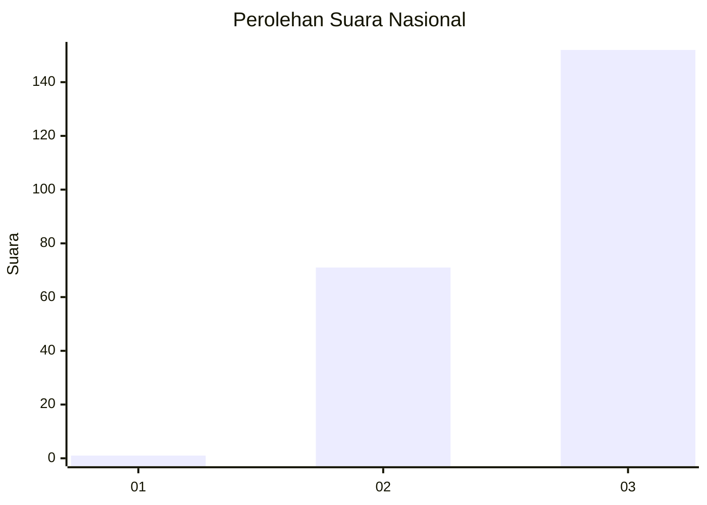
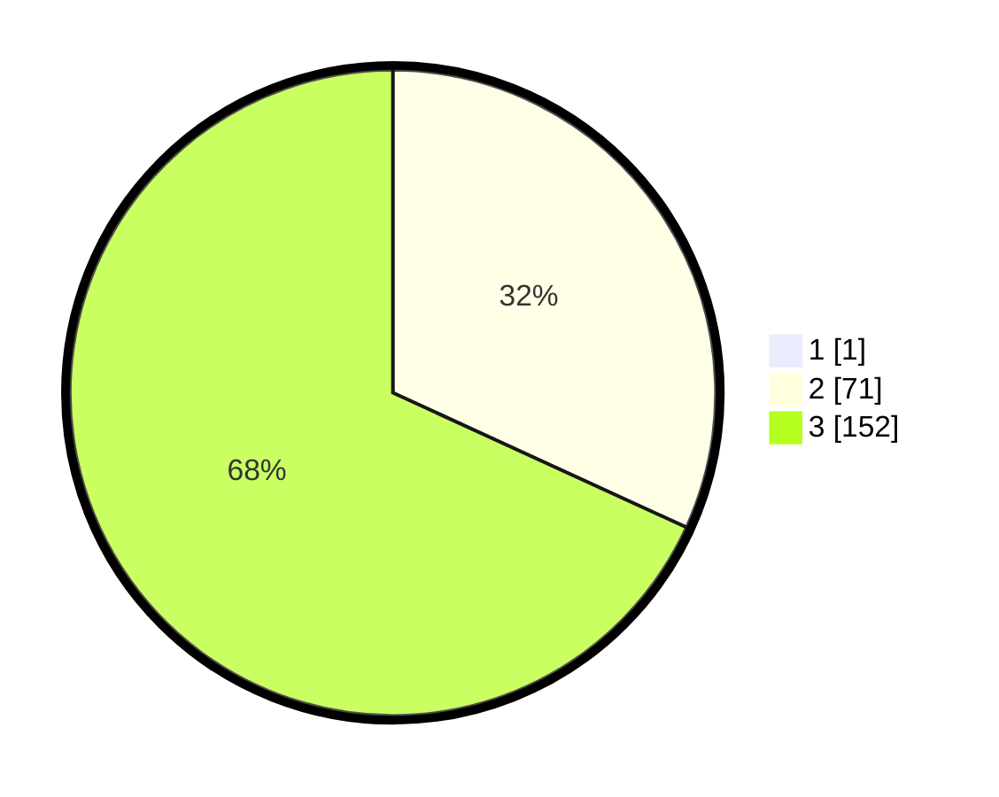

# Hasil

## Grafik

## Tabel

| No. | Nama Paslon    | Suara | Suara (raw) | Persentase |
|:--- |:-------------- | -----:| -----------:| ----------:|
| 1   | ANIES MUHAIMIN | 1     | [1][p-1]    | 0,45       |
| 2   | PRABOWO GIBRAN | 71    | [71][p-2]   | 31,70      |
| 3   | GANJAR MAHFUD  | 152   | [152][p-3]  | 67,86      |

[p-1]: https://github.com/gigit-pemilu/pemilu-2024/blob/main/pilpres/hitung-suara/sub/51-bali/sub/02-tabanan/sub/05-tabanan/sub/2001-sudimara/sub/008-tps/sub/paslon-1.txt
[p-2]: https://github.com/gigit-pemilu/pemilu-2024/blob/main/pilpres/hitung-suara/sub/51-bali/sub/02-tabanan/sub/05-tabanan/sub/2001-sudimara/sub/008-tps/sub/paslon-2.txt
[p-3]: https://github.com/gigit-pemilu/pemilu-2024/blob/main/pilpres/hitung-suara/sub/51-bali/sub/02-tabanan/sub/05-tabanan/sub/2001-sudimara/sub/008-tps/sub/paslon-3.txt

## Foto C Plano

https://sirekap-obj-formc.kpu.go.id/47ee/pemilu/ppwp/51/02/05/20/01/5102052001008-20240215-005907--f7330a92-26a1-4dff-8d6a-403942752f39.jpg

https://sirekap-obj-formc.kpu.go.id/47ee/pemilu/ppwp/51/02/05/20/01/5102052001008-20240215-010052--6cb88a41-124a-4d04-8b76-1cced8b0b01a.jpg

https://sirekap-obj-formc.kpu.go.id/47ee/pemilu/ppwp/51/02/05/20/01/5102052001008-20240215-010308--864c3fe2-8f76-4090-9a55-87cc136da663.jpg

## Metadata

| Key        | Value               |
| ---------- | ------------------- |
| Time Stamp | 2024-02-15 23:29:50 |

