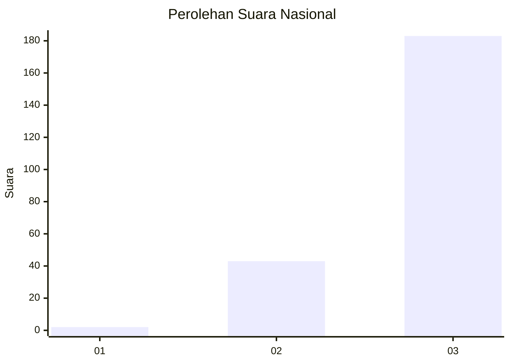
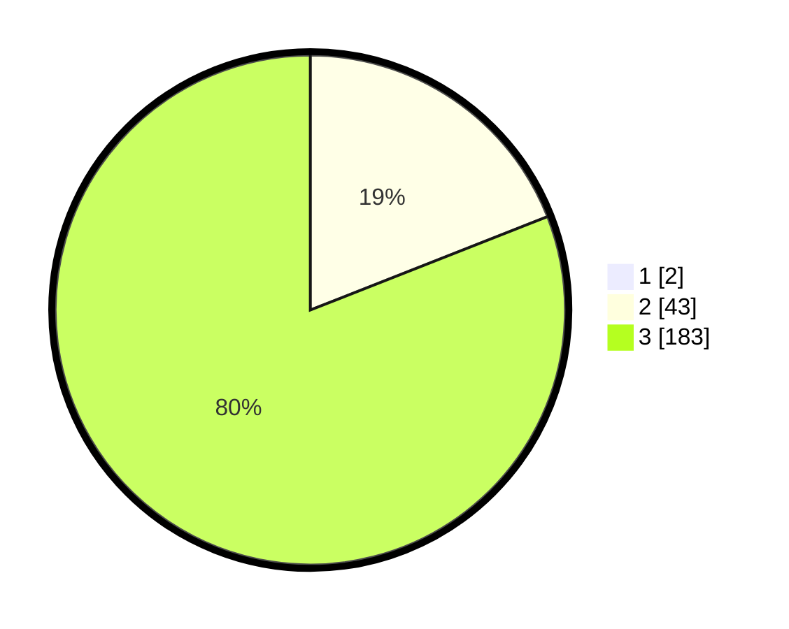

# Hasil

## Grafik

## Tabel

| No. | Nama Paslon    | Suara | Suara (raw) | Persentase |
|:--- |:-------------- | -----:| -----------:| ----------:|
| 1   | ANIES MUHAIMIN | 2     | [2][p-1]    | 0,88       |
| 2   | PRABOWO GIBRAN | 43    | [43][p-2]   | 18,86      |
| 3   | GANJAR MAHFUD  | 183   | [183][p-3]  | 80,26      |

[p-1]: https://github.com/gigit-pemilu/pemilu-2024/blob/main/pilpres/hitung-suara/sub/51-bali/sub/02-tabanan/sub/05-tabanan/sub/2001-sudimara/sub/009-tps/sub/paslon-1.txt
[p-2]: https://github.com/gigit-pemilu/pemilu-2024/blob/main/pilpres/hitung-suara/sub/51-bali/sub/02-tabanan/sub/05-tabanan/sub/2001-sudimara/sub/009-tps/sub/paslon-2.txt
[p-3]: https://github.com/gigit-pemilu/pemilu-2024/blob/main/pilpres/hitung-suara/sub/51-bali/sub/02-tabanan/sub/05-tabanan/sub/2001-sudimara/sub/009-tps/sub/paslon-3.txt

## Foto C Plano

https://sirekap-obj-formc.kpu.go.id/948e/pemilu/ppwp/51/02/05/20/01/5102052001009-20240215-021611--4a736461-79ea-4aa9-9829-d96df394958a.jpg

https://sirekap-obj-formc.kpu.go.id/948e/pemilu/ppwp/51/02/05/20/01/5102052001009-20240215-021755--73181e4c-2d82-4ee6-9239-91c12e99b18c.jpg

https://sirekap-obj-formc.kpu.go.id/948e/pemilu/ppwp/51/02/05/20/01/5102052001009-20240215-021932--670ba443-173a-4218-b69f-914e45fdebde.jpg

## Metadata

| Key        | Value               |
| ---------- | ------------------- |
| Time Stamp | 2024-02-15 22:30:27 |

