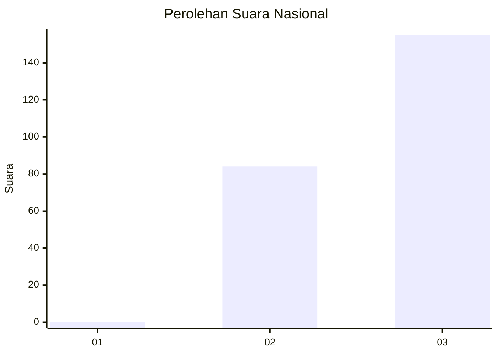
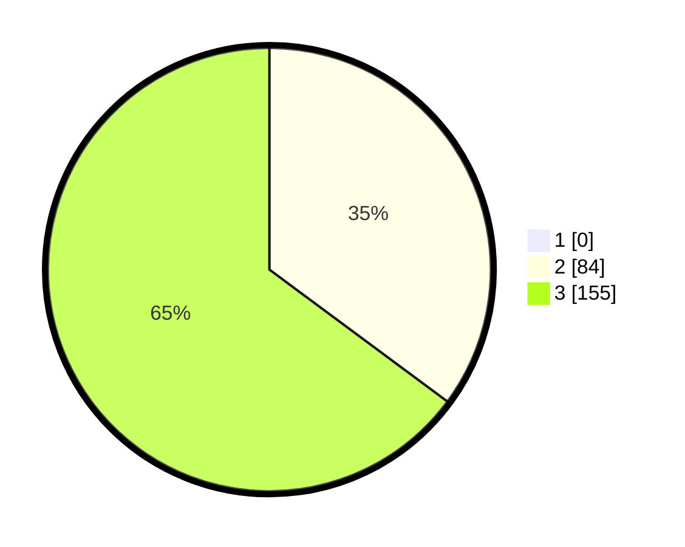

# Hasil

## Grafik

## Tabel

| No. | Nama Paslon    | Suara | Suara (raw) | Persentase |
|:--- |:-------------- | -----:| -----------:| ----------:|
| 1   | ANIES MUHAIMIN | 0     | [0][p-1]    | 0,00       |
| 2   | PRABOWO GIBRAN | 84    | [84][p-2]   | 35,15      |
| 3   | GANJAR MAHFUD  | 155   | [155][p-3]  | 64,85      |

[p-1]: https://github.com/gigit-pemilu/pemilu-2024/blob/main/pilpres/hitung-suara/sub/51-bali/sub/02-tabanan/sub/05-tabanan/sub/2001-sudimara/sub/010-tps/sub/paslon-1.txt
[p-2]: https://github.com/gigit-pemilu/pemilu-2024/blob/main/pilpres/hitung-suara/sub/51-bali/sub/02-tabanan/sub/05-tabanan/sub/2001-sudimara/sub/010-tps/sub/paslon-2.txt
[p-3]: https://github.com/gigit-pemilu/pemilu-2024/blob/main/pilpres/hitung-suara/sub/51-bali/sub/02-tabanan/sub/05-tabanan/sub/2001-sudimara/sub/010-tps/sub/paslon-3.txt

## Foto C Plano

https://sirekap-obj-formc.kpu.go.id/3f21/pemilu/ppwp/51/02/05/20/01/5102052001010-20240215-021713--8e954f1f-90f8-4674-a2c8-71f4510457bc.jpg

https://sirekap-obj-formc.kpu.go.id/3f21/pemilu/ppwp/51/02/05/20/01/5102052001010-20240215-021728--3d885c32-1785-4a54-9616-a10a1b4bfb9f.jpg

https://sirekap-obj-formc.kpu.go.id/3f21/pemilu/ppwp/51/02/05/20/01/5102052001010-20240215-021745--bb6c3dc8-db68-4c2f-813f-2ef281322145.jpg

## Metadata

| Key        | Value               |
| ---------- | ------------------- |
| Time Stamp | 2024-02-15 22:30:27 |

