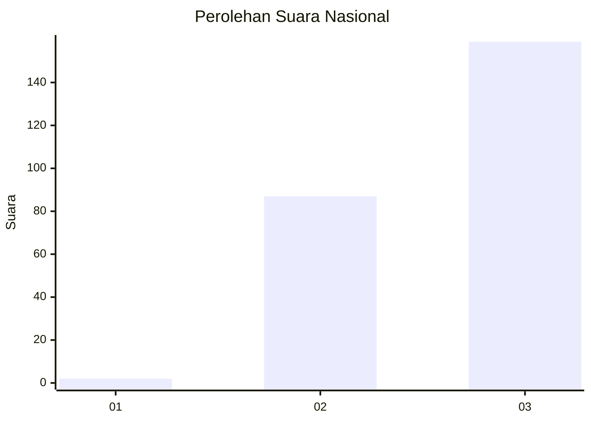
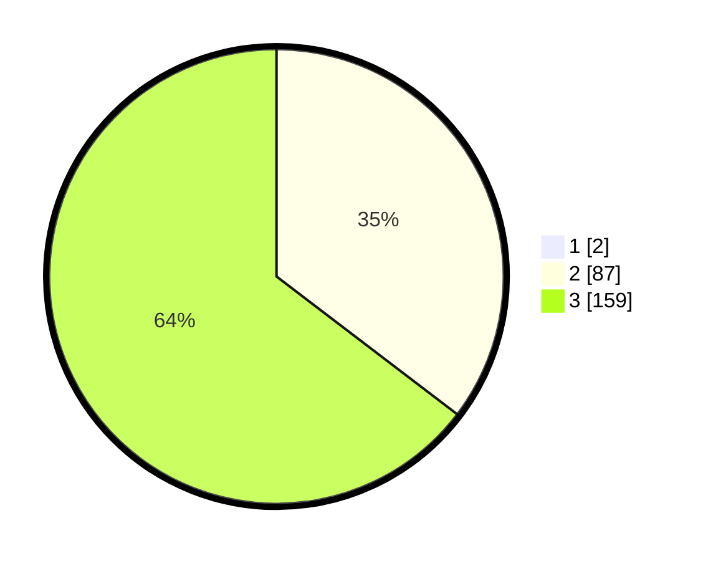

# Hasil

## Grafik

## Tabel

| No. | Nama Paslon    | Suara | Suara (raw) | Persentase |
|:--- |:-------------- | -----:| -----------:| ----------:|
| 1   | ANIES MUHAIMIN | 2     | [2][p-1]    | 0,81       |
| 2   | PRABOWO GIBRAN | 87    | [87][p-2]   | 35,08      |
| 3   | GANJAR MAHFUD  | 159   | [159][p-3]  | 64,11      |

[p-1]: https://github.com/gigit-pemilu/pemilu-2024/blob/main/pilpres/hitung-suara/sub/51-bali/sub/02-tabanan/sub/05-tabanan/sub/2001-sudimara/sub/011-tps/sub/paslon-1.txt
[p-2]: https://github.com/gigit-pemilu/pemilu-2024/blob/main/pilpres/hitung-suara/sub/51-bali/sub/02-tabanan/sub/05-tabanan/sub/2001-sudimara/sub/011-tps/sub/paslon-2.txt
[p-3]: https://github.com/gigit-pemilu/pemilu-2024/blob/main/pilpres/hitung-suara/sub/51-bali/sub/02-tabanan/sub/05-tabanan/sub/2001-sudimara/sub/011-tps/sub/paslon-3.txt

## Foto C Plano

https://sirekap-obj-formc.kpu.go.id/da40/pemilu/ppwp/51/02/05/20/01/5102052001011-20240215-101532--7e20e652-faa4-449e-869f-2210c9d3dfb8.jpg

https://sirekap-obj-formc.kpu.go.id/da40/pemilu/ppwp/51/02/05/20/01/5102052001011-20240215-101541--39d709b6-a66c-4a33-9f78-a8c5d0b3a682.jpg

https://sirekap-obj-formc.kpu.go.id/da40/pemilu/ppwp/51/02/05/20/01/5102052001011-20240215-101545--05e1bed8-5102-4ab4-8700-37b88e19eca4.jpg

## Metadata

| Key        | Value               |
| ---------- | ------------------- |
| Time Stamp | 2024-02-15 23:29:50 |

