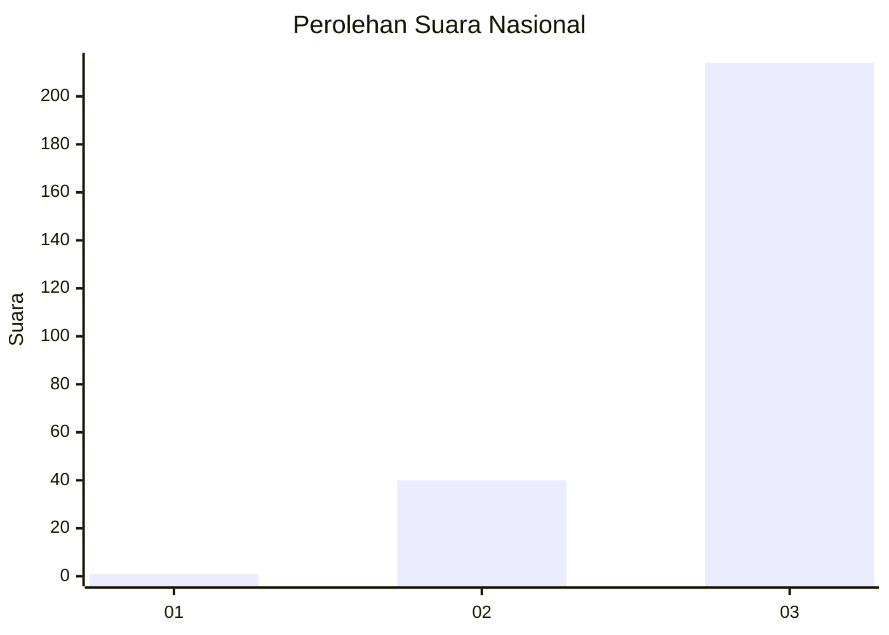
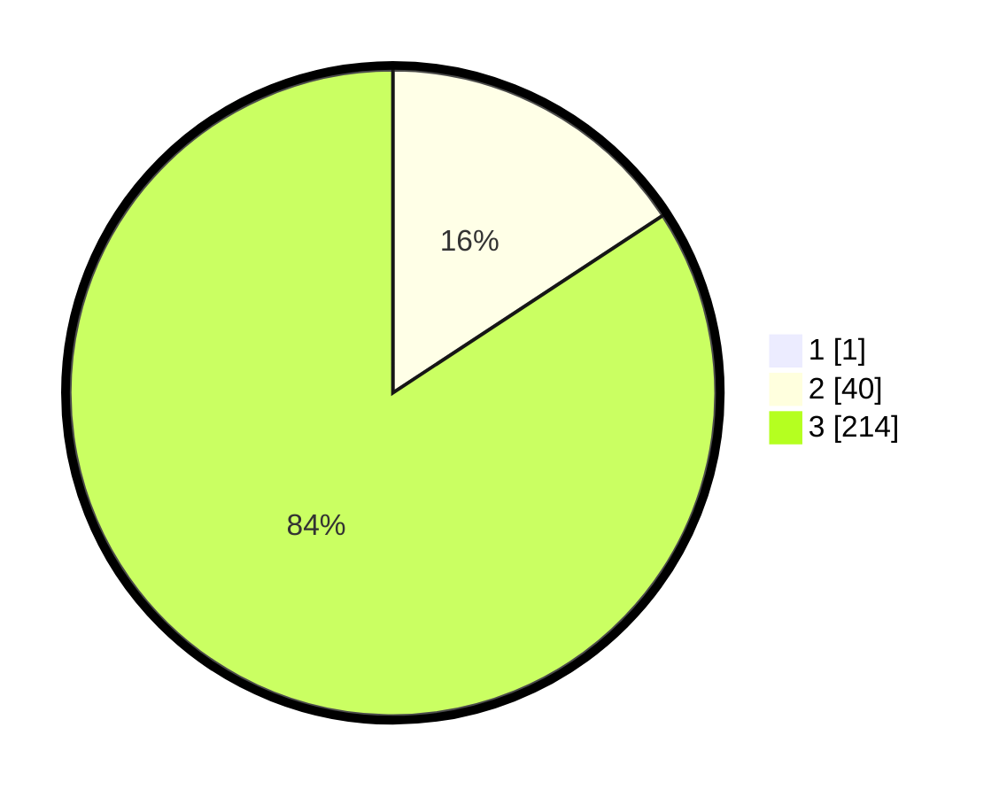

# Hasil

## Grafik

## Tabel

| No. | Nama Paslon    | Suara | Suara (raw) | Persentase |
|:--- |:-------------- | -----:| -----------:| ----------:|
| 1   | ANIES MUHAIMIN | 1     | [1][p-1]    | 0,39       |
| 2   | PRABOWO GIBRAN | 40    | [40][p-2]   | 15,69      |
| 3   | GANJAR MAHFUD  | 214   | [214][p-3]  | 83,92      |

[p-1]: https://github.com/gigit-pemilu/pemilu-2024/blob/main/pilpres/hitung-suara/sub/51-bali/sub/02-tabanan/sub/05-tabanan/sub/2001-sudimara/sub/012-tps/sub/paslon-1.txt
[p-2]: https://github.com/gigit-pemilu/pemilu-2024/blob/main/pilpres/hitung-suara/sub/51-bali/sub/02-tabanan/sub/05-tabanan/sub/2001-sudimara/sub/012-tps/sub/paslon-2.txt
[p-3]: https://github.com/gigit-pemilu/pemilu-2024/blob/main/pilpres/hitung-suara/sub/51-bali/sub/02-tabanan/sub/05-tabanan/sub/2001-sudimara/sub/012-tps/sub/paslon-3.txt

## Foto C Plano

https://sirekap-obj-formc.kpu.go.id/2d4c/pemilu/ppwp/51/02/05/20/01/5102052001012-20240214-220220--5af88323-efc7-42a9-aa1a-2a55decb127d.jpg

https://sirekap-obj-formc.kpu.go.id/2d4c/pemilu/ppwp/51/02/05/20/01/5102052001012-20240214-220122--872a0c3c-d779-4896-8352-3f808bc78730.jpg

https://sirekap-obj-formc.kpu.go.id/2d4c/pemilu/ppwp/51/02/05/20/01/5102052001012-20240214-220148--c0dbfd1e-a299-4a35-95e0-36d988592ccc.jpg

## Metadata

| Key        | Value               |
| ---------- | ------------------- |
| Time Stamp | 2024-02-15 20:00:44 |

## DATA PEMILIH TETAP

Jumlah pemilih dalam DPT: **285**.
 * L: **147**.
 * P: **138**.

## DATA PENGGUNA HAK PILIH

Jumlah pengguna hak pilih dalam DPT: **255**.
 * L: **131**.
 * P: **124**.

Jumlah pengguna hak pilih dalam DPTb: **1**.
 * L: **0**.
 * P: **1**.

Jumlah pengguna hak pilih dalam DPK: **2**.
 * L: **1**.
 * P: **1**.

Jumlah pengguna hak pilih: **258**.
 * L: **132**.
 * P: **126**.

## JUMLAH SUARA SAH DAN TIDAK SAH

JUMLAH SELURUH SUARA SAH: **255**.

JUMLAH SUARA TIDAK SAH: **3**.

JUMLAH SELURUH SUARA SAH DAN SUARA TIDAK SAH: **258**.

