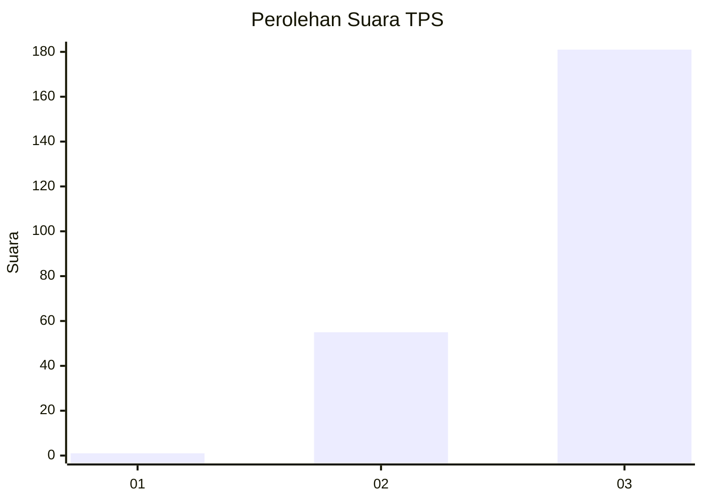
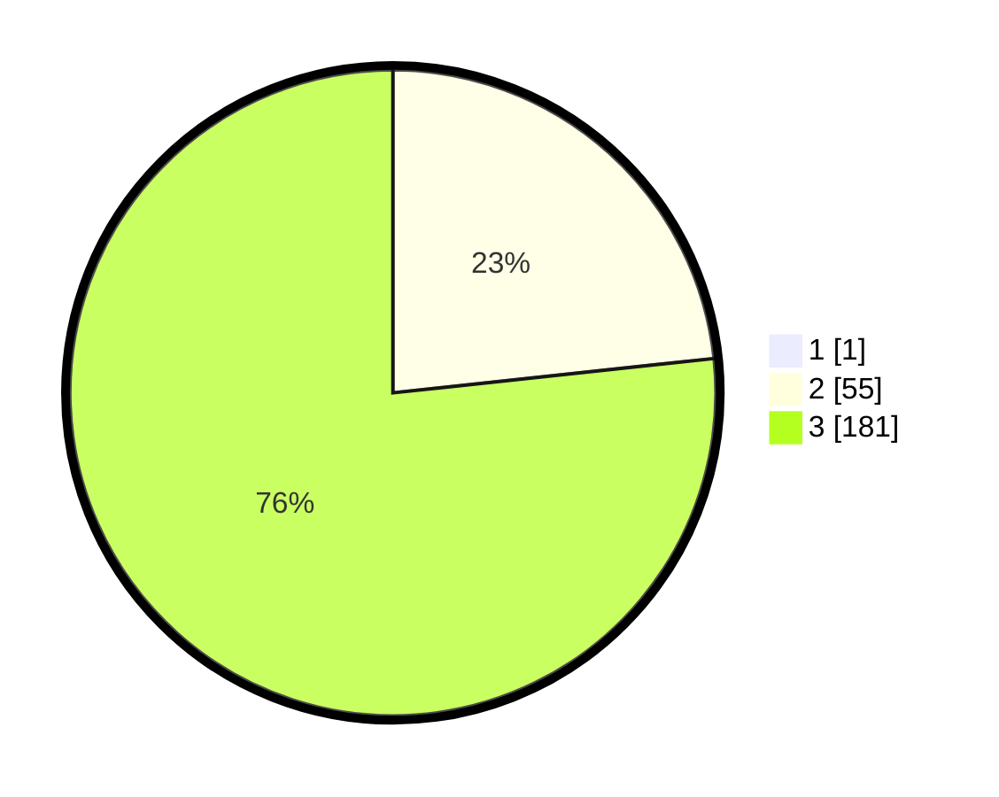

# Hasil

## Grafik

## Tabel

| No. | Nama Paslon    | Suara | Suara (raw) | Persentase |
|:--- |:-------------- | -----:| -----------:| ----------:|
| 1   | ANIES MUHAIMIN | 1     | [1][p-1]    | 0,42       |
| 2   | PRABOWO GIBRAN | 55    | [55][p-2]   | 23,21      |
| 3   | GANJAR MAHFUD  | 181   | [181][p-3]  | 76,37      |

[p-1]: https://github.com/gigit-pemilu/pemilu-2024-51-bali/blob/main/pilpres/hitung-suara/sub/51-bali/sub/02-tabanan/sub/05-tabanan/sub/2001-sudimara/sub/013-tps/sub/paslon-1.txt
[p-2]: https://github.com/gigit-pemilu/pemilu-2024-51-bali/blob/main/pilpres/hitung-suara/sub/51-bali/sub/02-tabanan/sub/05-tabanan/sub/2001-sudimara/sub/013-tps/sub/paslon-2.txt
[p-3]: https://github.com/gigit-pemilu/pemilu-2024-51-bali/blob/main/pilpres/hitung-suara/sub/51-bali/sub/02-tabanan/sub/05-tabanan/sub/2001-sudimara/sub/013-tps/sub/paslon-3.txt

## Foto C Plano

https://sirekap-obj-formc.kpu.go.id/9088/pemilu/ppwp/51/02/05/20/01/5102052001013-20240214-222757--8a9ba317-97c8-4f43-bbad-2ce60e18ba05.jpg

https://sirekap-obj-formc.kpu.go.id/9088/pemilu/ppwp/51/02/05/20/01/5102052001013-20240214-223009--f7d46c00-d48c-4dec-b0ca-d789bf517a92.jpg

## Metadata

| Key        | Value               |
| ---------- | ------------------- |
| Time Stamp | 2024-02-15 22:30:27 |

