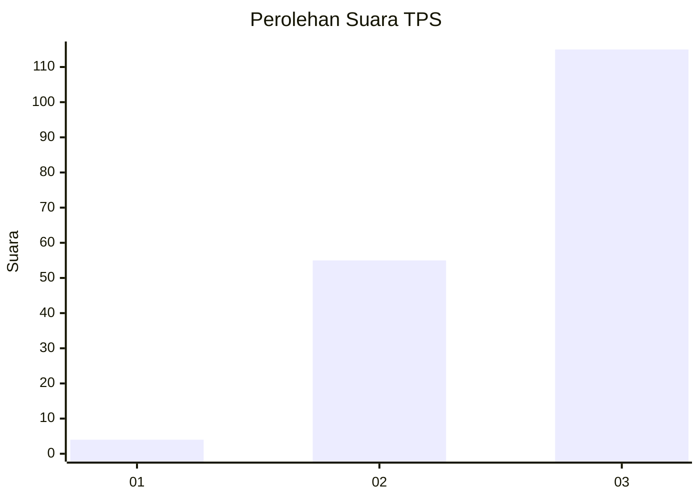
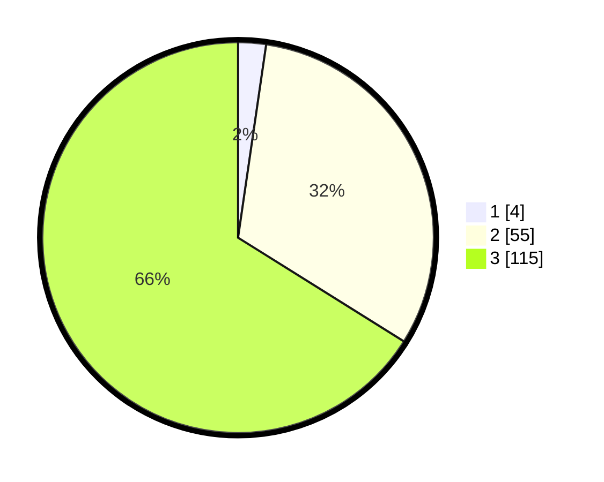

# Hasil

## Grafik

## Tabel

| No. | Nama Paslon    | Suara | Suara (raw) | Persentase |
|:--- |:-------------- | -----:| -----------:| ----------:|
| 1   | ANIES MUHAIMIN | 4     | [4][p-1]    | 2,30       |
| 2   | PRABOWO GIBRAN | 55    | [55][p-2]   | 31,61      |
| 3   | GANJAR MAHFUD  | 115   | [115][p-3]  | 66,09      |

[p-1]: https://github.com/gigit-pemilu/pemilu-2024-51-bali/blob/main/pilpres/hitung-suara/sub/51-bali/sub/02-tabanan/sub/05-tabanan/sub/2001-sudimara/sub/014-tps/sub/paslon-1.txt
[p-2]: https://github.com/gigit-pemilu/pemilu-2024-51-bali/blob/main/pilpres/hitung-suara/sub/51-bali/sub/02-tabanan/sub/05-tabanan/sub/2001-sudimara/sub/014-tps/sub/paslon-2.txt
[p-3]: https://github.com/gigit-pemilu/pemilu-2024-51-bali/blob/main/pilpres/hitung-suara/sub/51-bali/sub/02-tabanan/sub/05-tabanan/sub/2001-sudimara/sub/014-tps/sub/paslon-3.txt

## Foto C Plano

https://sirekap-obj-formc.kpu.go.id/e194/pemilu/ppwp/51/02/05/20/01/5102052001014-20240214-155313--bff41609-fe7e-40fa-8cdc-dd875f479593.jpg

https://sirekap-obj-formc.kpu.go.id/e194/pemilu/ppwp/51/02/05/20/01/5102052001014-20240214-235632--d1d50d3c-28f8-4acc-b602-133e7785d04c.jpg

https://sirekap-obj-formc.kpu.go.id/e194/pemilu/ppwp/51/02/05/20/01/5102052001014-20240214-235827--bdcfa943-3c03-4337-a80d-0d18a8af13f0.jpg

## Metadata

| Key        | Value               |
| ---------- | ------------------- |
| Time Stamp | 2024-02-15 12:00:28 |

## DATA PEMILIH TETAP

Jumlah pemilih dalam DPT: **219**.
 * L: **103**.
 * P: **116**.

## DATA PENGGUNA HAK PILIH

Jumlah pengguna hak pilih dalam DPT: **177**.
 * L: **80**.
 * P: **97**.

Jumlah pengguna hak pilih dalam DPTb: **0**.
 * L: **0**.
 * P: **0**.

Jumlah pengguna hak pilih dalam DPK: **0**.
 * L: **0**.
 * P: **0**.

Jumlah pengguna hak pilih: **177**.
 * L: **80**.
 * P: **97**.

## JUMLAH SUARA SAH DAN TIDAK SAH

JUMLAH SELURUH SUARA SAH: **174**.

JUMLAH SUARA TIDAK SAH: **3**.

JUMLAH SELURUH SUARA SAH DAN SUARA TIDAK SAH: **177**.

