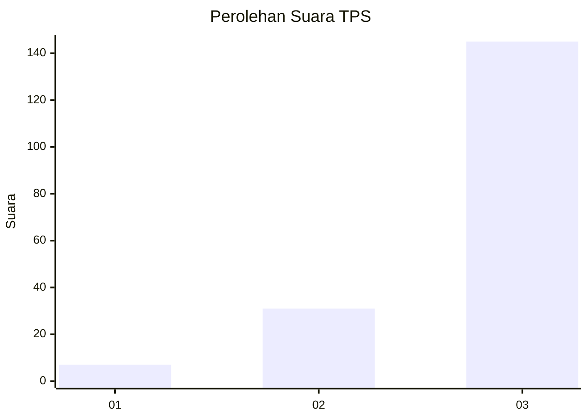
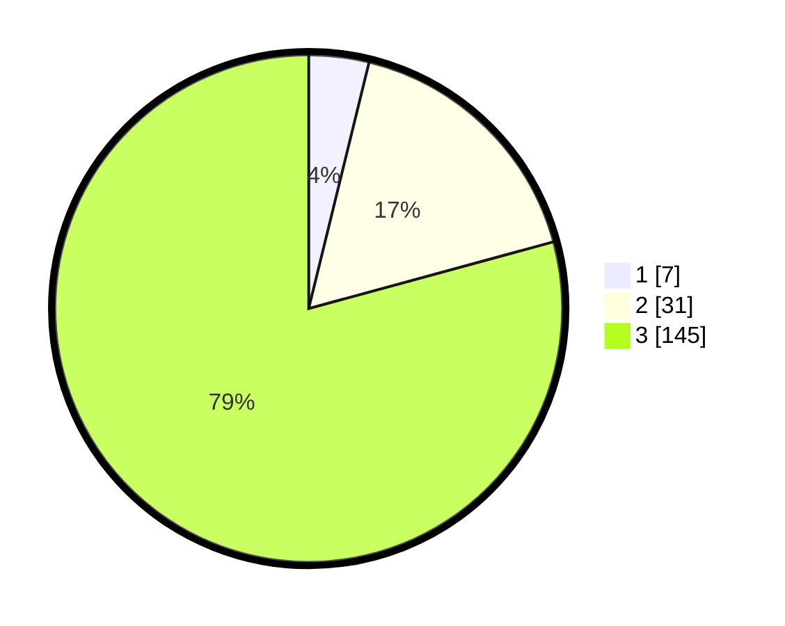

# Hasil

## Grafik

## Tabel

| No. | Nama Paslon    | Suara | Suara (raw) | Persentase |
|:--- |:-------------- | -----:| -----------:| ----------:|
| 1   | ANIES MUHAIMIN | 7     | [7][p-1]    | 3,83       |
| 2   | PRABOWO GIBRAN | 31    | [31][p-2]   | 16,94      |
| 3   | GANJAR MAHFUD  | 145   | [145][p-3]  | 79,23      |

[p-1]: https://github.com/gigit-pemilu/pemilu-2024-51-bali/blob/main/pilpres/hitung-suara/sub/51-bali/sub/02-tabanan/sub/05-tabanan/sub/2001-sudimara/sub/019-tps/sub/paslon-1.txt
[p-2]: https://github.com/gigit-pemilu/pemilu-2024-51-bali/blob/main/pilpres/hitung-suara/sub/51-bali/sub/02-tabanan/sub/05-tabanan/sub/2001-sudimara/sub/019-tps/sub/paslon-2.txt
[p-3]: https://github.com/gigit-pemilu/pemilu-2024-51-bali/blob/main/pilpres/hitung-suara/sub/51-bali/sub/02-tabanan/sub/05-tabanan/sub/2001-sudimara/sub/019-tps/sub/paslon-3.txt

## Foto C Plano

https://sirekap-obj-formc.kpu.go.id/0a05/pemilu/ppwp/51/02/05/20/01/5102052001019-20240214-155052--1871b04a-5464-4e73-96fc-1b7761a5e406.jpg

https://sirekap-obj-formc.kpu.go.id/0a05/pemilu/ppwp/51/02/05/20/01/5102052001019-20240214-155229--6009fd68-9f77-41ba-8eae-d7803767bd14.jpg

https://sirekap-obj-formc.kpu.go.id/0a05/pemilu/ppwp/51/02/05/20/01/5102052001019-20240214-155101--e6bcd05c-2f44-4a44-b9b2-e00e362f6831.jpg

## Metadata

| Key        | Value               |
| ---------- | ------------------- |
| Time Stamp | 2024-02-14 21:46:01 |

## DATA PEMILIH TETAP

Jumlah pemilih dalam DPT: **211**.
 * L: **106**.
 * P: **105**.

## DATA PENGGUNA HAK PILIH

Jumlah pengguna hak pilih dalam DPT: **189**.
 * L: **99**.
 * P: **90**.

Jumlah pengguna hak pilih dalam DPTb: **1**.
 * L: **0**.
 * P: **1**.

Jumlah pengguna hak pilih dalam DPK: **1**.
 * L: **0**.
 * P: **1**.

Jumlah pengguna hak pilih: **191**.
 * L: **99**.
 * P: **92**.

## JUMLAH SUARA SAH DAN TIDAK SAH

JUMLAH SELURUH SUARA SAH: **183**.

JUMLAH SUARA TIDAK SAH: **8**.

JUMLAH SELURUH SUARA SAH DAN SUARA TIDAK SAH: **191**.

