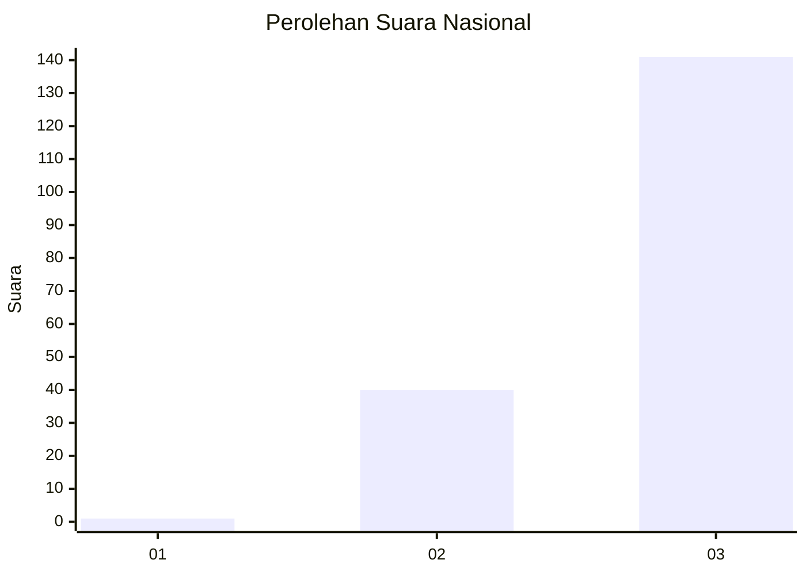
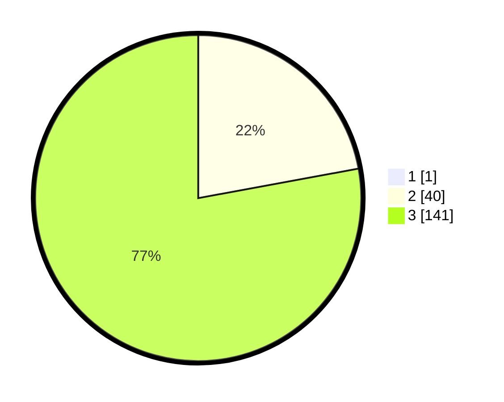

# Hasil

## Grafik

## Tabel

| No. | Nama Paslon    | Suara | Suara (raw) | Persentase |
|:--- |:-------------- | -----:| -----------:| ----------:|
| 1   | ANIES MUHAIMIN | 1     | [1][p-1]    | 0,55       |
| 2   | PRABOWO GIBRAN | 40    | [40][p-2]   | 21,98      |
| 3   | GANJAR MAHFUD  | 141   | [141][p-3]  | 77,47      |

[p-1]: https://github.com/gigit-pemilu/pemilu-2024/blob/main/pilpres/hitung-suara/sub/51-bali/sub/02-tabanan/sub/05-tabanan/sub/2001-sudimara/sub/020-tps/sub/paslon-1.txt
[p-2]: https://github.com/gigit-pemilu/pemilu-2024/blob/main/pilpres/hitung-suara/sub/51-bali/sub/02-tabanan/sub/05-tabanan/sub/2001-sudimara/sub/020-tps/sub/paslon-2.txt
[p-3]: https://github.com/gigit-pemilu/pemilu-2024/blob/main/pilpres/hitung-suara/sub/51-bali/sub/02-tabanan/sub/05-tabanan/sub/2001-sudimara/sub/020-tps/sub/paslon-3.txt

## Foto C Plano

https://sirekap-obj-formc.kpu.go.id/e5ab/pemilu/ppwp/51/02/05/20/01/5102052001020-20240215-003011--7f7c8c99-6af2-4378-9b75-982b97a8b043.jpg

https://sirekap-obj-formc.kpu.go.id/e5ab/pemilu/ppwp/51/02/05/20/01/5102052001020-20240215-003203--f90014a1-c58d-47cc-9e05-1bbf263af78d.jpg

https://sirekap-obj-formc.kpu.go.id/e5ab/pemilu/ppwp/51/02/05/20/01/5102052001020-20240215-003411--b6116994-929a-42bd-8ad8-96608b7574a2.jpg

## Metadata

| Key        | Value               |
| ---------- | ------------------- |
| Time Stamp | 2024-02-15 22:30:27 |

## DATA PEMILIH TETAP

Jumlah pemilih dalam DPT: **218**.
 * L: **113**.
 * P: **105**.

## DATA PENGGUNA HAK PILIH

Jumlah pengguna hak pilih dalam DPT: **195**.
 * L: **97**.
 * P: **98**.

Jumlah pengguna hak pilih dalam DPTb: **0**.
 * L: **0**.
 * P: **0**.

Jumlah pengguna hak pilih dalam DPK: **0**.
 * L: **0**.
 * P: **0**.

Jumlah pengguna hak pilih: **195**.
 * L: **97**.
 * P: **98**.

## JUMLAH SUARA SAH DAN TIDAK SAH

JUMLAH SELURUH SUARA SAH: **182**.

JUMLAH SUARA TIDAK SAH: **13**.

JUMLAH SELURUH SUARA SAH DAN SUARA TIDAK SAH: **195**.

