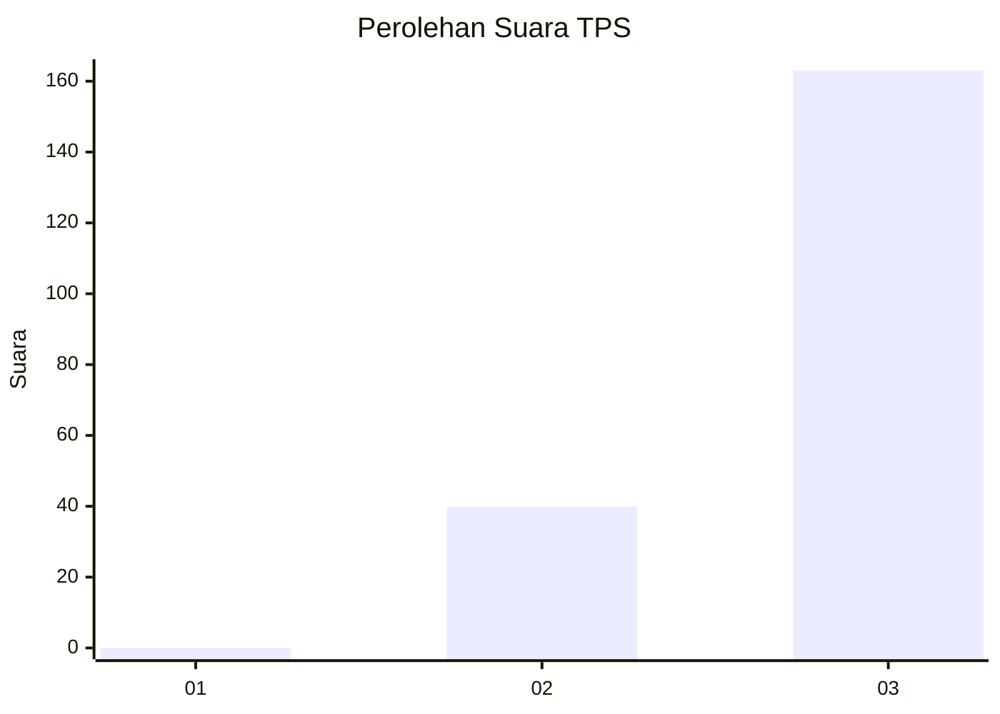
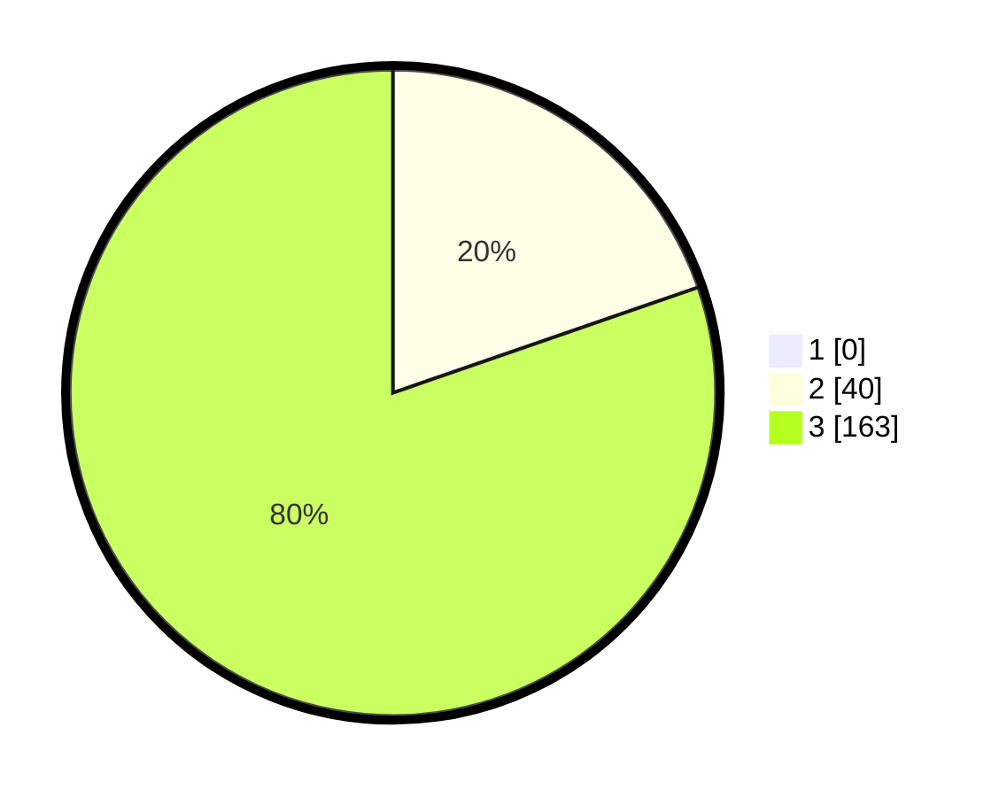

# Hasil

## Grafik

## Tabel

| No. | Nama Paslon    | Suara | Suara (raw) | Persentase |
|:--- |:-------------- | -----:| -----------:| ----------:|
| 1   | ANIES MUHAIMIN | 0     | [0][p-1]    | 0,00       |
| 2   | PRABOWO GIBRAN | 40    | [40][p-2]   | 19,70      |
| 3   | GANJAR MAHFUD  | 163   | [163][p-3]  | 80,30      |

[p-1]: https://github.com/gigit-pemilu/pemilu-2024-51-bali/blob/main/pilpres/hitung-suara/sub/51-bali/sub/02-tabanan/sub/05-tabanan/sub/2001-sudimara/sub/022-tps/sub/paslon-1.txt
[p-2]: https://github.com/gigit-pemilu/pemilu-2024-51-bali/blob/main/pilpres/hitung-suara/sub/51-bali/sub/02-tabanan/sub/05-tabanan/sub/2001-sudimara/sub/022-tps/sub/paslon-2.txt
[p-3]: https://github.com/gigit-pemilu/pemilu-2024-51-bali/blob/main/pilpres/hitung-suara/sub/51-bali/sub/02-tabanan/sub/05-tabanan/sub/2001-sudimara/sub/022-tps/sub/paslon-3.txt

## Foto C Plano

https://sirekap-obj-formc.kpu.go.id/61c4/pemilu/ppwp/51/02/05/20/01/5102052001022-20240216-152249--19825eb6-201d-41f6-9c2a-ba07604004a3.jpg

https://sirekap-obj-formc.kpu.go.id/61c4/pemilu/ppwp/51/02/05/20/01/5102052001022-20240216-152250--b8cd9ca6-1069-4d64-a836-21b6662cb588.jpg

https://sirekap-obj-formc.kpu.go.id/61c4/pemilu/ppwp/51/02/05/20/01/5102052001022-20240216-152249--c25c449f-4137-43c4-bae7-4935d5cac43e.jpg

## Metadata

| Key        | Value               |
| ---------- | ------------------- |
| Time Stamp | 2024-02-21 13:00:00 |

## DATA PEMILIH TETAP

Jumlah pemilih dalam DPT: **228**.
 * L: **112**.
 * P: **116**.

## DATA PENGGUNA HAK PILIH

Jumlah pengguna hak pilih dalam DPT: **207**.
 * L: **104**.
 * P: **103**.

Jumlah pengguna hak pilih dalam DPTb: **0**.
 * L: **0**.
 * P: **0**.

Jumlah pengguna hak pilih dalam DPK: **0**.
 * L: **0**.
 * P: **0**.

Jumlah pengguna hak pilih: **207**.
 * L: **104**.
 * P: **103**.

## JUMLAH SUARA SAH DAN TIDAK SAH

JUMLAH SELURUH SUARA SAH: **203**.

JUMLAH SUARA TIDAK SAH: **4**.

JUMLAH SELURUH SUARA SAH DAN SUARA TIDAK SAH: **207**.

