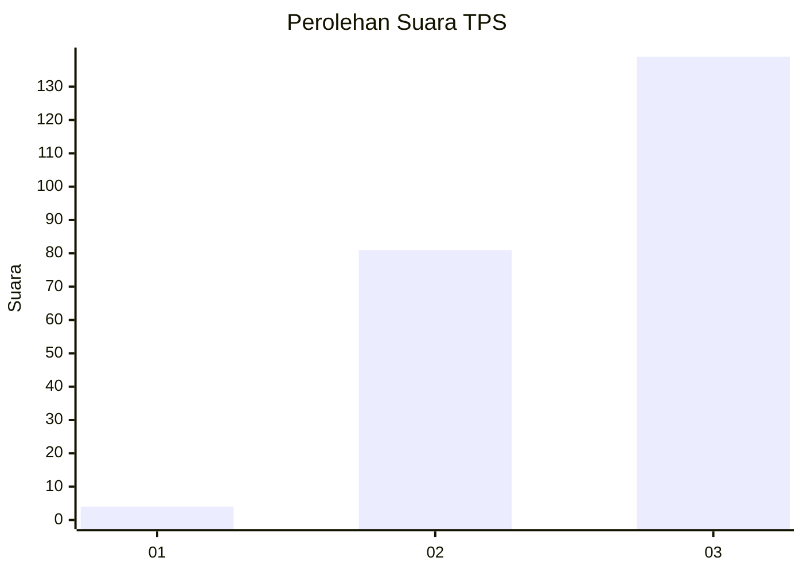
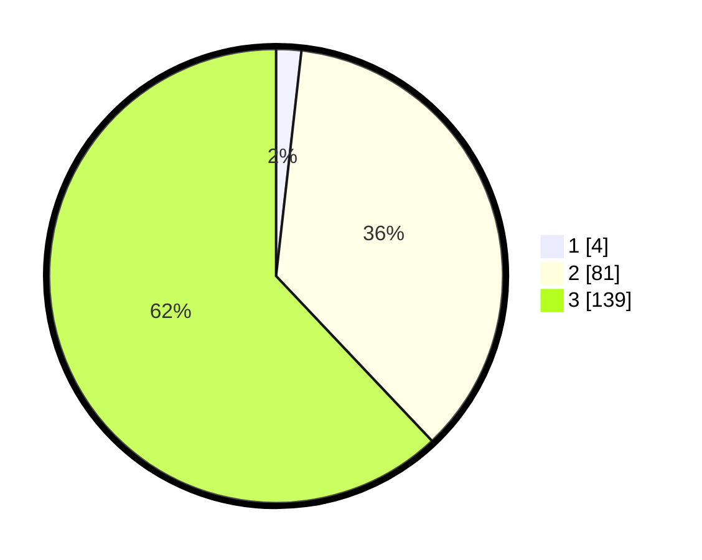

# Hasil

## Grafik

## Tabel

| No. | Nama Paslon    | Suara | Suara (raw) | Persentase |
|:--- |:-------------- | -----:| -----------:| ----------:|
| 1   | ANIES MUHAIMIN | 4     | [4][p-1]    | 1,79       |
| 2   | PRABOWO GIBRAN | 81    | [81][p-2]   | 36,16      |
| 3   | GANJAR MAHFUD  | 139   | [139][p-3]  | 62,05      |

[p-1]: https://github.com/gigit-pemilu/pemilu-2024-51-bali/blob/main/pilpres/hitung-suara/sub/51-bali/sub/02-tabanan/sub/05-tabanan/sub/2002-gubug/sub/001-tps/sub/paslon-1.txt
[p-2]: https://github.com/gigit-pemilu/pemilu-2024-51-bali/blob/main/pilpres/hitung-suara/sub/51-bali/sub/02-tabanan/sub/05-tabanan/sub/2002-gubug/sub/001-tps/sub/paslon-2.txt
[p-3]: https://github.com/gigit-pemilu/pemilu-2024-51-bali/blob/main/pilpres/hitung-suara/sub/51-bali/sub/02-tabanan/sub/05-tabanan/sub/2002-gubug/sub/001-tps/sub/paslon-3.txt

## Foto C Plano

https://sirekap-obj-formc.kpu.go.id/f0fc/pemilu/ppwp/51/02/05/20/02/5102052002001-20240215-001338--ed23f507-5d58-4c8d-8b67-f3e09bb6e4dd.jpg

https://sirekap-obj-formc.kpu.go.id/f0fc/pemilu/ppwp/51/02/05/20/02/5102052002001-20240215-001453--32c1f903-6021-4ac6-b970-95967c9218d1.jpg

https://sirekap-obj-formc.kpu.go.id/f0fc/pemilu/ppwp/51/02/05/20/02/5102052002001-20240215-001556--303d520f-e073-48ad-b3df-70f82d6ccbaa.jpg

## Metadata

| Key        | Value               |
| ---------- | ------------------- |
| Time Stamp | 2024-02-15 22:30:27 |

