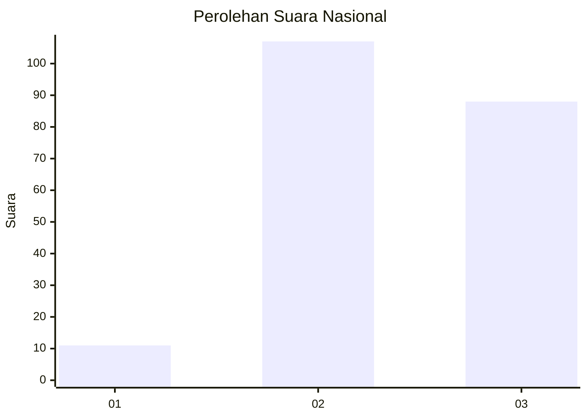
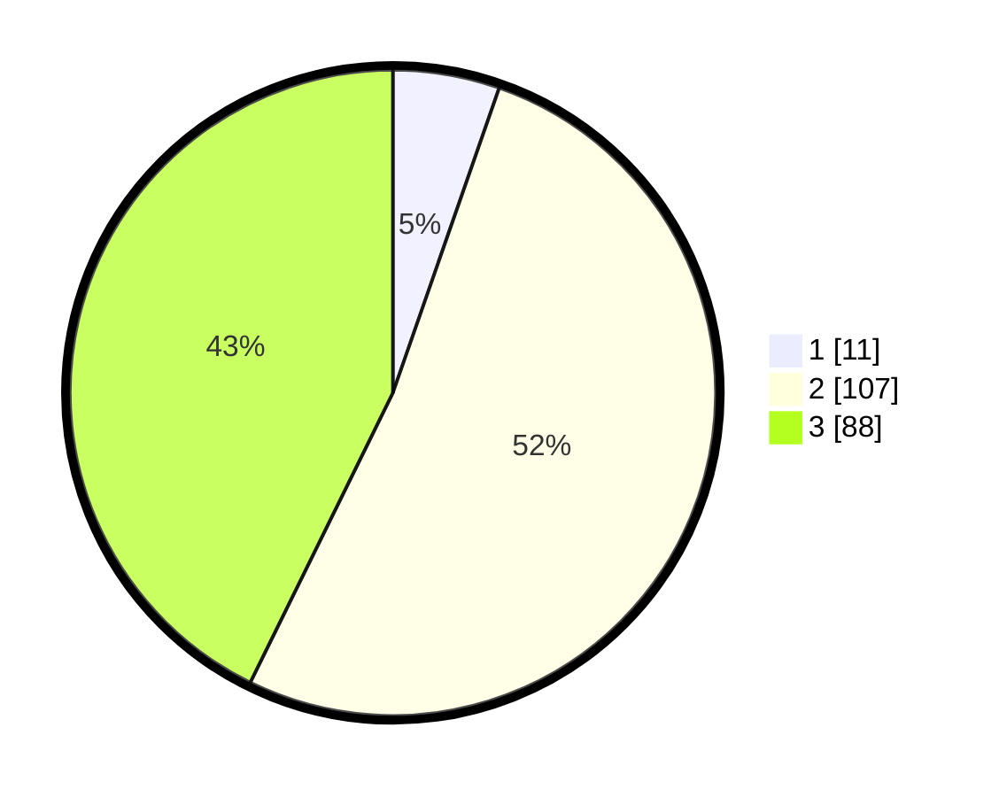

# Hasil

## Grafik

## Tabel

| No. | Nama Paslon    | Suara | Suara (raw) | Persentase |
|:--- |:-------------- | -----:| -----------:| ----------:|
| 1   | ANIES MUHAIMIN | 11    | [11][p-1]   | 5,34       |
| 2   | PRABOWO GIBRAN | 107   | [107][p-2]  | 51,94      |
| 3   | GANJAR MAHFUD  | 88    | [88][p-3]   | 42,72      |

[p-1]: https://github.com/gigit-pemilu/pemilu-2024/blob/main/pilpres/hitung-suara/sub/51-bali/sub/02-tabanan/sub/05-tabanan/sub/2002-gubug/sub/002-tps/sub/paslon-1.txt
[p-2]: https://github.com/gigit-pemilu/pemilu-2024/blob/main/pilpres/hitung-suara/sub/51-bali/sub/02-tabanan/sub/05-tabanan/sub/2002-gubug/sub/002-tps/sub/paslon-2.txt
[p-3]: https://github.com/gigit-pemilu/pemilu-2024/blob/main/pilpres/hitung-suara/sub/51-bali/sub/02-tabanan/sub/05-tabanan/sub/2002-gubug/sub/002-tps/sub/paslon-3.txt

## Foto C Plano

https://sirekap-obj-formc.kpu.go.id/c0f2/pemilu/ppwp/51/02/05/20/02/5102052002002-20240215-000258--e0f456be-53db-4fc4-ac6f-785f31a83edd.jpg

https://sirekap-obj-formc.kpu.go.id/c0f2/pemilu/ppwp/51/02/05/20/02/5102052002002-20240215-000402--92c8e1d7-a6fa-477d-a5e3-723718031b7f.jpg

https://sirekap-obj-formc.kpu.go.id/c0f2/pemilu/ppwp/51/02/05/20/02/5102052002002-20240215-000543--9309b494-c013-4d2d-b556-d54abdb2d46d.jpg

## Metadata

| Key        | Value               |
| ---------- | ------------------- |
| Time Stamp | 2024-02-15 22:30:27 |

