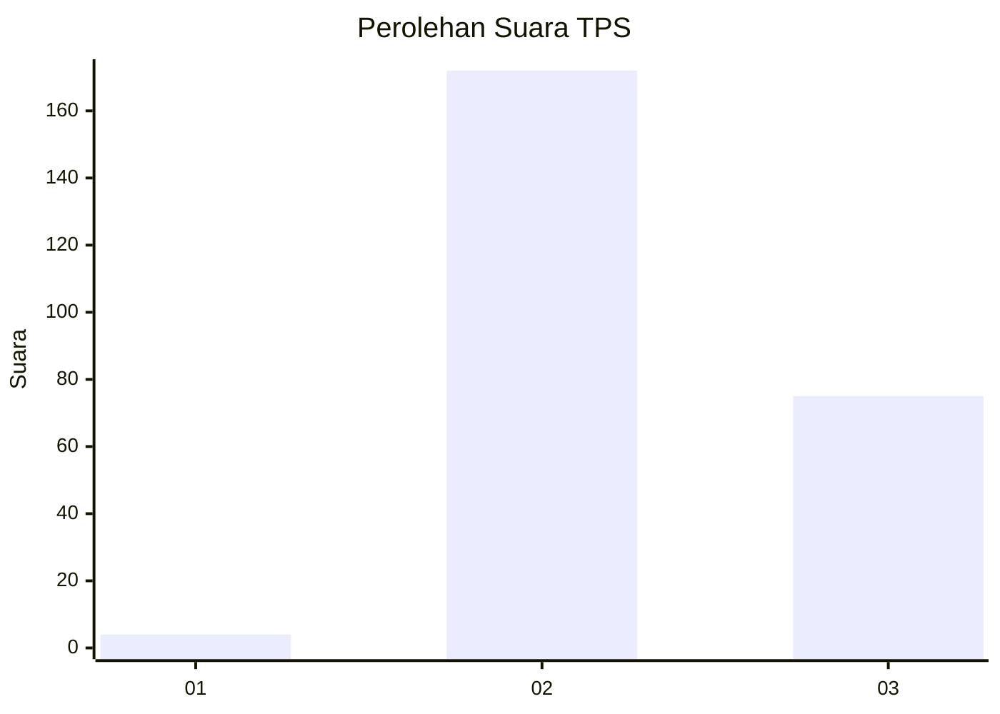

# Hasil

## Grafik

## Tabel

| No. | Nama Paslon    | Suara | Suara (raw) | Persentase |
|:--- |:-------------- | -----:| -----------:| ----------:|
| 1   | ANIES MUHAIMIN | 4     | [4][p-1]    | 1,59       |
| 2   | PRABOWO GIBRAN | 172   | [172][p-2]  | 68,53      |
| 3   | GANJAR MAHFUD  | 75    | [75][p-3]   | 29,88      |

[p-1]: https://github.com/gigit-pemilu/pemilu-2024-51-bali/blob/main/pilpres/hitung-suara/sub/51-bali/sub/02-tabanan/sub/05-tabanan/sub/2002-gubug/sub/004-tps/sub/paslon-1.txt
[p-2]: https://github.com/gigit-pemilu/pemilu-2024-51-bali/blob/main/pilpres/hitung-suara/sub/51-bali/sub/02-tabanan/sub/05-tabanan/sub/2002-gubug/sub/004-tps/sub/paslon-2.txt
[p-3]: https://github.com/gigit-pemilu/pemilu-2024-51-bali/blob/main/pilpres/hitung-suara/sub/51-bali/sub/02-tabanan/sub/05-tabanan/sub/2002-gubug/sub/004-tps/sub/paslon-3.txt

## Foto C Plano

https://sirekap-obj-formc.kpu.go.id/1c4d/pemilu/ppwp/51/02/05/20/02/5102052002004-20240216-135046--658bb76e-d65d-4050-b835-db77ad754e3f.jpg

https://sirekap-obj-formc.kpu.go.id/1c4d/pemilu/ppwp/51/02/05/20/02/5102052002004-20240216-135047--844518b7-04c2-4099-9325-3400a8d64a7b.jpg

https://sirekap-obj-formc.kpu.go.id/1c4d/pemilu/ppwp/51/02/05/20/02/5102052002004-20240216-135047--12315ee8-014b-42b1-8594-7351694b862d.jpg

## Metadata

| Key        | Value               |
| ---------- | ------------------- |
| Time Stamp | 2024-02-16 14:30:33 |

## DATA PEMILIH TETAP

Jumlah pemilih dalam DPT: **288**.
 * L: **144**.
 * P: **144**.

## DATA PENGGUNA HAK PILIH

Jumlah pengguna hak pilih dalam DPT: **251**.
 * L: **126**.
 * P: **125**.

Jumlah pengguna hak pilih dalam DPTb: **4**.
 * L: **1**.
 * P: **3**.

Jumlah pengguna hak pilih dalam DPK: **0**.
 * L: **0**.
 * P: **0**.

Jumlah pengguna hak pilih: **255**.
 * L: **127**.
 * P: **128**.

## JUMLAH SUARA SAH DAN TIDAK SAH

JUMLAH SELURUH SUARA SAH: **251**.

JUMLAH SUARA TIDAK SAH: **4**.

JUMLAH SELURUH SUARA SAH DAN SUARA TIDAK SAH: **255**.

