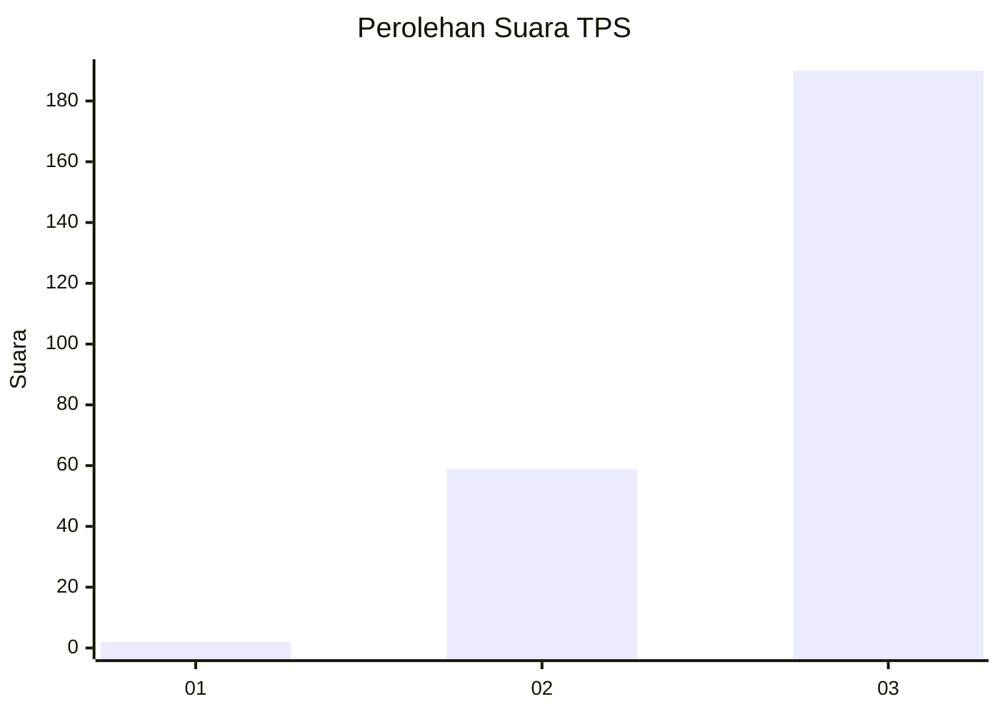
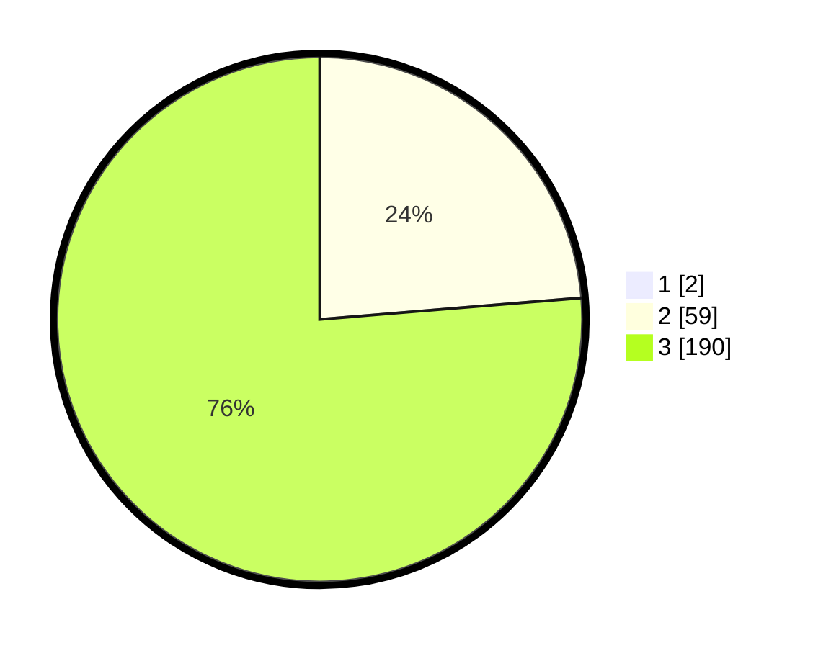

# Hasil

## Grafik

## Tabel

| No. | Nama Paslon    | Suara | Suara (raw) | Persentase |
|:--- |:-------------- | -----:| -----------:| ----------:|
| 1   | ANIES MUHAIMIN | 2     | [2][p-1]    | 0,80       |
| 2   | PRABOWO GIBRAN | 59    | [59][p-2]   | 23,51      |
| 3   | GANJAR MAHFUD  | 190   | [190][p-3]  | 75,70      |

[p-1]: https://github.com/gigit-pemilu/pemilu-2024-51-bali/blob/main/pilpres/hitung-suara/sub/51-bali/sub/02-tabanan/sub/05-tabanan/sub/2002-gubug/sub/005-tps/sub/paslon-1.txt
[p-2]: https://github.com/gigit-pemilu/pemilu-2024-51-bali/blob/main/pilpres/hitung-suara/sub/51-bali/sub/02-tabanan/sub/05-tabanan/sub/2002-gubug/sub/005-tps/sub/paslon-2.txt
[p-3]: https://github.com/gigit-pemilu/pemilu-2024-51-bali/blob/main/pilpres/hitung-suara/sub/51-bali/sub/02-tabanan/sub/05-tabanan/sub/2002-gubug/sub/005-tps/sub/paslon-3.txt

## Foto C Plano

https://sirekap-obj-formc.kpu.go.id/6313/pemilu/ppwp/51/02/05/20/02/5102052002005-20240214-201744--eb115d32-f684-4019-b3ff-a6c3ed0733a7.jpg

https://sirekap-obj-formc.kpu.go.id/6313/pemilu/ppwp/51/02/05/20/02/5102052002005-20240214-201917--df7c3110-297f-4b76-82fa-49cf735447b1.jpg

https://sirekap-obj-formc.kpu.go.id/6313/pemilu/ppwp/51/02/05/20/02/5102052002005-20240214-205440--68bb55a5-0fe0-42b7-b875-41e455a3b1b0.jpg

## Metadata

| Key        | Value               |
| ---------- | ------------------- |
| Time Stamp | 2024-02-15 01:47:43 |

## DATA PEMILIH TETAP

Jumlah pemilih dalam DPT: **270**.
 * L: **135**.
 * P: **135**.

## DATA PENGGUNA HAK PILIH

Jumlah pengguna hak pilih dalam DPT: **252**.
 * L: **126**.
 * P: **126**.

Jumlah pengguna hak pilih dalam DPTb: **2**.
 * L: **0**.
 * P: **2**.

Jumlah pengguna hak pilih dalam DPK: **0**.
 * L: **0**.
 * P: **0**.

Jumlah pengguna hak pilih: **254**.
 * L: **126**.
 * P: **128**.

## JUMLAH SUARA SAH DAN TIDAK SAH

JUMLAH SELURUH SUARA SAH: **251**.

JUMLAH SUARA TIDAK SAH: **3**.

JUMLAH SELURUH SUARA SAH DAN SUARA TIDAK SAH: **254**.

