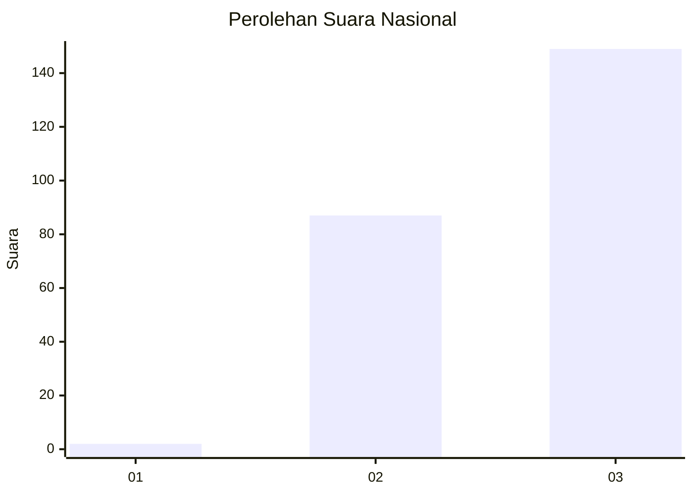
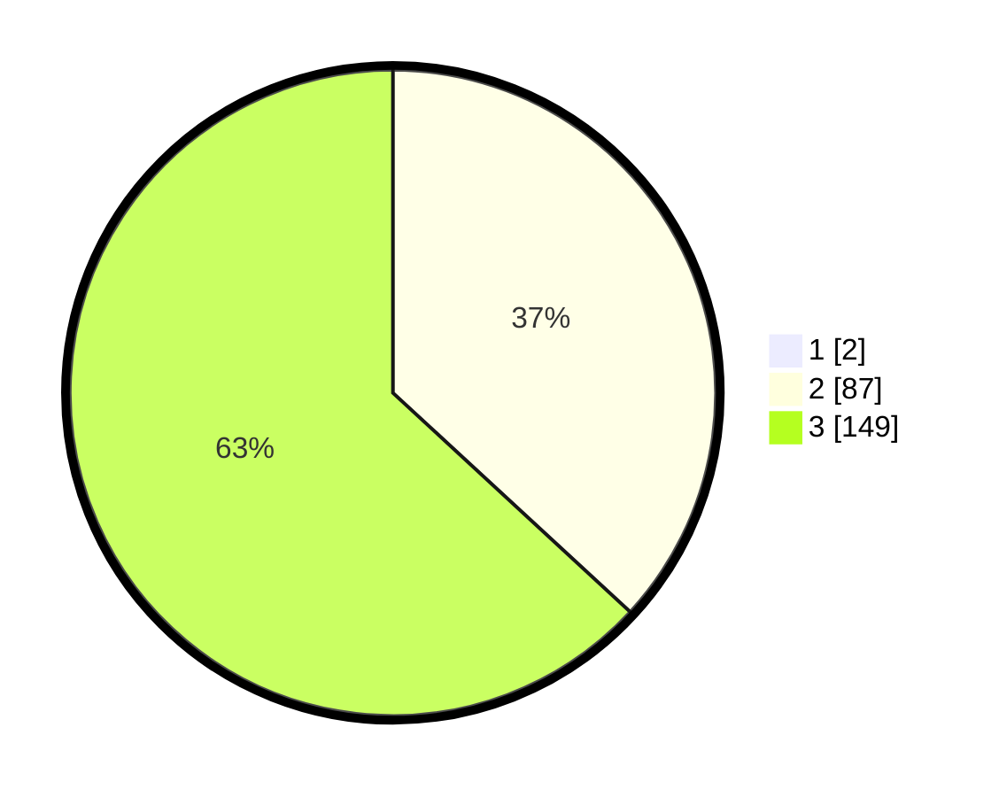

# Hasil

## Grafik

## Tabel

| No. | Nama Paslon    | Suara | Suara (raw) | Persentase |
|:--- |:-------------- | -----:| -----------:| ----------:|
| 1   | ANIES MUHAIMIN | 2     | [2][p-1]    | 0,84       |
| 2   | PRABOWO GIBRAN | 87    | [87][p-2]   | 36,55      |
| 3   | GANJAR MAHFUD  | 149   | [149][p-3]  | 62,61      |

[p-1]: https://github.com/gigit-pemilu/pemilu-2024/blob/main/pilpres/hitung-suara/sub/51-bali/sub/02-tabanan/sub/05-tabanan/sub/2002-gubug/sub/007-tps/sub/paslon-1.txt
[p-2]: https://github.com/gigit-pemilu/pemilu-2024/blob/main/pilpres/hitung-suara/sub/51-bali/sub/02-tabanan/sub/05-tabanan/sub/2002-gubug/sub/007-tps/sub/paslon-2.txt
[p-3]: https://github.com/gigit-pemilu/pemilu-2024/blob/main/pilpres/hitung-suara/sub/51-bali/sub/02-tabanan/sub/05-tabanan/sub/2002-gubug/sub/007-tps/sub/paslon-3.txt

## Foto C Plano

https://sirekap-obj-formc.kpu.go.id/eb9e/pemilu/ppwp/51/02/05/20/02/5102052002007-20240218-195829--e72f55cc-e361-49cb-a2bf-b7731f40bef7.jpg

https://sirekap-obj-formc.kpu.go.id/eb9e/pemilu/ppwp/51/02/05/20/02/5102052002007-20240214-185413--a9327d71-3bdc-4739-9595-e6bd2f689bf2.jpg

https://sirekap-obj-formc.kpu.go.id/eb9e/pemilu/ppwp/51/02/05/20/02/5102052002007-20240214-194200--e4b43ec4-450a-45bb-b2c0-1adab7c82815.jpg

## Metadata

| Key        | Value               |
| ---------- | ------------------- |
| Time Stamp | 2024-02-19 06:16:00 |

