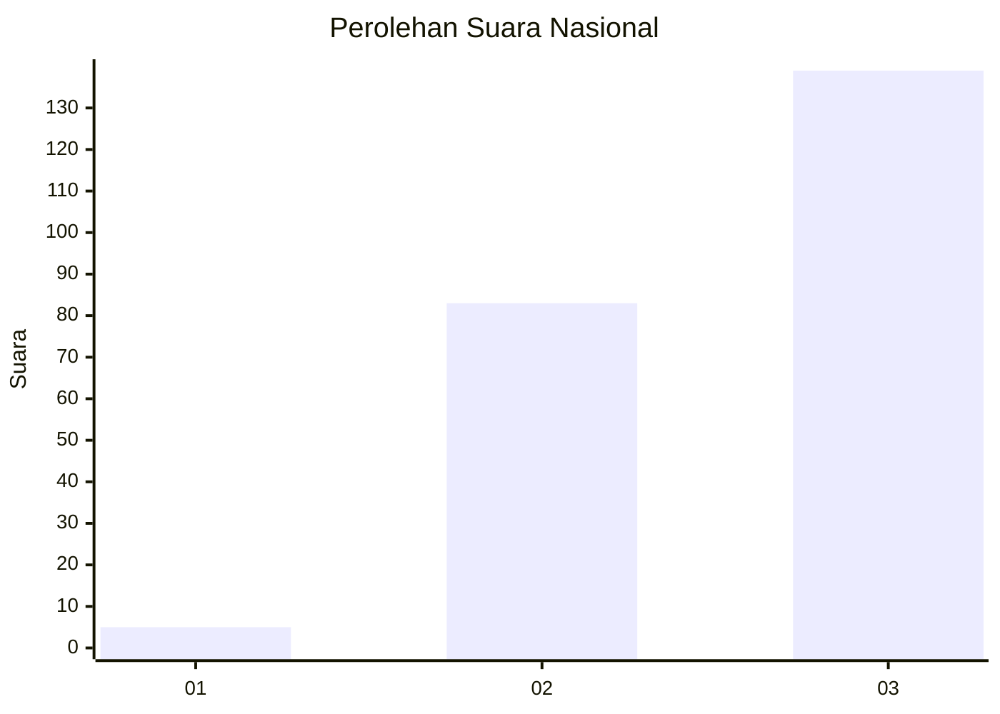
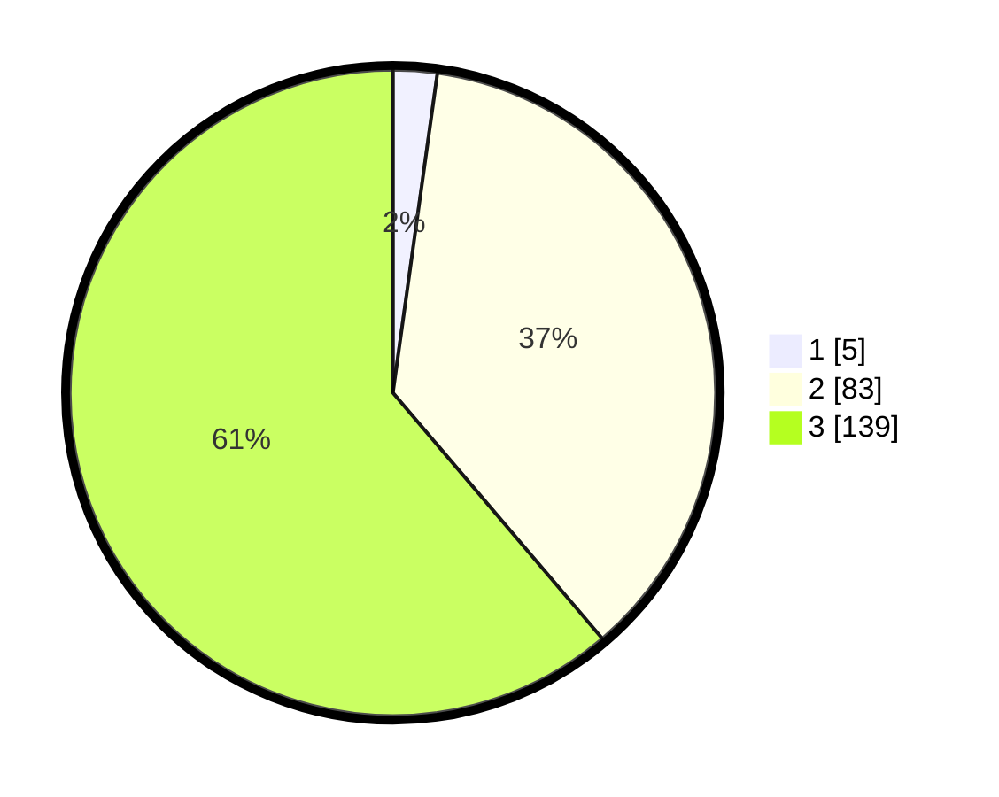

# Hasil

## Grafik

## Tabel

| No. | Nama Paslon    | Suara | Suara (raw) | Persentase |
|:--- |:-------------- | -----:| -----------:| ----------:|
| 1   | ANIES MUHAIMIN | 5     | [5][p-1]    | 2,20       |
| 2   | PRABOWO GIBRAN | 83    | [83][p-2]   | 36,56      |
| 3   | GANJAR MAHFUD  | 139   | [139][p-3]  | 61,23      |

[p-1]: https://github.com/gigit-pemilu/pemilu-2024/blob/main/pilpres/hitung-suara/sub/51-bali/sub/02-tabanan/sub/05-tabanan/sub/2002-gubug/sub/008-tps/sub/paslon-1.txt
[p-2]: https://github.com/gigit-pemilu/pemilu-2024/blob/main/pilpres/hitung-suara/sub/51-bali/sub/02-tabanan/sub/05-tabanan/sub/2002-gubug/sub/008-tps/sub/paslon-2.txt
[p-3]: https://github.com/gigit-pemilu/pemilu-2024/blob/main/pilpres/hitung-suara/sub/51-bali/sub/02-tabanan/sub/05-tabanan/sub/2002-gubug/sub/008-tps/sub/paslon-3.txt

## Foto C Plano

https://sirekap-obj-formc.kpu.go.id/a941/pemilu/ppwp/51/02/05/20/02/5102052002008-20240214-185000--3576587a-2da6-465b-b15a-50013330767a.jpg

https://sirekap-obj-formc.kpu.go.id/a941/pemilu/ppwp/51/02/05/20/02/5102052002008-20240214-185003--956d2de7-d3a8-4e25-ac68-826e028f8b12.jpg

https://sirekap-obj-formc.kpu.go.id/a941/pemilu/ppwp/51/02/05/20/02/5102052002008-20240214-185006--26305806-4c61-4466-b6a0-d2ef35f640ee.jpg

## Metadata

| Key        | Value               |
| ---------- | ------------------- |
| Time Stamp | 2024-02-15 22:30:27 |

