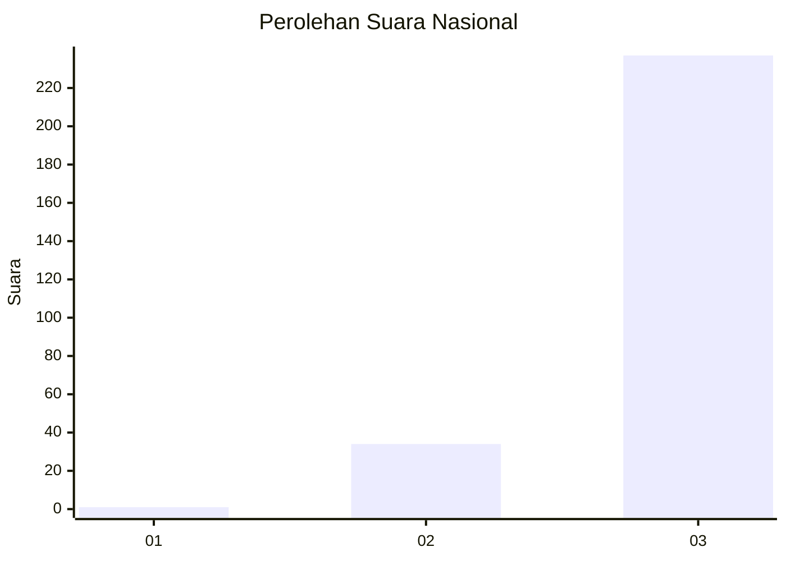
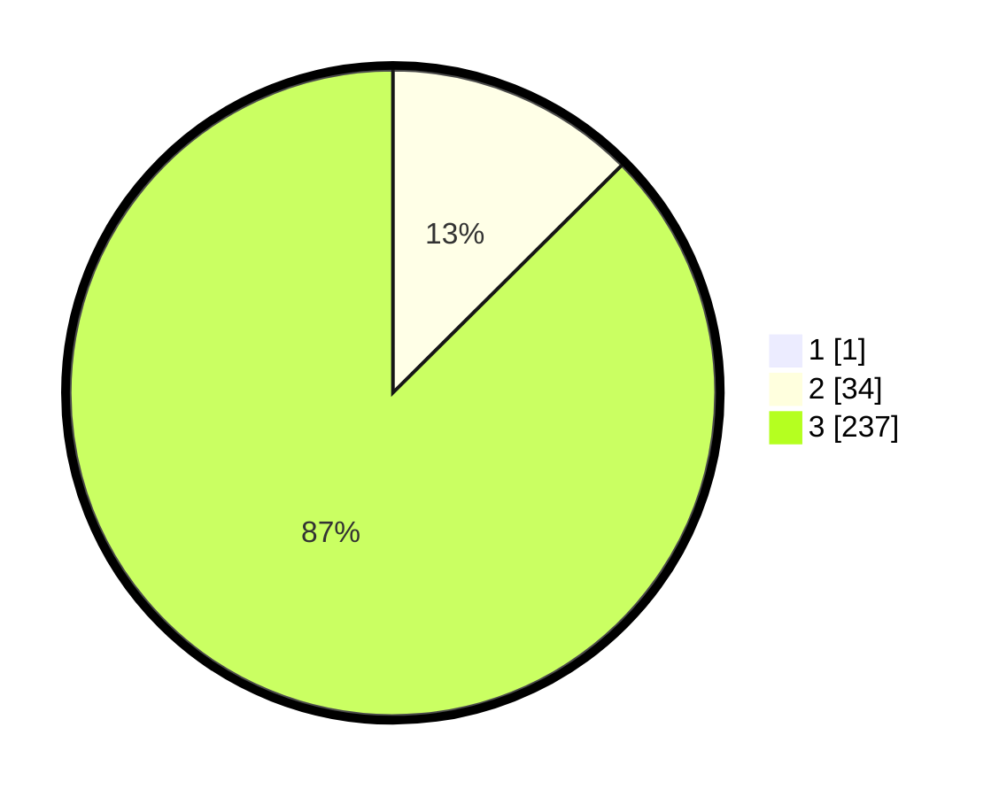

# Hasil

## Grafik

## Tabel

| No. | Nama Paslon    | Suara | Suara (raw) | Persentase |
|:--- |:-------------- | -----:| -----------:| ----------:|
| 1   | ANIES MUHAIMIN | 1     | [1][p-1]    | 0,37       |
| 2   | PRABOWO GIBRAN | 34    | [34][p-2]   | 12,50      |
| 3   | GANJAR MAHFUD  | 237   | [237][p-3]  | 87,13      |

[p-1]: https://github.com/gigit-pemilu/pemilu-2024/blob/main/pilpres/hitung-suara/sub/51-bali/sub/02-tabanan/sub/05-tabanan/sub/2002-gubug/sub/009-tps/sub/paslon-1.txt
[p-2]: https://github.com/gigit-pemilu/pemilu-2024/blob/main/pilpres/hitung-suara/sub/51-bali/sub/02-tabanan/sub/05-tabanan/sub/2002-gubug/sub/009-tps/sub/paslon-2.txt
[p-3]: https://github.com/gigit-pemilu/pemilu-2024/blob/main/pilpres/hitung-suara/sub/51-bali/sub/02-tabanan/sub/05-tabanan/sub/2002-gubug/sub/009-tps/sub/paslon-3.txt

## Foto C Plano

https://sirekap-obj-formc.kpu.go.id/16bd/pemilu/ppwp/51/02/05/20/02/5102052002009-20240214-202138--05a148cc-efac-4f43-97a3-9cebfff1abbb.jpg

https://sirekap-obj-formc.kpu.go.id/16bd/pemilu/ppwp/51/02/05/20/02/5102052002009-20240214-203013--816db6af-b103-4b13-96c3-ad030e64359c.jpg

https://sirekap-obj-formc.kpu.go.id/16bd/pemilu/ppwp/51/02/05/20/02/5102052002009-20240214-202521--afe24df9-0795-4403-a26d-516a5ed464e2.jpg

## Metadata

| Key        | Value               |
| ---------- | ------------------- |
| Time Stamp | 2024-02-15 00:41:44 |

## DATA PEMILIH TETAP

Jumlah pemilih dalam DPT: **288**.
 * L: **138**.
 * P: **150**.

## DATA PENGGUNA HAK PILIH

Jumlah pengguna hak pilih dalam DPT: **274**.
 * L: **132**.
 * P: **142**.

Jumlah pengguna hak pilih dalam DPTb: **1**.
 * L: **1**.
 * P: **0**.

Jumlah pengguna hak pilih dalam DPK: **0**.
 * L: **0**.
 * P: **0**.

Jumlah pengguna hak pilih: **275**.
 * L: **133**.
 * P: **142**.

## JUMLAH SUARA SAH DAN TIDAK SAH

JUMLAH SELURUH SUARA SAH: **272**.

JUMLAH SUARA TIDAK SAH: **3**.

JUMLAH SELURUH SUARA SAH DAN SUARA TIDAK SAH: **275**.

