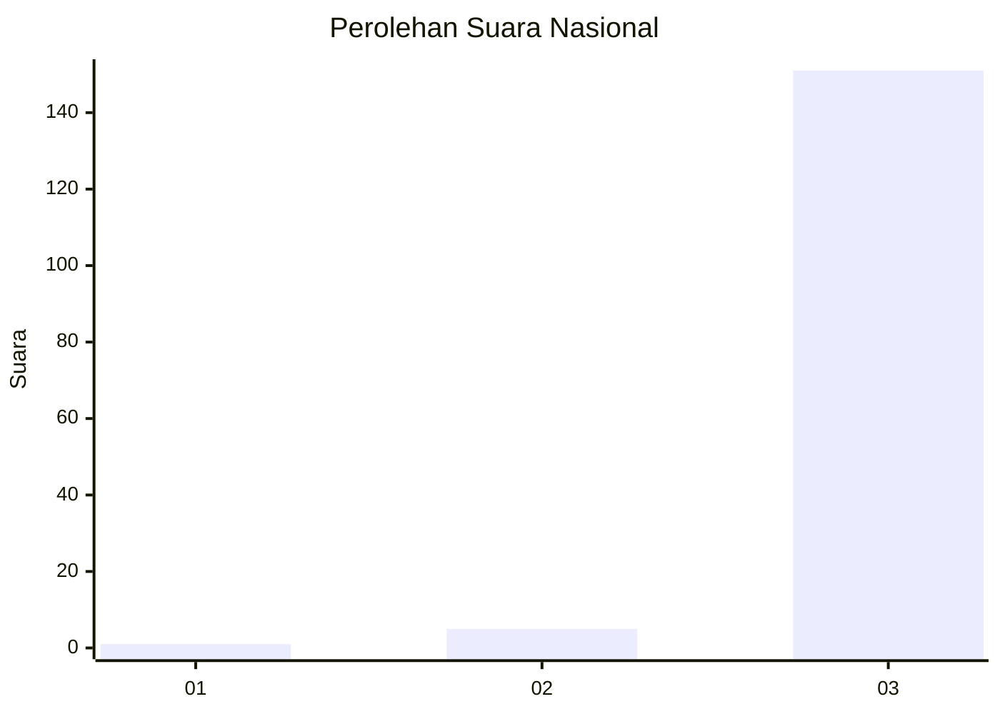
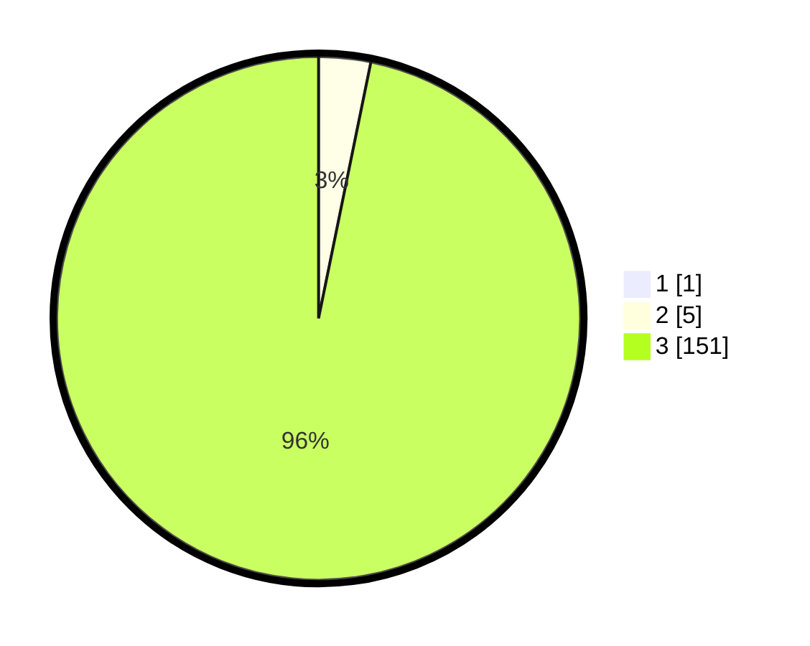

# Hasil

## Grafik

## Tabel

| No. | Nama Paslon    | Suara | Suara (raw) | Persentase |
|:--- |:-------------- | -----:| -----------:| ----------:|
| 1   | ANIES MUHAIMIN | 1     | [1][p-1]    | 0,64       |
| 2   | PRABOWO GIBRAN | 5     | [5][p-2]    | 3,18       |
| 3   | GANJAR MAHFUD  | 151   | [151][p-3]  | 96,18      |

[p-1]: https://github.com/gigit-pemilu/pemilu-2024/blob/main/pilpres/hitung-suara/sub/51-bali/sub/02-tabanan/sub/05-tabanan/sub/2002-gubug/sub/012-tps/sub/paslon-1.txt
[p-2]: https://github.com/gigit-pemilu/pemilu-2024/blob/main/pilpres/hitung-suara/sub/51-bali/sub/02-tabanan/sub/05-tabanan/sub/2002-gubug/sub/012-tps/sub/paslon-2.txt
[p-3]: https://github.com/gigit-pemilu/pemilu-2024/blob/main/pilpres/hitung-suara/sub/51-bali/sub/02-tabanan/sub/05-tabanan/sub/2002-gubug/sub/012-tps/sub/paslon-3.txt

## Foto C Plano

https://sirekap-obj-formc.kpu.go.id/e687/pemilu/ppwp/51/02/05/20/02/5102052002012-20240216-004150--974304ee-2609-4732-911b-f0dbb8883759.jpg

https://sirekap-obj-formc.kpu.go.id/e687/pemilu/ppwp/51/02/05/20/02/5102052002012-20240215-233451--9c22e1de-16d3-4d3a-af4c-81394a903a3e.jpg

https://sirekap-obj-formc.kpu.go.id/e687/pemilu/ppwp/51/02/05/20/02/5102052002012-20240215-142035--ac6f56b4-4378-4fff-a654-d413b0ca0684.jpg

## Metadata

| Key        | Value               |
| ---------- | ------------------- |
| Time Stamp | 2024-02-16 10:30:29 |

## DATA PEMILIH TETAP

Jumlah pemilih dalam DPT: **192**.
 * L: **92**.
 * P: **100**.

## DATA PENGGUNA HAK PILIH

Jumlah pengguna hak pilih dalam DPT: **187**.
 * L: **91**.
 * P: **96**.

Jumlah pengguna hak pilih dalam DPTb: **2**.
 * L: **1**.
 * P: **1**.

Jumlah pengguna hak pilih dalam DPK: **0**.
 * L: **0**.
 * P: **0**.

Jumlah pengguna hak pilih: **189**.
 * L: **92**.
 * P: **97**.

## JUMLAH SUARA SAH DAN TIDAK SAH

JUMLAH SELURUH SUARA SAH: **157**.

JUMLAH SUARA TIDAK SAH: **32**.

JUMLAH SELURUH SUARA SAH DAN SUARA TIDAK SAH: **189**.

