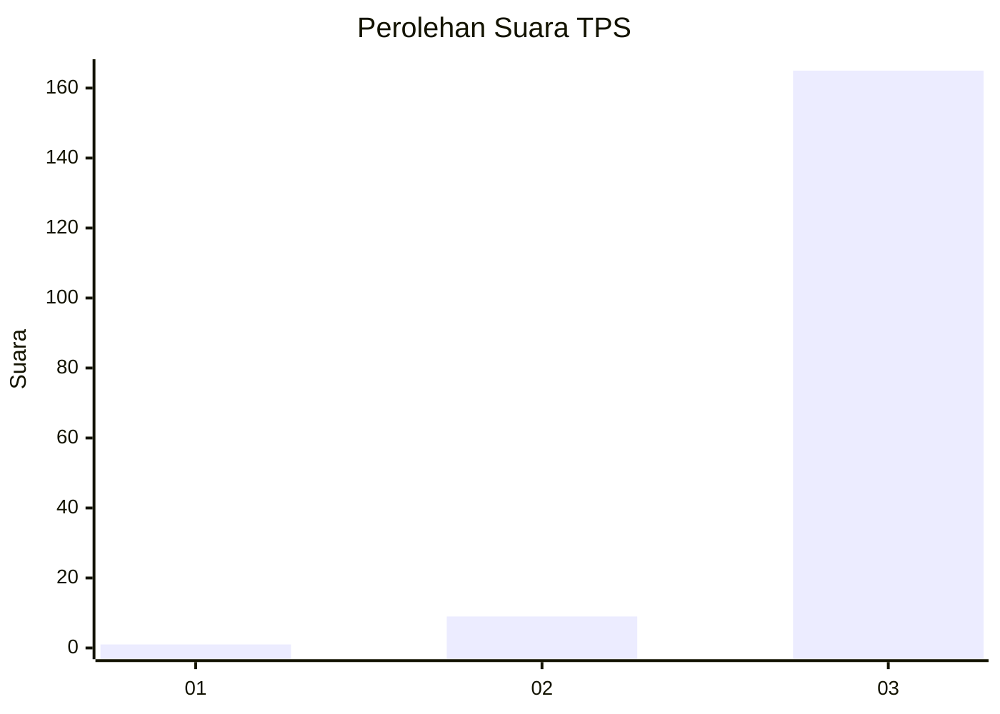
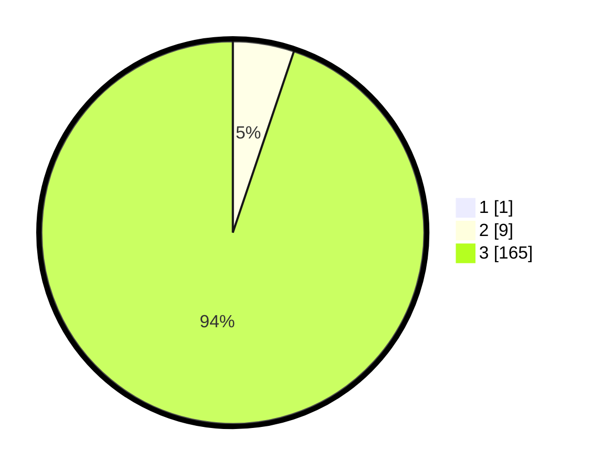

# Hasil

## Grafik

## Tabel

| No. | Nama Paslon    | Suara | Suara (raw) | Persentase |
|:--- |:-------------- | -----:| -----------:| ----------:|
| 1   | ANIES MUHAIMIN | 1     | [1][p-1]    | 0,57       |
| 2   | PRABOWO GIBRAN | 9     | [9][p-2]    | 5,14       |
| 3   | GANJAR MAHFUD  | 165   | [165][p-3]  | 94,29      |

[p-1]: https://github.com/gigit-pemilu/pemilu-2024-51-bali/blob/main/pilpres/hitung-suara/sub/51-bali/sub/02-tabanan/sub/05-tabanan/sub/2002-gubug/sub/013-tps/sub/paslon-1.txt
[p-2]: https://github.com/gigit-pemilu/pemilu-2024-51-bali/blob/main/pilpres/hitung-suara/sub/51-bali/sub/02-tabanan/sub/05-tabanan/sub/2002-gubug/sub/013-tps/sub/paslon-2.txt
[p-3]: https://github.com/gigit-pemilu/pemilu-2024-51-bali/blob/main/pilpres/hitung-suara/sub/51-bali/sub/02-tabanan/sub/05-tabanan/sub/2002-gubug/sub/013-tps/sub/paslon-3.txt

## Foto C Plano

https://sirekap-obj-formc.kpu.go.id/4a15/pemilu/ppwp/51/02/05/20/02/5102052002013-20240216-095440--6ec496cc-80fd-47bc-bbd3-ec15a50422d4.jpg

https://sirekap-obj-formc.kpu.go.id/4a15/pemilu/ppwp/51/02/05/20/02/5102052002013-20240216-095951--b02fda0b-6d6a-45ec-8b25-ea31feaae4d9.jpg

https://sirekap-obj-formc.kpu.go.id/4a15/pemilu/ppwp/51/02/05/20/02/5102052002013-20240216-100256--ab5c0373-ebbc-4db0-9cd0-eed894ef8ca9.jpg

## Metadata

| Key        | Value               |
| ---------- | ------------------- |
| Time Stamp | 2024-02-16 10:30:29 |

## DATA PEMILIH TETAP

Jumlah pemilih dalam DPT: **204**.
 * L: **97**.
 * P: **107**.

## DATA PENGGUNA HAK PILIH

Jumlah pengguna hak pilih dalam DPT: **198**.
 * L: **94**.
 * P: **104**.

Jumlah pengguna hak pilih dalam DPTb: **2**.
 * L: **1**.
 * P: **1**.

Jumlah pengguna hak pilih dalam DPK: **1**.
 * L: **0**.
 * P: **1**.

Jumlah pengguna hak pilih: **201**.
 * L: **95**.
 * P: **106**.

## JUMLAH SUARA SAH DAN TIDAK SAH

JUMLAH SELURUH SUARA SAH: **175**.

JUMLAH SUARA TIDAK SAH: **26**.

JUMLAH SELURUH SUARA SAH DAN SUARA TIDAK SAH: **201**.

