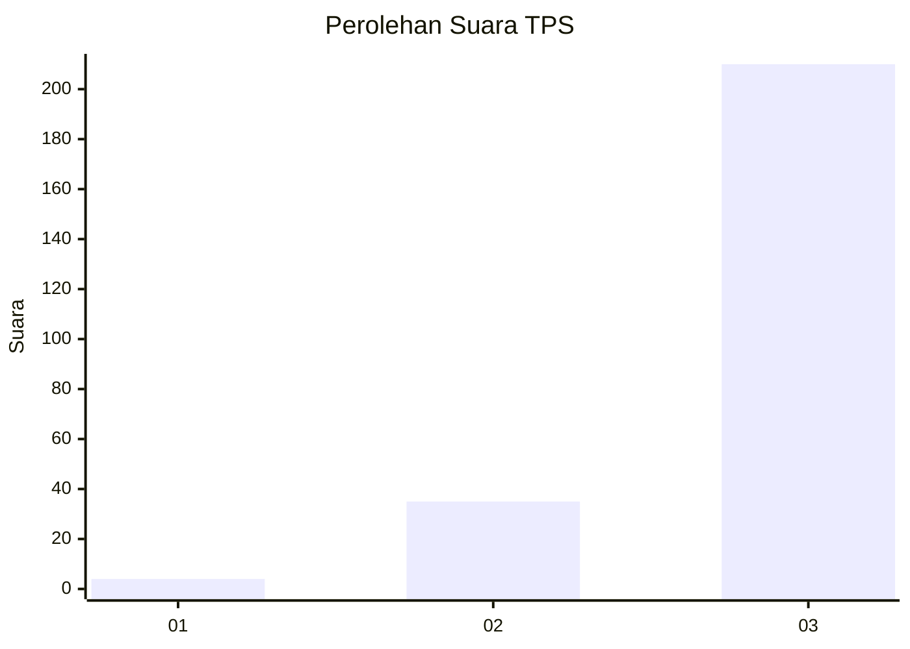
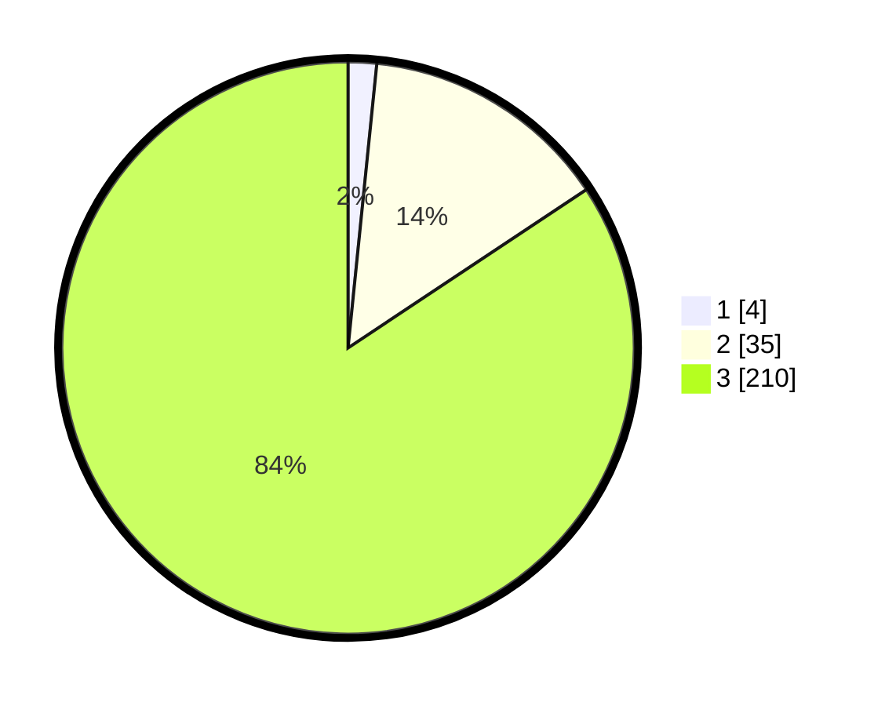

# Hasil

## Grafik

## Tabel

| No. | Nama Paslon    | Suara | Suara (raw) | Persentase |
|:--- |:-------------- | -----:| -----------:| ----------:|
| 1   | ANIES MUHAIMIN | 4     | [4][p-1]    | 1,61       |
| 2   | PRABOWO GIBRAN | 35    | [35][p-2]   | 14,06      |
| 3   | GANJAR MAHFUD  | 210   | [210][p-3]  | 84,34      |

[p-1]: https://github.com/gigit-pemilu/pemilu-2024-51-bali/blob/main/pilpres/hitung-suara/sub/51-bali/sub/02-tabanan/sub/05-tabanan/sub/2002-gubug/sub/014-tps/sub/paslon-1.txt
[p-2]: https://github.com/gigit-pemilu/pemilu-2024-51-bali/blob/main/pilpres/hitung-suara/sub/51-bali/sub/02-tabanan/sub/05-tabanan/sub/2002-gubug/sub/014-tps/sub/paslon-2.txt
[p-3]: https://github.com/gigit-pemilu/pemilu-2024-51-bali/blob/main/pilpres/hitung-suara/sub/51-bali/sub/02-tabanan/sub/05-tabanan/sub/2002-gubug/sub/014-tps/sub/paslon-3.txt

## Foto C Plano

https://sirekap-obj-formc.kpu.go.id/a02e/pemilu/ppwp/51/02/05/20/02/5102052002014-20240214-223940--6bb40a3a-269d-4621-9079-c08768a0fbdd.jpg

https://sirekap-obj-formc.kpu.go.id/a02e/pemilu/ppwp/51/02/05/20/02/5102052002014-20240214-224025--f0d497c4-b7b8-4a46-b954-38df530141c8.jpg

https://sirekap-obj-formc.kpu.go.id/a02e/pemilu/ppwp/51/02/05/20/02/5102052002014-20240214-224100--5ff16157-7fcb-483f-8c39-ef445511a172.jpg

## Metadata

| Key        | Value               |
| ---------- | ------------------- |
| Time Stamp | 2024-02-15 23:29:50 |

