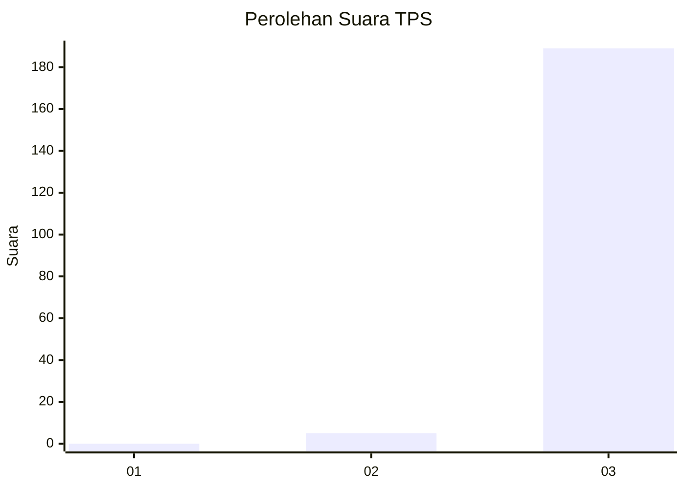
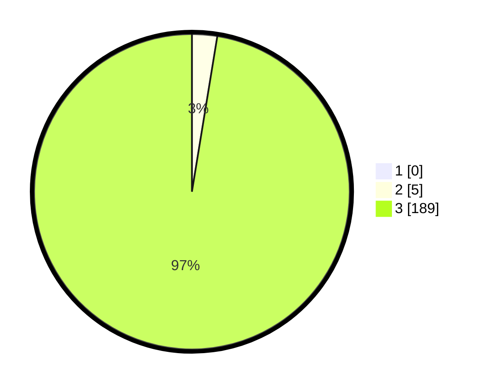

# Hasil

## Grafik

## Tabel

| No. | Nama Paslon    | Suara | Suara (raw) | Persentase |
|:--- |:-------------- | -----:| -----------:| ----------:|
| 1   | ANIES MUHAIMIN | 0     | [0][p-1]    | 0,00       |
| 2   | PRABOWO GIBRAN | 5     | [5][p-2]    | 2,58       |
| 3   | GANJAR MAHFUD  | 189   | [189][p-3]  | 97,42      |

[p-1]: https://github.com/gigit-pemilu/pemilu-2024-51-bali/blob/main/pilpres/hitung-suara/sub/51-bali/sub/02-tabanan/sub/05-tabanan/sub/2002-gubug/sub/015-tps/sub/paslon-1.txt
[p-2]: https://github.com/gigit-pemilu/pemilu-2024-51-bali/blob/main/pilpres/hitung-suara/sub/51-bali/sub/02-tabanan/sub/05-tabanan/sub/2002-gubug/sub/015-tps/sub/paslon-2.txt
[p-3]: https://github.com/gigit-pemilu/pemilu-2024-51-bali/blob/main/pilpres/hitung-suara/sub/51-bali/sub/02-tabanan/sub/05-tabanan/sub/2002-gubug/sub/015-tps/sub/paslon-3.txt

## Foto C Plano

https://sirekap-obj-formc.kpu.go.id/07f8/pemilu/ppwp/51/02/05/20/02/5102052002015-20240215-225709--0ccb9a9d-6c1a-4ae3-b5dc-619b9809ffa9.jpg

https://sirekap-obj-formc.kpu.go.id/07f8/pemilu/ppwp/51/02/05/20/02/5102052002015-20240215-225934--29fc3190-97d3-4be8-98e9-eb2413029e26.jpg

https://sirekap-obj-formc.kpu.go.id/07f8/pemilu/ppwp/51/02/05/20/02/5102052002015-20240215-230126--7eb316eb-015c-43e0-95c9-1e2571936d33.jpg

## Metadata

| Key        | Value               |
| ---------- | ------------------- |
| Time Stamp | 2024-02-24 22:31:28 |

