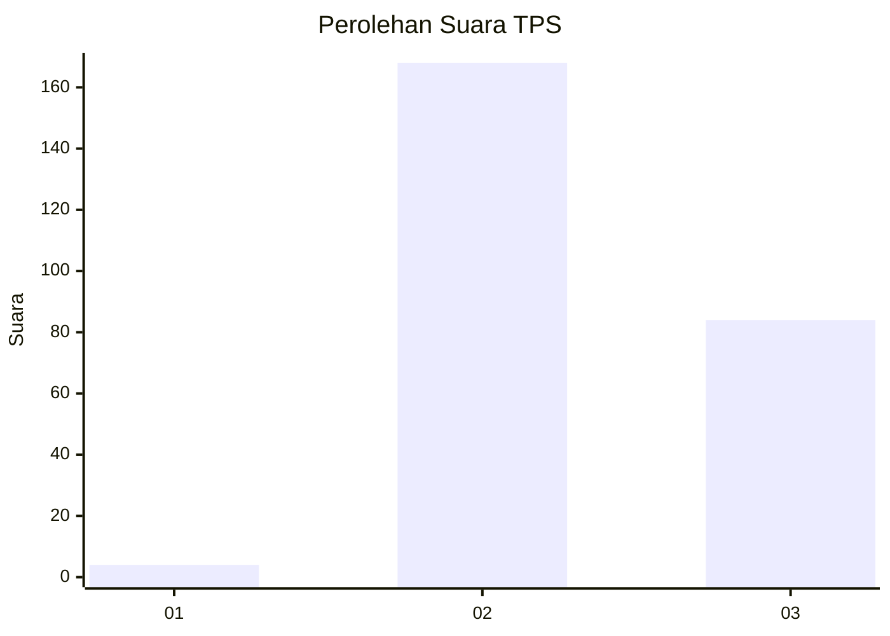
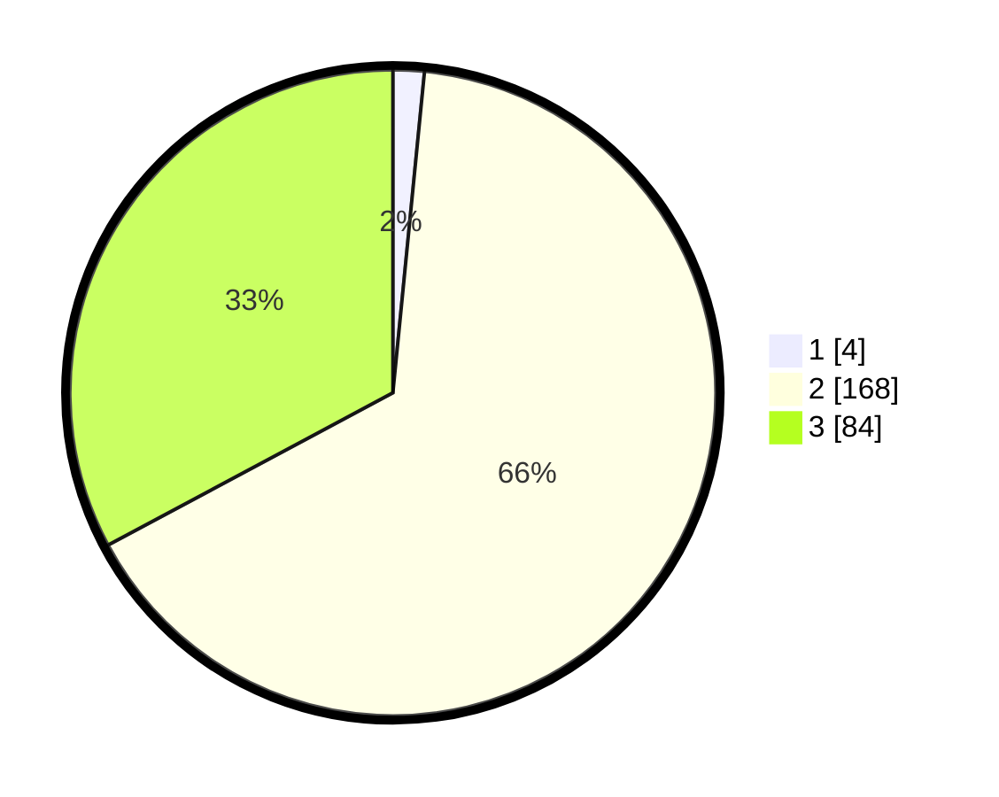

# Hasil

## Grafik

## Tabel

| No. | Nama Paslon    | Suara | Suara (raw) | Persentase |
|:--- |:-------------- | -----:| -----------:| ----------:|
| 1   | ANIES MUHAIMIN | 4     | [4][p-1]    | 1,56       |
| 2   | PRABOWO GIBRAN | 168   | [168][p-2]  | 65,63      |
| 3   | GANJAR MAHFUD  | 84    | [84][p-3]   | 32,81      |

[p-1]: https://github.com/gigit-pemilu/pemilu-2024-51-bali/blob/main/pilpres/hitung-suara/sub/51-bali/sub/02-tabanan/sub/05-tabanan/sub/2002-gubug/sub/016-tps/sub/paslon-1.txt
[p-2]: https://github.com/gigit-pemilu/pemilu-2024-51-bali/blob/main/pilpres/hitung-suara/sub/51-bali/sub/02-tabanan/sub/05-tabanan/sub/2002-gubug/sub/016-tps/sub/paslon-2.txt
[p-3]: https://github.com/gigit-pemilu/pemilu-2024-51-bali/blob/main/pilpres/hitung-suara/sub/51-bali/sub/02-tabanan/sub/05-tabanan/sub/2002-gubug/sub/016-tps/sub/paslon-3.txt

## Foto C Plano

https://sirekap-obj-formc.kpu.go.id/e3fc/pemilu/ppwp/51/02/05/20/02/5102052002016-20240215-010035--366ba45b-cf6c-4fcc-9019-c235feba440e.jpg

https://sirekap-obj-formc.kpu.go.id/e3fc/pemilu/ppwp/51/02/05/20/02/5102052002016-20240215-010623--3ca90211-65b8-44b3-a7f6-03043addad17.jpg

https://sirekap-obj-formc.kpu.go.id/e3fc/pemilu/ppwp/51/02/05/20/02/5102052002016-20240215-011217--9bf39cb3-6b3f-451b-9511-e3e1b12b004c.jpg

## Metadata

| Key        | Value               |
| ---------- | ------------------- |
| Time Stamp | 2024-02-24 22:31:28 |

