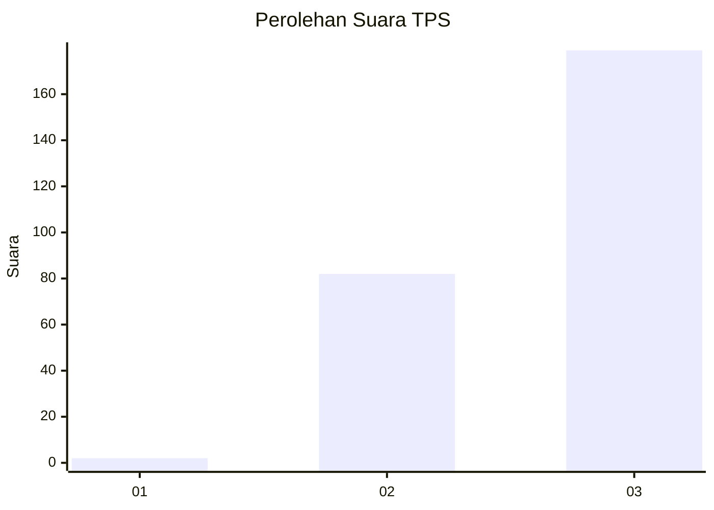
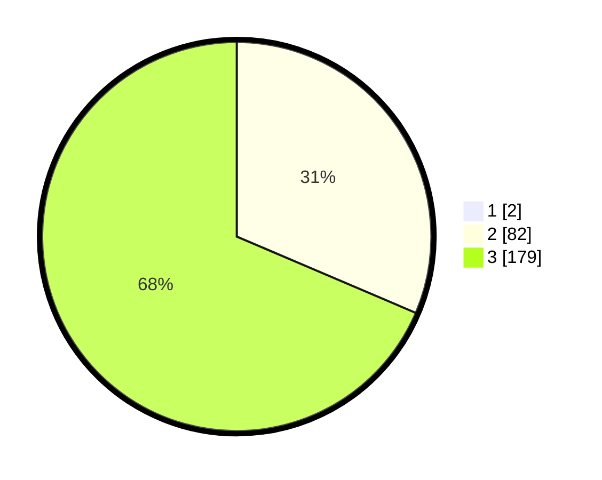

# Hasil

## Grafik

## Tabel

| No. | Nama Paslon    | Suara | Suara (raw) | Persentase |
|:--- |:-------------- | -----:| -----------:| ----------:|
| 1   | ANIES MUHAIMIN | 2     | [2][p-1]    | 0,76       |
| 2   | PRABOWO GIBRAN | 82    | [82][p-2]   | 31,18      |
| 3   | GANJAR MAHFUD  | 179   | [179][p-3]  | 68,06      |

[p-1]: https://github.com/gigit-pemilu/pemilu-2024-51-bali/blob/main/pilpres/hitung-suara/sub/51-bali/sub/02-tabanan/sub/05-tabanan/sub/2002-gubug/sub/017-tps/sub/paslon-1.txt
[p-2]: https://github.com/gigit-pemilu/pemilu-2024-51-bali/blob/main/pilpres/hitung-suara/sub/51-bali/sub/02-tabanan/sub/05-tabanan/sub/2002-gubug/sub/017-tps/sub/paslon-2.txt
[p-3]: https://github.com/gigit-pemilu/pemilu-2024-51-bali/blob/main/pilpres/hitung-suara/sub/51-bali/sub/02-tabanan/sub/05-tabanan/sub/2002-gubug/sub/017-tps/sub/paslon-3.txt

## Foto C Plano

https://sirekap-obj-formc.kpu.go.id/b126/pemilu/ppwp/51/02/05/20/02/5102052002017-20240218-093843--74f18055-58e6-4783-af97-4c89b0928dac.jpg

https://sirekap-obj-formc.kpu.go.id/b126/pemilu/ppwp/51/02/05/20/02/5102052002017-20240214-234526--10f7babc-9a24-488e-9d4d-60fa1bb284de.jpg

https://sirekap-obj-formc.kpu.go.id/b126/pemilu/ppwp/51/02/05/20/02/5102052002017-20240214-234729--2dce8b7a-2c51-4838-b9ef-a56c63e09ba0.jpg

## Metadata

| Key        | Value               |
| ---------- | ------------------- |
| Time Stamp | 2024-02-26 17:00:04 |

