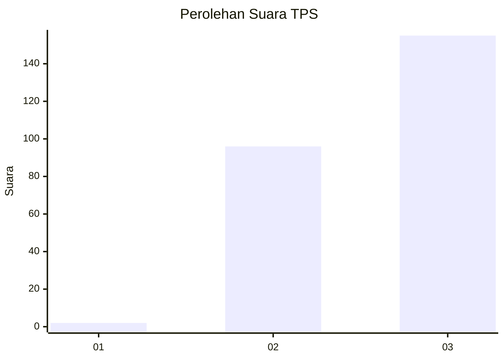
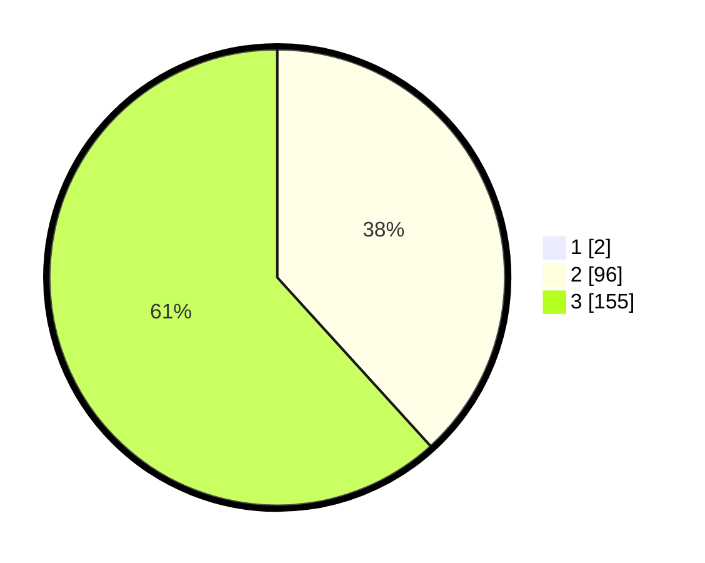

# Hasil

## Grafik

## Tabel

| No. | Nama Paslon    | Suara | Suara (raw) | Persentase |
|:--- |:-------------- | -----:| -----------:| ----------:|
| 1   | ANIES MUHAIMIN | 2     | [2][p-1]    | 0,79       |
| 2   | PRABOWO GIBRAN | 96    | [96][p-2]   | 37,94      |
| 3   | GANJAR MAHFUD  | 155   | [155][p-3]  | 61,26      |

[p-1]: https://github.com/gigit-pemilu/pemilu-2024-51-bali/blob/main/pilpres/hitung-suara/sub/51-bali/sub/02-tabanan/sub/05-tabanan/sub/2003-bongan/sub/009-tps/sub/paslon-1.txt
[p-2]: https://github.com/gigit-pemilu/pemilu-2024-51-bali/blob/main/pilpres/hitung-suara/sub/51-bali/sub/02-tabanan/sub/05-tabanan/sub/2003-bongan/sub/009-tps/sub/paslon-2.txt
[p-3]: https://github.com/gigit-pemilu/pemilu-2024-51-bali/blob/main/pilpres/hitung-suara/sub/51-bali/sub/02-tabanan/sub/05-tabanan/sub/2003-bongan/sub/009-tps/sub/paslon-3.txt

## Foto C Plano

https://sirekap-obj-formc.kpu.go.id/4c14/pemilu/ppwp/51/02/05/20/03/5102052003009-20240215-212432--66502076-a104-49e2-912e-191e30a652b5.jpg

https://sirekap-obj-formc.kpu.go.id/4c14/pemilu/ppwp/51/02/05/20/03/5102052003009-20240215-212435--6ec80507-6edf-4df9-aa62-5a6e81cae608.jpg

https://sirekap-obj-formc.kpu.go.id/4c14/pemilu/ppwp/51/02/05/20/03/5102052003009-20240215-212434--448aaea1-d969-4d81-b570-a8a058b2f784.jpg

## Metadata

| Key        | Value               |
| ---------- | ------------------- |
| Time Stamp | 2024-02-15 22:30:27 |

## DATA PEMILIH TETAP

Jumlah pemilih dalam DPT: **282**.
 * L: **137**.
 * P: **145**.

## DATA PENGGUNA HAK PILIH

Jumlah pengguna hak pilih dalam DPT: **257**.
 * L: **129**.
 * P: **128**.

Jumlah pengguna hak pilih dalam DPTb: **0**.
 * L: **0**.
 * P: **0**.

Jumlah pengguna hak pilih dalam DPK: **1**.
 * L: **0**.
 * P: **1**.

Jumlah pengguna hak pilih: **258**.
 * L: **129**.
 * P: **129**.

## JUMLAH SUARA SAH DAN TIDAK SAH

JUMLAH SELURUH SUARA SAH: **253**.

JUMLAH SUARA TIDAK SAH: **5**.

JUMLAH SELURUH SUARA SAH DAN SUARA TIDAK SAH: **258**.

