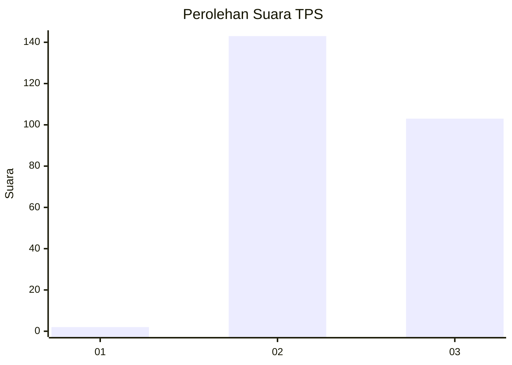
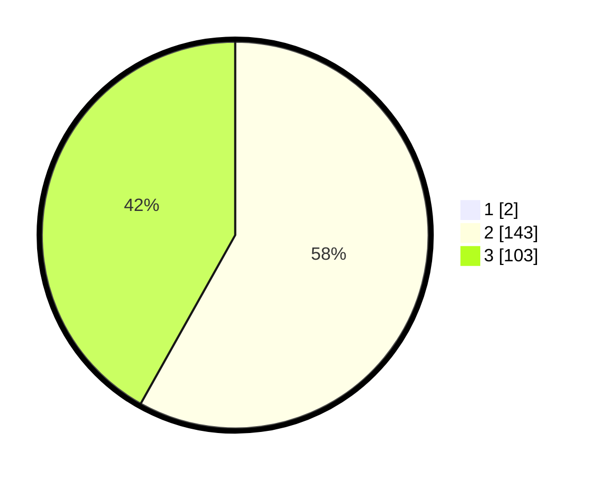

# Hasil

## Grafik

## Tabel

| No. | Nama Paslon    | Suara | Suara (raw) | Persentase |
|:--- |:-------------- | -----:| -----------:| ----------:|
| 1   | ANIES MUHAIMIN | 2     | [2][p-1]    | 0,81       |
| 2   | PRABOWO GIBRAN | 143   | [143][p-2]  | 57,66      |
| 3   | GANJAR MAHFUD  | 103   | [103][p-3]  | 41,53      |

[p-1]: https://github.com/gigit-pemilu/pemilu-2024-51-bali/blob/main/pilpres/hitung-suara/sub/51-bali/sub/02-tabanan/sub/05-tabanan/sub/2003-bongan/sub/011-tps/sub/paslon-1.txt
[p-2]: https://github.com/gigit-pemilu/pemilu-2024-51-bali/blob/main/pilpres/hitung-suara/sub/51-bali/sub/02-tabanan/sub/05-tabanan/sub/2003-bongan/sub/011-tps/sub/paslon-2.txt
[p-3]: https://github.com/gigit-pemilu/pemilu-2024-51-bali/blob/main/pilpres/hitung-suara/sub/51-bali/sub/02-tabanan/sub/05-tabanan/sub/2003-bongan/sub/011-tps/sub/paslon-3.txt

## Foto C Plano

https://sirekap-obj-formc.kpu.go.id/651f/pemilu/ppwp/51/02/05/20/03/5102052003011-20240215-030412--d5127cd5-5b32-4687-96c0-c8ddb89eaee3.jpg

https://sirekap-obj-formc.kpu.go.id/651f/pemilu/ppwp/51/02/05/20/03/5102052003011-20240215-030423--df1ffcd8-53a8-4980-9ad1-99c793a1648a.jpg

https://sirekap-obj-formc.kpu.go.id/651f/pemilu/ppwp/51/02/05/20/03/5102052003011-20240215-030434--8c24908d-4b75-49df-a60a-102f2604adb1.jpg

## Metadata

| Key        | Value               |
| ---------- | ------------------- |
| Time Stamp | 2024-02-25 15:00:00 |

