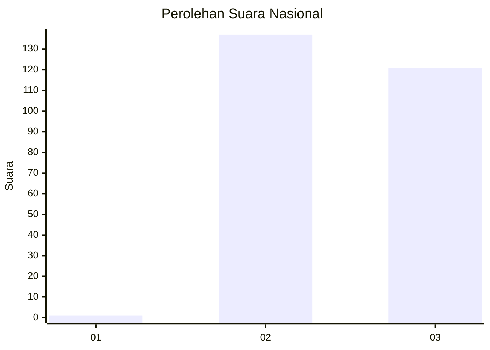
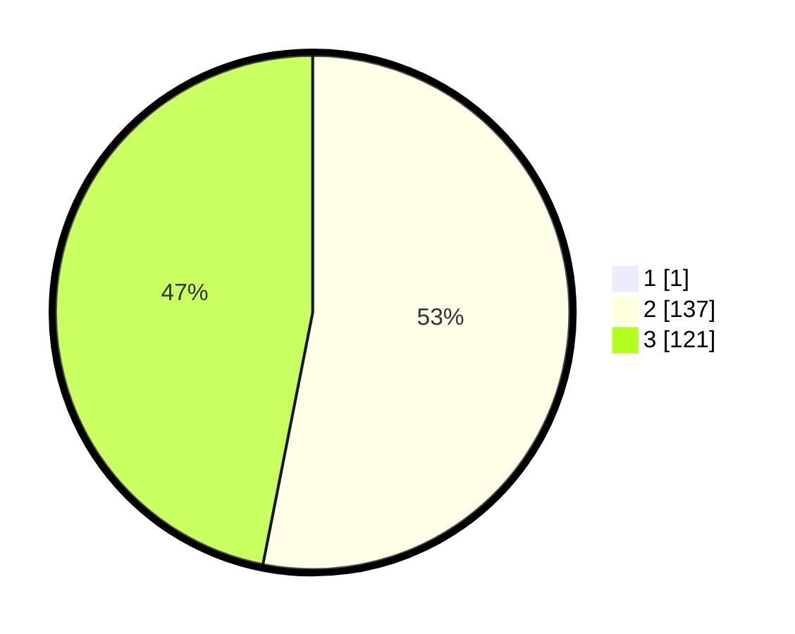

# Hasil

## Grafik

## Tabel

| No. | Nama Paslon    | Suara | Suara (raw) | Persentase |
|:--- |:-------------- | -----:| -----------:| ----------:|
| 1   | ANIES MUHAIMIN | 1     | [1][p-1]    | 0,39       |
| 2   | PRABOWO GIBRAN | 137   | [137][p-2]  | 52,90      |
| 3   | GANJAR MAHFUD  | 121   | [121][p-3]  | 46,72      |

[p-1]: https://github.com/gigit-pemilu/pemilu-2024/blob/main/pilpres/hitung-suara/sub/51-bali/sub/02-tabanan/sub/05-tabanan/sub/2003-bongan/sub/012-tps/sub/paslon-1.txt
[p-2]: https://github.com/gigit-pemilu/pemilu-2024/blob/main/pilpres/hitung-suara/sub/51-bali/sub/02-tabanan/sub/05-tabanan/sub/2003-bongan/sub/012-tps/sub/paslon-2.txt
[p-3]: https://github.com/gigit-pemilu/pemilu-2024/blob/main/pilpres/hitung-suara/sub/51-bali/sub/02-tabanan/sub/05-tabanan/sub/2003-bongan/sub/012-tps/sub/paslon-3.txt

## Foto C Plano

https://sirekap-obj-formc.kpu.go.id/cf63/pemilu/ppwp/51/02/05/20/03/5102052003012-20240215-024250--a3d11cff-b1d9-48a6-85dc-e56dd3b1288c.jpg

https://sirekap-obj-formc.kpu.go.id/cf63/pemilu/ppwp/51/02/05/20/03/5102052003012-20240215-024300--5a8cf65a-0a56-4119-afdd-bcb0c830e09c.jpg

https://sirekap-obj-formc.kpu.go.id/cf63/pemilu/ppwp/51/02/05/20/03/5102052003012-20240215-024307--3e8a7871-8257-45c3-be7a-aadbb8a9a8ae.jpg

## Metadata

| Key        | Value               |
| ---------- | ------------------- |
| Time Stamp | 2024-02-25 12:00:00 |

## DATA PEMILIH TETAP

Jumlah pemilih dalam DPT: **281**.
 * L: **137**.
 * P: **144**.

## DATA PENGGUNA HAK PILIH

Jumlah pengguna hak pilih dalam DPT: **268**.
 * L: **133**.
 * P: **135**.

Jumlah pengguna hak pilih dalam DPTb: **0**.
 * L: **0**.
 * P: **0**.

Jumlah pengguna hak pilih dalam DPK: **0**.
 * L: **0**.
 * P: **0**.

Jumlah pengguna hak pilih: **268**.
 * L: **133**.
 * P: **135**.

## JUMLAH SUARA SAH DAN TIDAK SAH

JUMLAH SELURUH SUARA SAH: **259**.

JUMLAH SUARA TIDAK SAH: **9**.

JUMLAH SELURUH SUARA SAH DAN SUARA TIDAK SAH: **268**.

