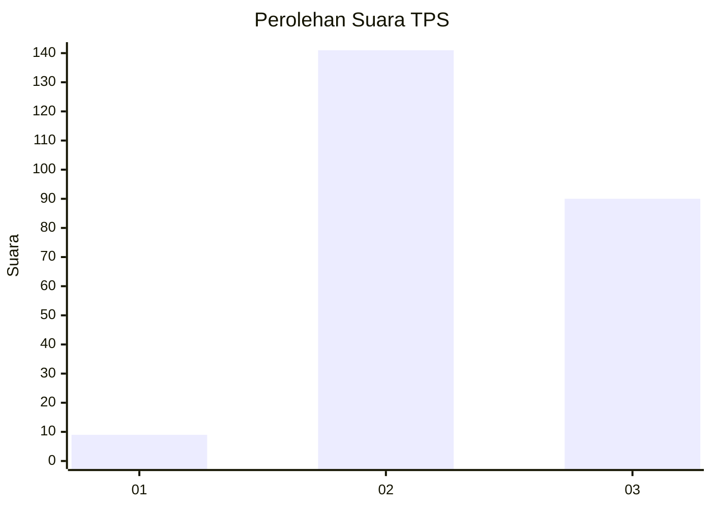
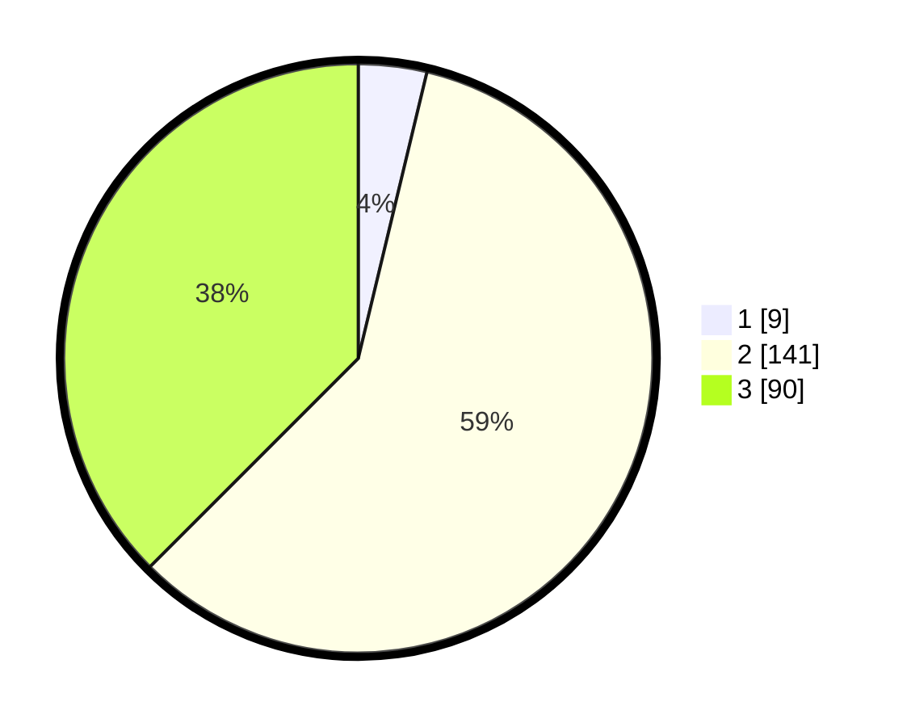

# Hasil

## Grafik

## Tabel

| No. | Nama Paslon    | Suara | Suara (raw) | Persentase |
|:--- |:-------------- | -----:| -----------:| ----------:|
| 1   | ANIES MUHAIMIN | 9     | [9][p-1]    | 3,75       |
| 2   | PRABOWO GIBRAN | 141   | [141][p-2]  | 58,75      |
| 3   | GANJAR MAHFUD  | 90    | [90][p-3]   | 37,50      |

[p-1]: https://github.com/gigit-pemilu/pemilu-2024-51-bali/blob/main/pilpres/hitung-suara/sub/51-bali/sub/02-tabanan/sub/05-tabanan/sub/2003-bongan/sub/013-tps/sub/paslon-1.txt
[p-2]: https://github.com/gigit-pemilu/pemilu-2024-51-bali/blob/main/pilpres/hitung-suara/sub/51-bali/sub/02-tabanan/sub/05-tabanan/sub/2003-bongan/sub/013-tps/sub/paslon-2.txt
[p-3]: https://github.com/gigit-pemilu/pemilu-2024-51-bali/blob/main/pilpres/hitung-suara/sub/51-bali/sub/02-tabanan/sub/05-tabanan/sub/2003-bongan/sub/013-tps/sub/paslon-3.txt

## Foto C Plano

https://sirekap-obj-formc.kpu.go.id/6994/pemilu/ppwp/51/02/05/20/03/5102052003013-20240214-221540--a6af6254-c90f-47b3-af40-17a63eff8390.jpg

https://sirekap-obj-formc.kpu.go.id/6994/pemilu/ppwp/51/02/05/20/03/5102052003013-20240214-221555--70c8ab2b-2d67-4c67-8afd-0558ce51d1ea.jpg

https://sirekap-obj-formc.kpu.go.id/6994/pemilu/ppwp/51/02/05/20/03/5102052003013-20240214-221636--dd9c6b5d-e62f-4b28-9405-7c47f63cd0b2.jpg

## Metadata

| Key        | Value               |
| ---------- | ------------------- |
| Time Stamp | 2024-02-24 22:31:28 |

## DATA PEMILIH TETAP

Jumlah pemilih dalam DPT: **292**.
 * L: **149**.
 * P: **143**.

## DATA PENGGUNA HAK PILIH

Jumlah pengguna hak pilih dalam DPT: **236**.
 * L: **120**.
 * P: **116**.

Jumlah pengguna hak pilih dalam DPTb: **2**.
 * L: **1**.
 * P: **1**.

Jumlah pengguna hak pilih dalam DPK: **6**.
 * L: **2**.
 * P: **4**.

Jumlah pengguna hak pilih: **244**.
 * L: **123**.
 * P: **121**.

## JUMLAH SUARA SAH DAN TIDAK SAH

JUMLAH SELURUH SUARA SAH: **240**.

JUMLAH SUARA TIDAK SAH: **4**.

JUMLAH SELURUH SUARA SAH DAN SUARA TIDAK SAH: **244**.

