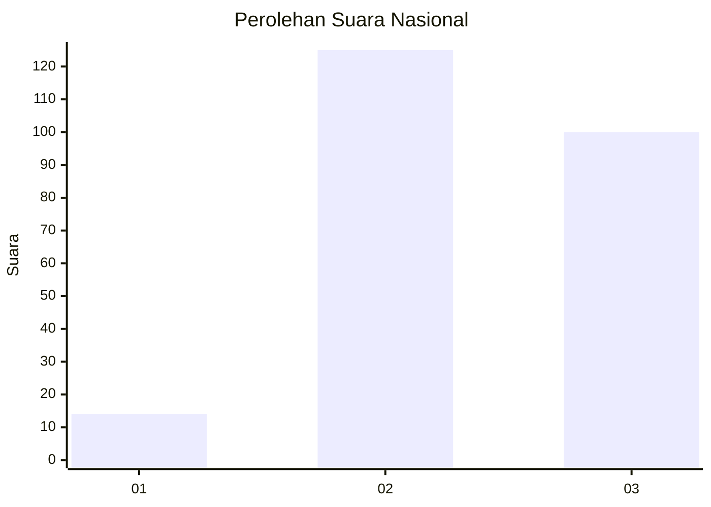
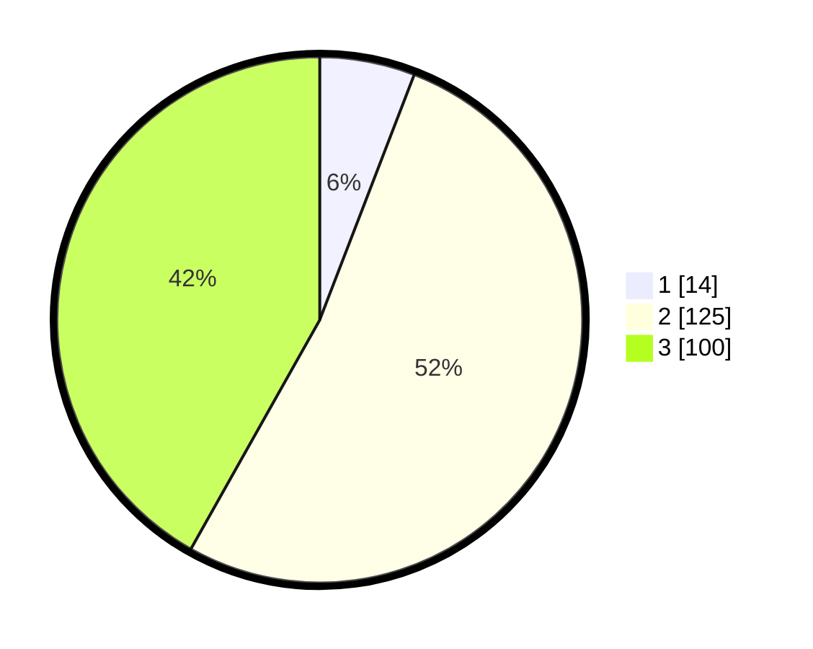

# Hasil

## Grafik

## Tabel

| No. | Nama Paslon    | Suara | Suara (raw) | Persentase |
|:--- |:-------------- | -----:| -----------:| ----------:|
| 1   | ANIES MUHAIMIN | 14    | [14][p-1]   | 5,86       |
| 2   | PRABOWO GIBRAN | 125   | [125][p-2]  | 52,30      |
| 3   | GANJAR MAHFUD  | 100   | [100][p-3]  | 41,84      |

[p-1]: https://github.com/gigit-pemilu/pemilu-2024/blob/main/pilpres/hitung-suara/sub/51-bali/sub/02-tabanan/sub/05-tabanan/sub/2003-bongan/sub/014-tps/sub/paslon-1.txt
[p-2]: https://github.com/gigit-pemilu/pemilu-2024/blob/main/pilpres/hitung-suara/sub/51-bali/sub/02-tabanan/sub/05-tabanan/sub/2003-bongan/sub/014-tps/sub/paslon-2.txt
[p-3]: https://github.com/gigit-pemilu/pemilu-2024/blob/main/pilpres/hitung-suara/sub/51-bali/sub/02-tabanan/sub/05-tabanan/sub/2003-bongan/sub/014-tps/sub/paslon-3.txt

## Foto C Plano

https://sirekap-obj-formc.kpu.go.id/161d/pemilu/ppwp/51/02/05/20/03/5102052003014-20240214-201808--53778d36-cd58-43a8-ad0e-f7a93b3c68da.jpg

https://sirekap-obj-formc.kpu.go.id/161d/pemilu/ppwp/51/02/05/20/03/5102052003014-20240214-201848--704c4505-ba8e-47ba-a826-1d33ba37fd9d.jpg

https://sirekap-obj-formc.kpu.go.id/161d/pemilu/ppwp/51/02/05/20/03/5102052003014-20240214-201926--87644e6a-0b2d-4649-90cd-da1c869ad2ce.jpg

## Metadata

| Key        | Value               |
| ---------- | ------------------- |
| Time Stamp | 2024-02-14 21:46:01 |

## DATA PEMILIH TETAP

Jumlah pemilih dalam DPT: **296**.
 * L: **140**.
 * P: **156**.

## DATA PENGGUNA HAK PILIH

Jumlah pengguna hak pilih dalam DPT: **242**.
 * L: **117**.
 * P: **125**.

Jumlah pengguna hak pilih dalam DPTb: **0**.
 * L: **0**.
 * P: **0**.

Jumlah pengguna hak pilih dalam DPK: **0**.
 * L: **0**.
 * P: **0**.

Jumlah pengguna hak pilih: **242**.
 * L: **117**.
 * P: **125**.

## JUMLAH SUARA SAH DAN TIDAK SAH

JUMLAH SELURUH SUARA SAH: **239**.

JUMLAH SUARA TIDAK SAH: **3**.

JUMLAH SELURUH SUARA SAH DAN SUARA TIDAK SAH: **242**.

