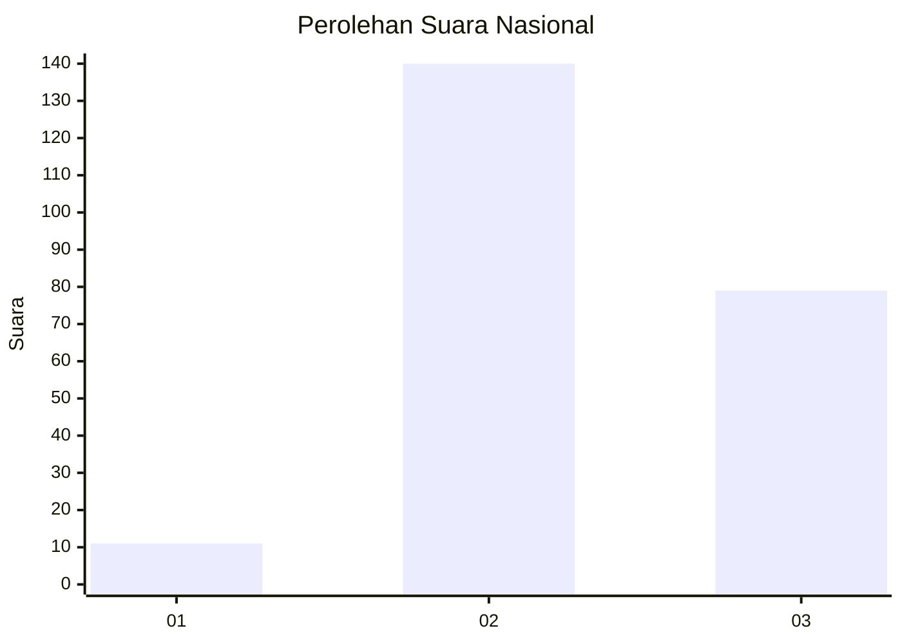
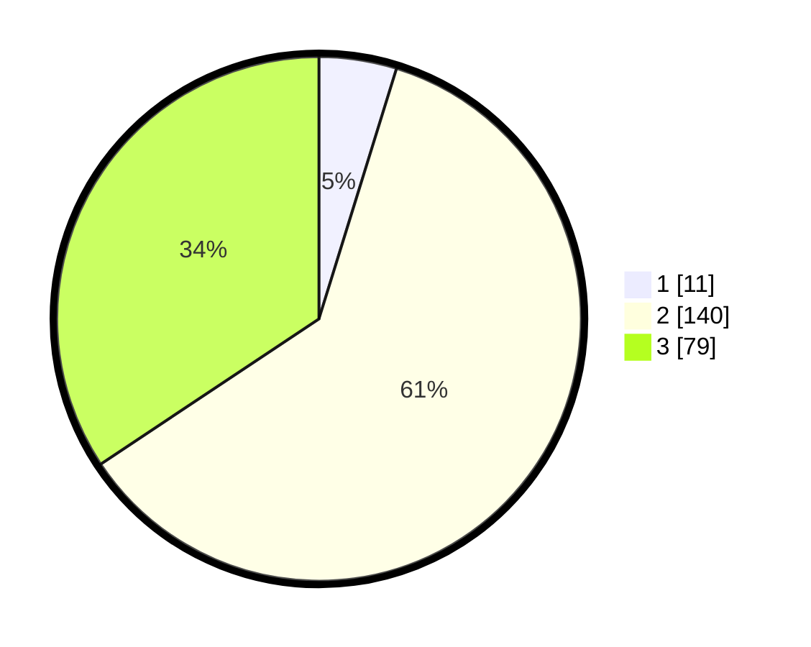

# Hasil

## Grafik

## Tabel

| No. | Nama Paslon    | Suara | Suara (raw) | Persentase |
|:--- |:-------------- | -----:| -----------:| ----------:|
| 1   | ANIES MUHAIMIN | 11    | [11][p-1]   | 4,78       |
| 2   | PRABOWO GIBRAN | 140   | [140][p-2]  | 60,87      |
| 3   | GANJAR MAHFUD  | 79    | [79][p-3]   | 34,35      |

[p-1]: https://github.com/gigit-pemilu/pemilu-2024/blob/main/pilpres/hitung-suara/sub/51-bali/sub/02-tabanan/sub/05-tabanan/sub/2003-bongan/sub/015-tps/sub/paslon-1.txt
[p-2]: https://github.com/gigit-pemilu/pemilu-2024/blob/main/pilpres/hitung-suara/sub/51-bali/sub/02-tabanan/sub/05-tabanan/sub/2003-bongan/sub/015-tps/sub/paslon-2.txt
[p-3]: https://github.com/gigit-pemilu/pemilu-2024/blob/main/pilpres/hitung-suara/sub/51-bali/sub/02-tabanan/sub/05-tabanan/sub/2003-bongan/sub/015-tps/sub/paslon-3.txt

## Foto C Plano

https://sirekap-obj-formc.kpu.go.id/61e3/pemilu/ppwp/51/02/05/20/03/5102052003015-20240215-020316--703798e3-1cb1-4656-b2f6-a64556e59977.jpg

https://sirekap-obj-formc.kpu.go.id/61e3/pemilu/ppwp/51/02/05/20/03/5102052003015-20240215-020627--75e1c9f0-c73a-459e-b259-b4f2877818ab.jpg

https://sirekap-obj-formc.kpu.go.id/61e3/pemilu/ppwp/51/02/05/20/03/5102052003015-20240215-020455--74729b0d-55b2-4ab2-b1ed-65fe84e5a9f5.jpg

## Metadata

| Key        | Value               |
| ---------- | ------------------- |
| Time Stamp | 2024-02-24 22:31:28 |

