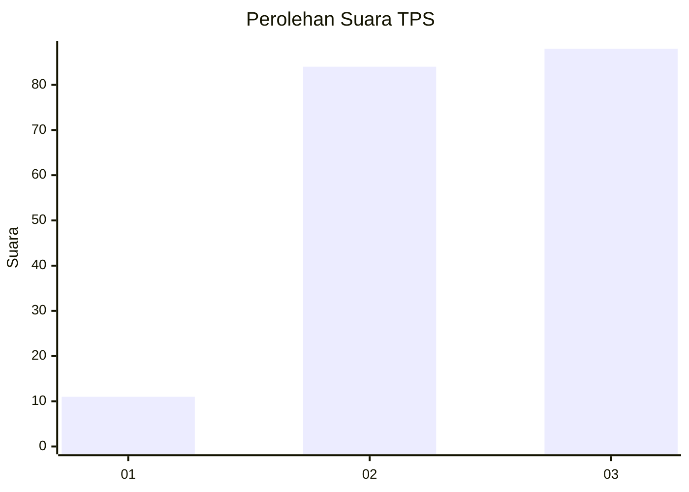
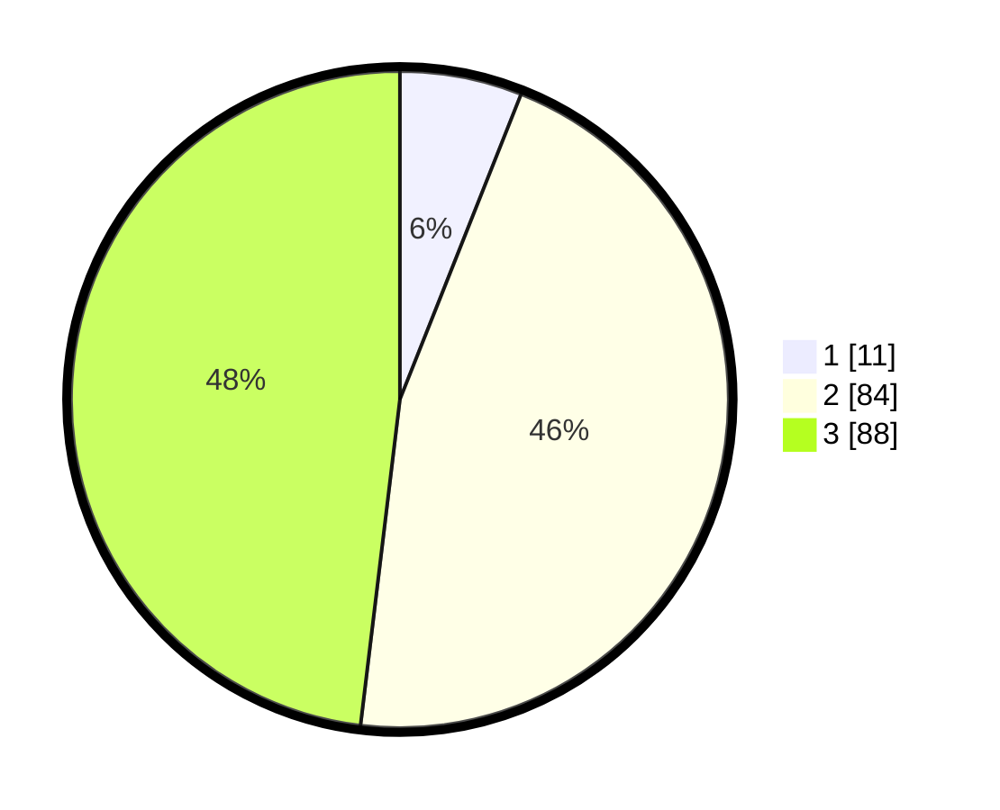

# Hasil

## Grafik

## Tabel

| No. | Nama Paslon    | Suara | Suara (raw) | Persentase |
|:--- |:-------------- | -----:| -----------:| ----------:|
| 1   | ANIES MUHAIMIN | 11    | [11][p-1]   | 6,01       |
| 2   | PRABOWO GIBRAN | 84    | [84][p-2]   | 45,90      |
| 3   | GANJAR MAHFUD  | 88    | [88][p-3]   | 48,09      |

[p-1]: https://github.com/gigit-pemilu/pemilu-2024-51-bali/blob/main/pilpres/hitung-suara/sub/51-bali/sub/02-tabanan/sub/05-tabanan/sub/2003-bongan/sub/016-tps/sub/paslon-1.txt
[p-2]: https://github.com/gigit-pemilu/pemilu-2024-51-bali/blob/main/pilpres/hitung-suara/sub/51-bali/sub/02-tabanan/sub/05-tabanan/sub/2003-bongan/sub/016-tps/sub/paslon-2.txt
[p-3]: https://github.com/gigit-pemilu/pemilu-2024-51-bali/blob/main/pilpres/hitung-suara/sub/51-bali/sub/02-tabanan/sub/05-tabanan/sub/2003-bongan/sub/016-tps/sub/paslon-3.txt

## Foto C Plano

https://sirekap-obj-formc.kpu.go.id/7e9f/pemilu/ppwp/51/02/05/20/03/5102052003016-20240214-235727--ae5c5640-994d-479c-87ec-d74006ed7fc2.jpg

https://sirekap-obj-formc.kpu.go.id/7e9f/pemilu/ppwp/51/02/05/20/03/5102052003016-20240215-004345--0cc4e7e8-d341-48b0-94ef-13a51c5151b6.jpg

https://sirekap-obj-formc.kpu.go.id/7e9f/pemilu/ppwp/51/02/05/20/03/5102052003016-20240215-004459--de48eb66-544b-45bd-a420-512d74100e58.jpg

## Metadata

| Key        | Value               |
| ---------- | ------------------- |
| Time Stamp | 2024-02-26 23:00:00 |

## DATA PEMILIH TETAP

Jumlah pemilih dalam DPT: **210**.
 * L: **99**.
 * P: **111**.

## DATA PENGGUNA HAK PILIH

Jumlah pengguna hak pilih dalam DPT: **182**.
 * L: **86**.
 * P: **96**.

Jumlah pengguna hak pilih dalam DPTb: **0**.
 * L: **0**.
 * P: **0**.

Jumlah pengguna hak pilih dalam DPK: **6**.
 * L: **3**.
 * P: **3**.

Jumlah pengguna hak pilih: **188**.
 * L: **89**.
 * P: **102**.

## JUMLAH SUARA SAH DAN TIDAK SAH

JUMLAH SELURUH SUARA SAH: **183**.

JUMLAH SUARA TIDAK SAH: **5**.

JUMLAH SELURUH SUARA SAH DAN SUARA TIDAK SAH: **188**.

