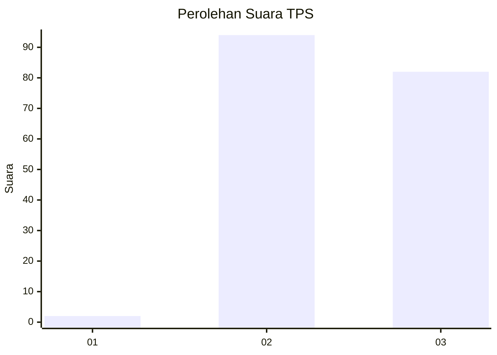
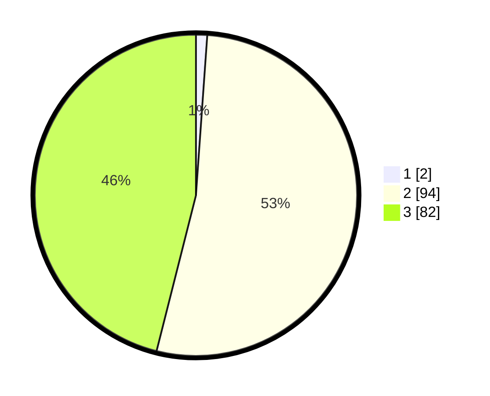

# Hasil

## Grafik

## Tabel

| No. | Nama Paslon    | Suara | Suara (raw) | Persentase |
|:--- |:-------------- | -----:| -----------:| ----------:|
| 1   | ANIES MUHAIMIN | 2     | [2][p-1]    | 1,12       |
| 2   | PRABOWO GIBRAN | 94    | [94][p-2]   | 52,81      |
| 3   | GANJAR MAHFUD  | 82    | [82][p-3]   | 46,07      |

[p-1]: https://github.com/gigit-pemilu/pemilu-2024-51-bali/blob/main/pilpres/hitung-suara/sub/51-bali/sub/02-tabanan/sub/05-tabanan/sub/2003-bongan/sub/018-tps/sub/paslon-1.txt
[p-2]: https://github.com/gigit-pemilu/pemilu-2024-51-bali/blob/main/pilpres/hitung-suara/sub/51-bali/sub/02-tabanan/sub/05-tabanan/sub/2003-bongan/sub/018-tps/sub/paslon-2.txt
[p-3]: https://github.com/gigit-pemilu/pemilu-2024-51-bali/blob/main/pilpres/hitung-suara/sub/51-bali/sub/02-tabanan/sub/05-tabanan/sub/2003-bongan/sub/018-tps/sub/paslon-3.txt

## Foto C Plano

https://sirekap-obj-formc.kpu.go.id/e1ef/pemilu/ppwp/51/02/05/20/03/5102052003018-20240216-211351--3a1543a7-4f64-4433-9152-5892c7c2f7a1.jpg

https://sirekap-obj-formc.kpu.go.id/e1ef/pemilu/ppwp/51/02/05/20/03/5102052003018-20240216-211126--c9979937-82a8-428a-873b-0e1e57fec122.jpg

https://sirekap-obj-formc.kpu.go.id/e1ef/pemilu/ppwp/51/02/05/20/03/5102052003018-20240216-205400--922e9fef-f1c4-48dc-9b84-191774e5aca4.jpg

## Metadata

| Key        | Value               |
| ---------- | ------------------- |
| Time Stamp | 2024-02-24 22:31:28 |

