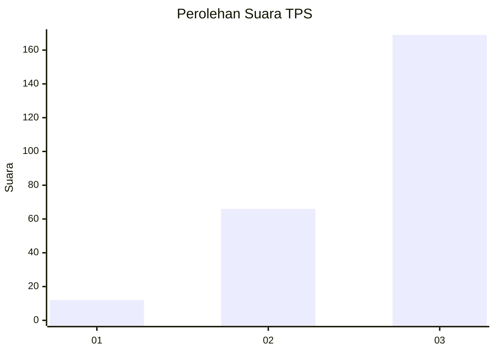
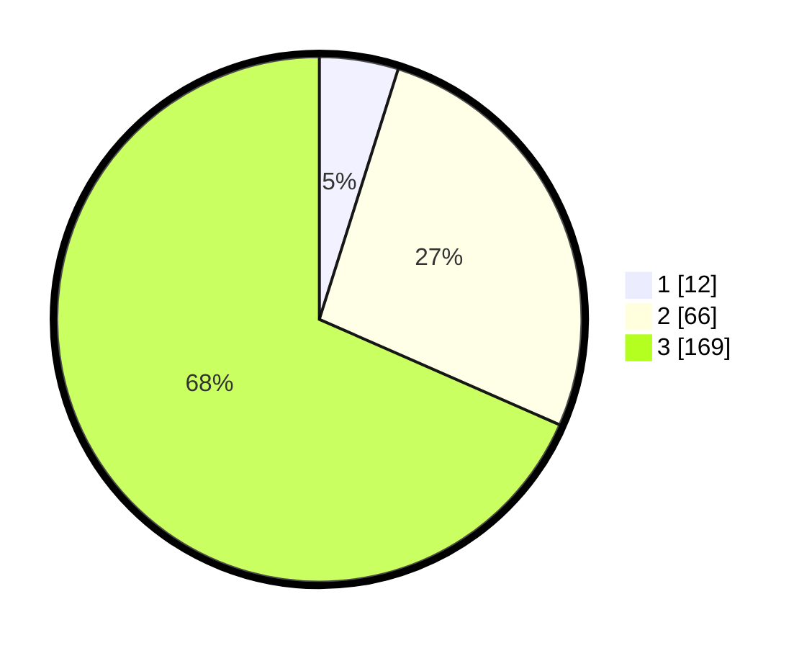

# Hasil

## Grafik

## Tabel

| No. | Nama Paslon    | Suara | Suara (raw) | Persentase |
|:--- |:-------------- | -----:| -----------:| ----------:|
| 1   | ANIES MUHAIMIN | 12    | [12][p-1]   | 4,86       |
| 2   | PRABOWO GIBRAN | 66    | [66][p-2]   | 26,72      |
| 3   | GANJAR MAHFUD  | 169   | [169][p-3]  | 68,42      |

[p-1]: https://github.com/gigit-pemilu/pemilu-2024-51-bali/blob/main/pilpres/hitung-suara/sub/51-bali/sub/02-tabanan/sub/05-tabanan/sub/2003-bongan/sub/019-tps/sub/paslon-1.txt
[p-2]: https://github.com/gigit-pemilu/pemilu-2024-51-bali/blob/main/pilpres/hitung-suara/sub/51-bali/sub/02-tabanan/sub/05-tabanan/sub/2003-bongan/sub/019-tps/sub/paslon-2.txt
[p-3]: https://github.com/gigit-pemilu/pemilu-2024-51-bali/blob/main/pilpres/hitung-suara/sub/51-bali/sub/02-tabanan/sub/05-tabanan/sub/2003-bongan/sub/019-tps/sub/paslon-3.txt

## Foto C Plano

https://sirekap-obj-formc.kpu.go.id/baa0/pemilu/ppwp/51/02/05/20/03/5102052003019-20240214-212156--cabdc6d6-4549-4cfe-882e-c4a9fae73efe.jpg

https://sirekap-obj-formc.kpu.go.id/baa0/pemilu/ppwp/51/02/05/20/03/5102052003019-20240214-194629--f9aea82c-f395-46c8-abb5-f8f6afa020eb.jpg

https://sirekap-obj-formc.kpu.go.id/baa0/pemilu/ppwp/51/02/05/20/03/5102052003019-20240214-194819--e53bed35-7a9c-4a9b-8f00-20d0ea34eff5.jpg

## Metadata

| Key        | Value               |
| ---------- | ------------------- |
| Time Stamp | 2024-02-24 22:31:28 |

