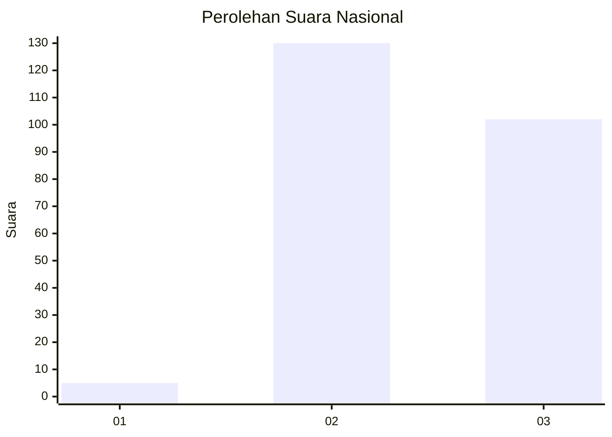
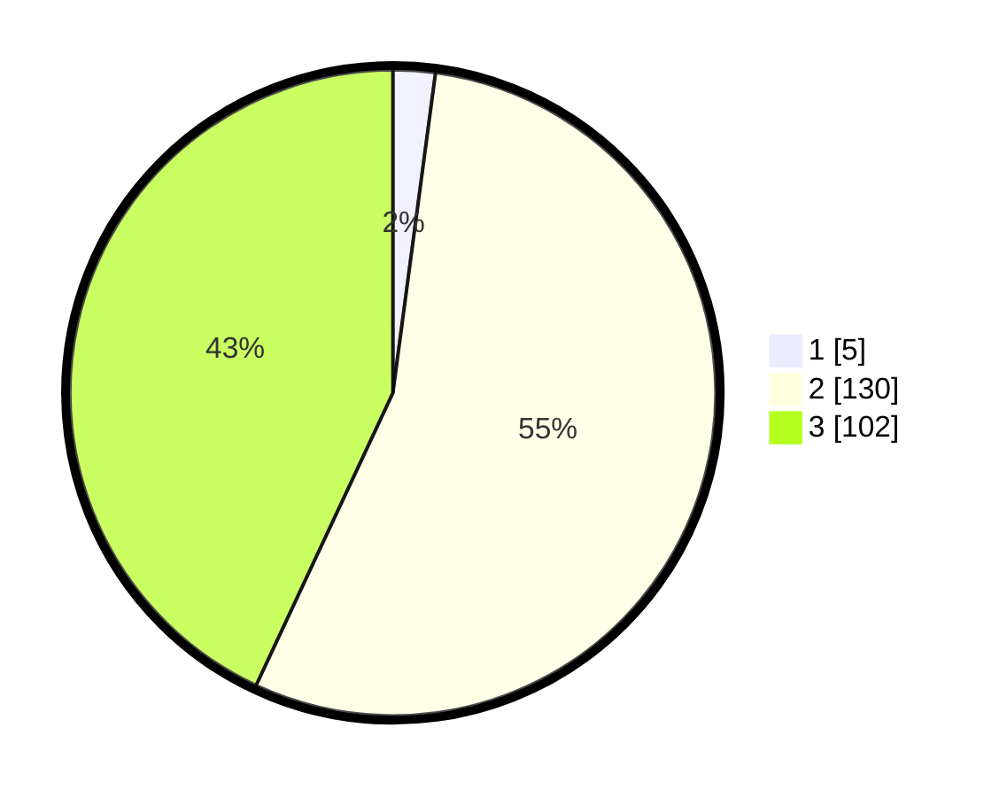

# Hasil

## Grafik

## Tabel

| No. | Nama Paslon    | Suara | Suara (raw) | Persentase |
|:--- |:-------------- | -----:| -----------:| ----------:|
| 1   | ANIES MUHAIMIN | 5     | [5][p-1]    | 2,11       |
| 2   | PRABOWO GIBRAN | 130   | [130][p-2]  | 54,85      |
| 3   | GANJAR MAHFUD  | 102   | [102][p-3]  | 43,04      |

[p-1]: https://github.com/gigit-pemilu/pemilu-2024/blob/main/pilpres/hitung-suara/sub/51-bali/sub/02-tabanan/sub/05-tabanan/sub/2004-delod-peken/sub/002-tps/sub/paslon-1.txt
[p-2]: https://github.com/gigit-pemilu/pemilu-2024/blob/main/pilpres/hitung-suara/sub/51-bali/sub/02-tabanan/sub/05-tabanan/sub/2004-delod-peken/sub/002-tps/sub/paslon-2.txt
[p-3]: https://github.com/gigit-pemilu/pemilu-2024/blob/main/pilpres/hitung-suara/sub/51-bali/sub/02-tabanan/sub/05-tabanan/sub/2004-delod-peken/sub/002-tps/sub/paslon-3.txt

## Foto C Plano

https://sirekap-obj-formc.kpu.go.id/741d/pemilu/ppwp/51/02/05/20/04/5102052004002-20240215-000703--8367ab64-2fc3-4f43-ac42-095856f7e3d8.jpg

https://sirekap-obj-formc.kpu.go.id/741d/pemilu/ppwp/51/02/05/20/04/5102052004002-20240214-212752--f7a91f5a-d92f-4778-9235-255df7b86977.jpg

https://sirekap-obj-formc.kpu.go.id/741d/pemilu/ppwp/51/02/05/20/04/5102052004002-20240214-212853--309bee94-e626-4c0c-92d5-cf16cef17380.jpg

## Metadata

| Key        | Value               |
| ---------- | ------------------- |
| Time Stamp | 2024-02-24 22:31:28 |

