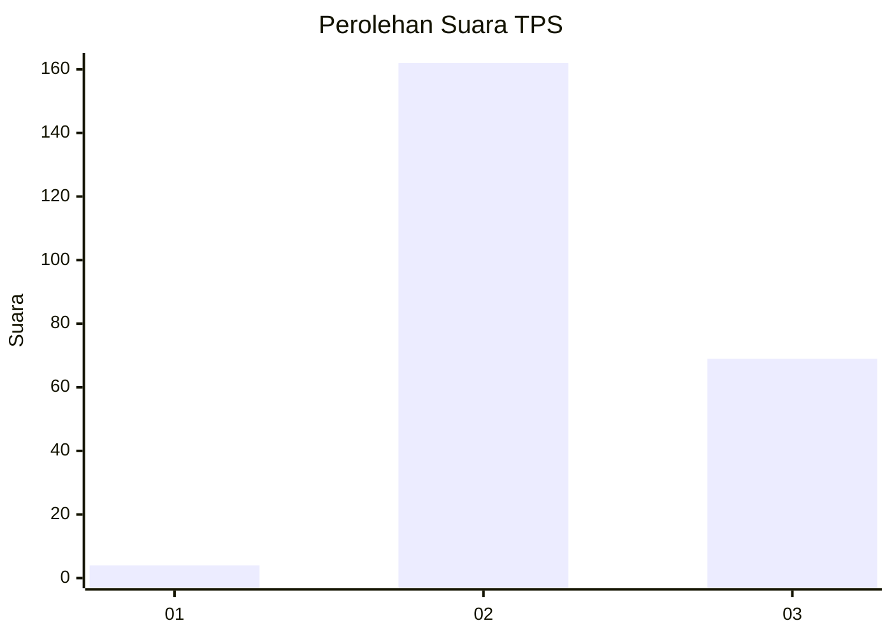

# Hasil

## Grafik

## Tabel

| No. | Nama Paslon    | Suara | Suara (raw) | Persentase |
|:--- |:-------------- | -----:| -----------:| ----------:|
| 1   | ANIES MUHAIMIN | 4     | [4][p-1]    | 1,70       |
| 2   | PRABOWO GIBRAN | 162   | [162][p-2]  | 68,94      |
| 3   | GANJAR MAHFUD  | 69    | [69][p-3]   | 29,36      |

[p-1]: https://github.com/gigit-pemilu/pemilu-2024-51-bali/blob/main/pilpres/hitung-suara/sub/51-bali/sub/02-tabanan/sub/05-tabanan/sub/2004-delod-peken/sub/010-tps/sub/paslon-1.txt
[p-2]: https://github.com/gigit-pemilu/pemilu-2024-51-bali/blob/main/pilpres/hitung-suara/sub/51-bali/sub/02-tabanan/sub/05-tabanan/sub/2004-delod-peken/sub/010-tps/sub/paslon-2.txt
[p-3]: https://github.com/gigit-pemilu/pemilu-2024-51-bali/blob/main/pilpres/hitung-suara/sub/51-bali/sub/02-tabanan/sub/05-tabanan/sub/2004-delod-peken/sub/010-tps/sub/paslon-3.txt

## Foto C Plano

https://sirekap-obj-formc.kpu.go.id/feac/pemilu/ppwp/51/02/05/20/04/5102052004010-20240214-155052--27fd54fa-9250-440e-99bb-8ccadabd8be1.jpg

https://sirekap-obj-formc.kpu.go.id/feac/pemilu/ppwp/51/02/05/20/04/5102052004010-20240214-155213--83a6cd92-c76d-4200-a530-962c522439ba.jpg

https://sirekap-obj-formc.kpu.go.id/feac/pemilu/ppwp/51/02/05/20/04/5102052004010-20240214-155332--54acea4f-00c4-4c57-8674-903b20ab012a.jpg

## Metadata

| Key        | Value               |
| ---------- | ------------------- |
| Time Stamp | 2024-02-15 22:30:27 |

## DATA PEMILIH TETAP

Jumlah pemilih dalam DPT: **284**.
 * L: **137**.
 * P: **147**.

## DATA PENGGUNA HAK PILIH

Jumlah pengguna hak pilih dalam DPT: **239**.
 * L: **115**.
 * P: **124**.

Jumlah pengguna hak pilih dalam DPTb: **0**.
 * L: **0**.
 * P: **0**.

Jumlah pengguna hak pilih dalam DPK: **5**.
 * L: **1**.
 * P: **2**.

Jumlah pengguna hak pilih: **242**.
 * L: **116**.
 * P: **126**.

## JUMLAH SUARA SAH DAN TIDAK SAH

JUMLAH SELURUH SUARA SAH: **235**.

JUMLAH SUARA TIDAK SAH: **7**.

JUMLAH SELURUH SUARA SAH DAN SUARA TIDAK SAH: **242**.

