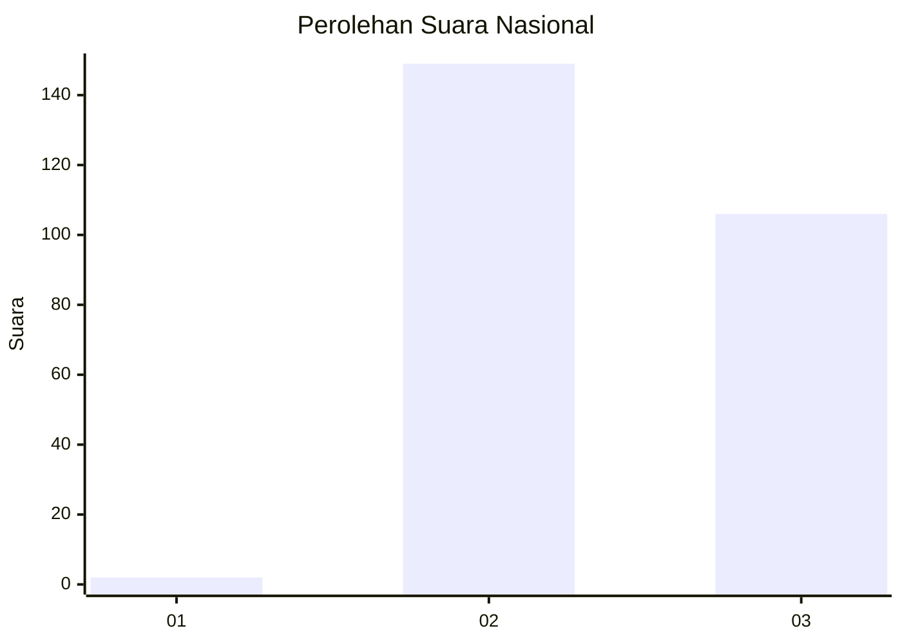
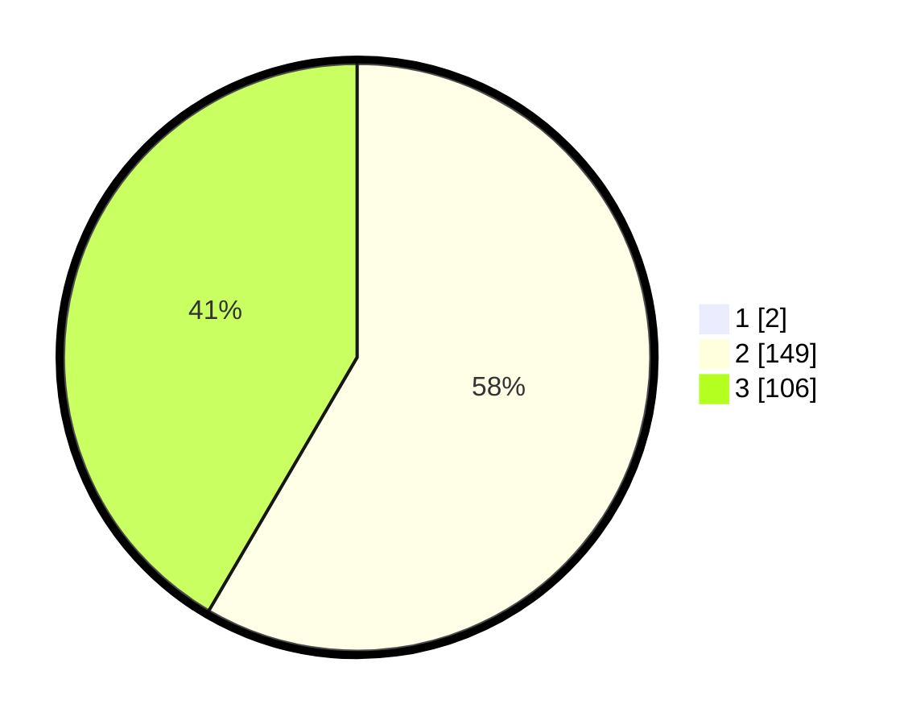

# Hasil

## Grafik

## Tabel

| No. | Nama Paslon    | Suara | Suara (raw) | Persentase |
|:--- |:-------------- | -----:| -----------:| ----------:|
| 1   | ANIES MUHAIMIN | 2     | [2][p-1]    | 0,78       |
| 2   | PRABOWO GIBRAN | 149   | [149][p-2]  | 57,98      |
| 3   | GANJAR MAHFUD  | 106   | [106][p-3]  | 41,25      |

[p-1]: https://github.com/gigit-pemilu/pemilu-2024/blob/main/pilpres/hitung-suara/sub/51-bali/sub/02-tabanan/sub/05-tabanan/sub/2004-delod-peken/sub/012-tps/sub/paslon-1.txt
[p-2]: https://github.com/gigit-pemilu/pemilu-2024/blob/main/pilpres/hitung-suara/sub/51-bali/sub/02-tabanan/sub/05-tabanan/sub/2004-delod-peken/sub/012-tps/sub/paslon-2.txt
[p-3]: https://github.com/gigit-pemilu/pemilu-2024/blob/main/pilpres/hitung-suara/sub/51-bali/sub/02-tabanan/sub/05-tabanan/sub/2004-delod-peken/sub/012-tps/sub/paslon-3.txt

## Foto C Plano

https://sirekap-obj-formc.kpu.go.id/31eb/pemilu/ppwp/51/02/05/20/04/5102052004012-20240214-202551--a326b656-e599-474d-bbf2-8fa9c024f9ff.jpg

https://sirekap-obj-formc.kpu.go.id/31eb/pemilu/ppwp/51/02/05/20/04/5102052004012-20240214-202720--e3d87dcd-7dd3-41ed-8761-9fa0bebf1f54.jpg

https://sirekap-obj-formc.kpu.go.id/31eb/pemilu/ppwp/51/02/05/20/04/5102052004012-20240214-202816--7b581fa1-b5bd-431d-a5f5-72bfad579e43.jpg

## Metadata

| Key        | Value               |
| ---------- | ------------------- |
| Time Stamp | 2024-02-24 22:31:28 |

