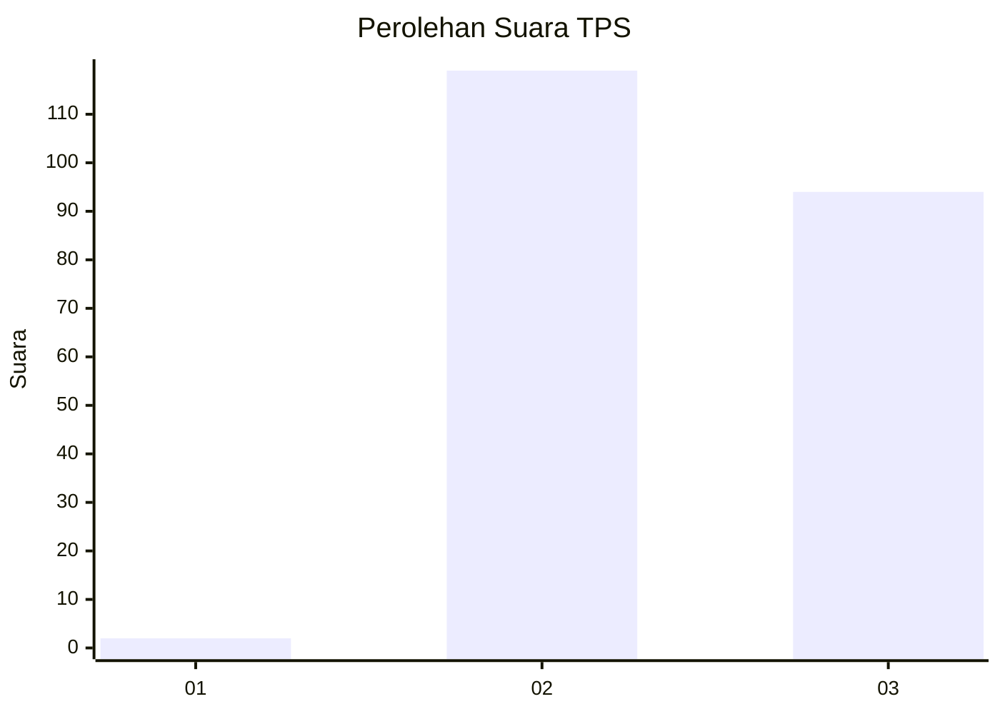
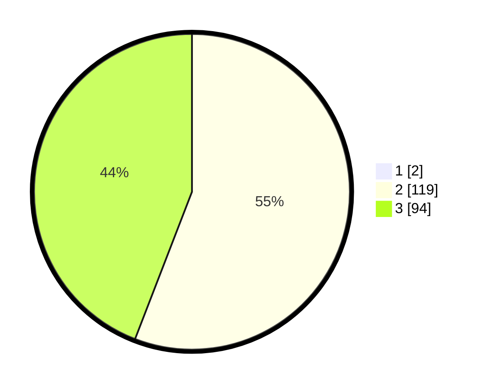

# Hasil

## Grafik

## Tabel

| No. | Nama Paslon    | Suara | Suara (raw) | Persentase |
|:--- |:-------------- | -----:| -----------:| ----------:|
| 1   | ANIES MUHAIMIN | 2     | [2][p-1]    | 0,93       |
| 2   | PRABOWO GIBRAN | 119   | [119][p-2]  | 55,35      |
| 3   | GANJAR MAHFUD  | 94    | [94][p-3]   | 43,72      |

[p-1]: https://github.com/gigit-pemilu/pemilu-2024-51-bali/blob/main/pilpres/hitung-suara/sub/51-bali/sub/02-tabanan/sub/05-tabanan/sub/2004-delod-peken/sub/013-tps/sub/paslon-1.txt
[p-2]: https://github.com/gigit-pemilu/pemilu-2024-51-bali/blob/main/pilpres/hitung-suara/sub/51-bali/sub/02-tabanan/sub/05-tabanan/sub/2004-delod-peken/sub/013-tps/sub/paslon-2.txt
[p-3]: https://github.com/gigit-pemilu/pemilu-2024-51-bali/blob/main/pilpres/hitung-suara/sub/51-bali/sub/02-tabanan/sub/05-tabanan/sub/2004-delod-peken/sub/013-tps/sub/paslon-3.txt

## Foto C Plano

https://sirekap-obj-formc.kpu.go.id/0ea9/pemilu/ppwp/51/02/05/20/04/5102052004013-20240214-195543--16ce376f-29f8-4cb7-849a-9438b8637d7c.jpg

https://sirekap-obj-formc.kpu.go.id/0ea9/pemilu/ppwp/51/02/05/20/04/5102052004013-20240214-195603--f0acb805-48c8-47fb-8b77-99f2b6aee880.jpg

https://sirekap-obj-formc.kpu.go.id/0ea9/pemilu/ppwp/51/02/05/20/04/5102052004013-20240214-195649--918058d3-e1b5-4778-a58c-5c132fd6179b.jpg

## Metadata

| Key        | Value               |
| ---------- | ------------------- |
| Time Stamp | 2024-02-24 22:31:28 |

