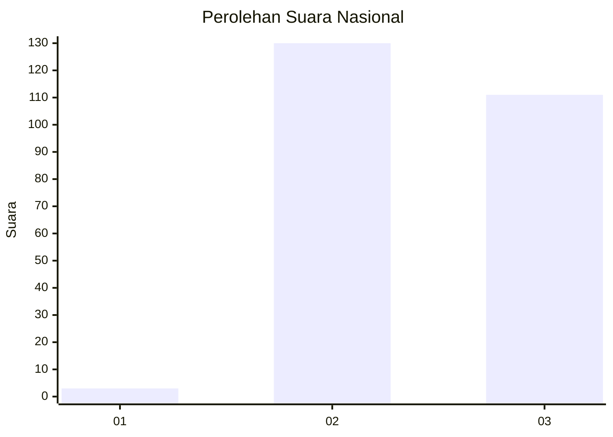
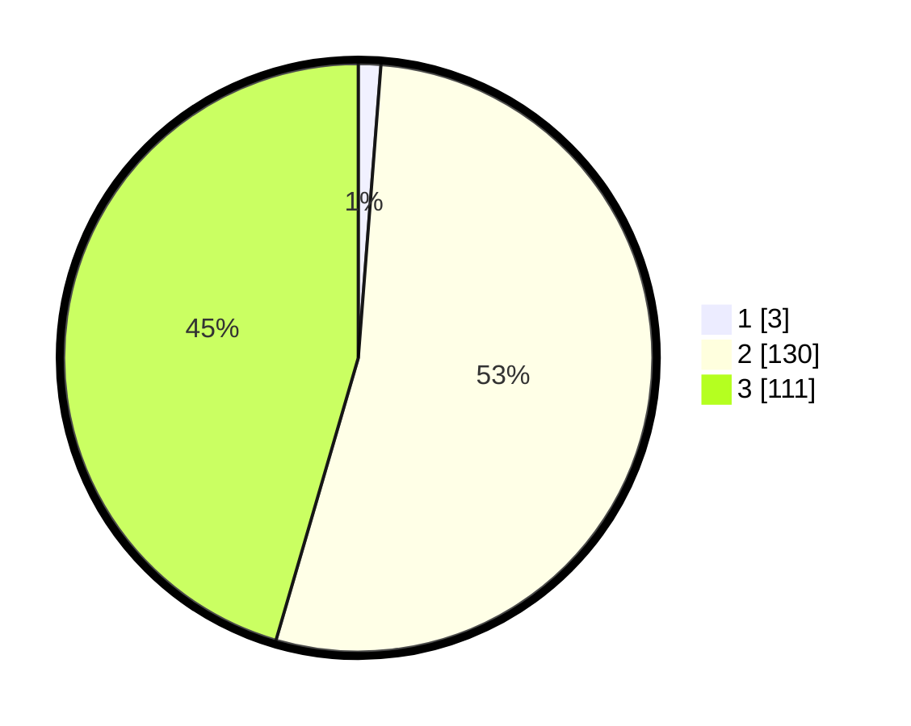

# Hasil

## Grafik

## Tabel

| No. | Nama Paslon    | Suara | Suara (raw) | Persentase |
|:--- |:-------------- | -----:| -----------:| ----------:|
| 1   | ANIES MUHAIMIN | 3     | [3][p-1]    | 1,23       |
| 2   | PRABOWO GIBRAN | 130   | [130][p-2]  | 53,28      |
| 3   | GANJAR MAHFUD  | 111   | [111][p-3]  | 45,49      |

[p-1]: https://github.com/gigit-pemilu/pemilu-2024/blob/main/pilpres/hitung-suara/sub/51-bali/sub/02-tabanan/sub/05-tabanan/sub/2004-delod-peken/sub/014-tps/sub/paslon-1.txt
[p-2]: https://github.com/gigit-pemilu/pemilu-2024/blob/main/pilpres/hitung-suara/sub/51-bali/sub/02-tabanan/sub/05-tabanan/sub/2004-delod-peken/sub/014-tps/sub/paslon-2.txt
[p-3]: https://github.com/gigit-pemilu/pemilu-2024/blob/main/pilpres/hitung-suara/sub/51-bali/sub/02-tabanan/sub/05-tabanan/sub/2004-delod-peken/sub/014-tps/sub/paslon-3.txt

## Foto C Plano

https://sirekap-obj-formc.kpu.go.id/0c65/pemilu/ppwp/51/02/05/20/04/5102052004014-20240215-233906--5552520e-de93-44fa-88f9-3a5249568179.jpg

https://sirekap-obj-formc.kpu.go.id/0c65/pemilu/ppwp/51/02/05/20/04/5102052004014-20240214-195336--909f0c95-be41-4956-bff1-90df2269b617.jpg

https://sirekap-obj-formc.kpu.go.id/0c65/pemilu/ppwp/51/02/05/20/04/5102052004014-20240214-195342--f713c44f-4e33-483e-a854-5558f311f1bc.jpg

## Metadata

| Key        | Value               |
| ---------- | ------------------- |
| Time Stamp | 2024-02-16 00:00:26 |

## DATA PEMILIH TETAP

Jumlah pemilih dalam DPT: **284**.
 * L: **137**.
 * P: **147**.

## DATA PENGGUNA HAK PILIH

Jumlah pengguna hak pilih dalam DPT: **251**.
 * L: **122**.
 * P: **129**.

Jumlah pengguna hak pilih dalam DPTb: **0**.
 * L: **0**.
 * P: **0**.

Jumlah pengguna hak pilih dalam DPK: **2**.
 * L: **1**.
 * P: **1**.

Jumlah pengguna hak pilih: **253**.
 * L: **123**.
 * P: **130**.

## JUMLAH SUARA SAH DAN TIDAK SAH

JUMLAH SELURUH SUARA SAH: **244**.

JUMLAH SUARA TIDAK SAH: **9**.

JUMLAH SELURUH SUARA SAH DAN SUARA TIDAK SAH: **253**.

