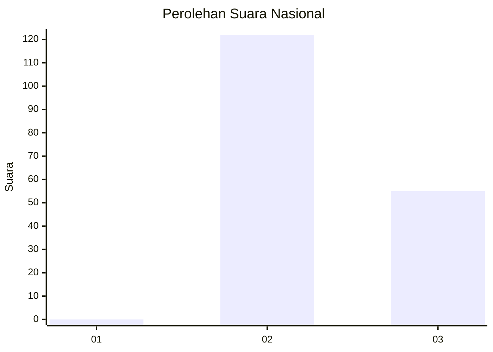
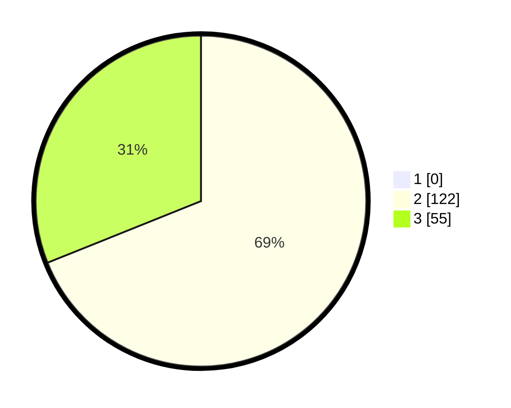

# Hasil

## Grafik

## Tabel

| No. | Nama Paslon    | Suara | Suara (raw) | Persentase |
|:--- |:-------------- | -----:| -----------:| ----------:|
| 1   | ANIES MUHAIMIN | 0     | [0][p-1]    | 0,00       |
| 2   | PRABOWO GIBRAN | 122   | [122][p-2]  | 68,93      |
| 3   | GANJAR MAHFUD  | 55    | [55][p-3]   | 31,07      |

[p-1]: https://github.com/gigit-pemilu/pemilu-2024/blob/main/pilpres/hitung-suara/sub/51-bali/sub/02-tabanan/sub/05-tabanan/sub/2004-delod-peken/sub/015-tps/sub/paslon-1.txt
[p-2]: https://github.com/gigit-pemilu/pemilu-2024/blob/main/pilpres/hitung-suara/sub/51-bali/sub/02-tabanan/sub/05-tabanan/sub/2004-delod-peken/sub/015-tps/sub/paslon-2.txt
[p-3]: https://github.com/gigit-pemilu/pemilu-2024/blob/main/pilpres/hitung-suara/sub/51-bali/sub/02-tabanan/sub/05-tabanan/sub/2004-delod-peken/sub/015-tps/sub/paslon-3.txt

## Foto C Plano

https://sirekap-obj-formc.kpu.go.id/6ffc/pemilu/ppwp/51/02/05/20/04/5102052004015-20240214-141833--524f7a3a-62d3-4889-8255-426256e9b9ce.jpg

https://sirekap-obj-formc.kpu.go.id/6ffc/pemilu/ppwp/51/02/05/20/04/5102052004015-20240214-212753--13547383-f497-4cee-8d34-6de30f108114.jpg

https://sirekap-obj-formc.kpu.go.id/6ffc/pemilu/ppwp/51/02/05/20/04/5102052004015-20240214-141847--9a990fb5-082d-4784-9f85-d9e97346b9f8.jpg

## Metadata

| Key        | Value               |
| ---------- | ------------------- |
| Time Stamp | 2024-02-24 22:31:28 |

