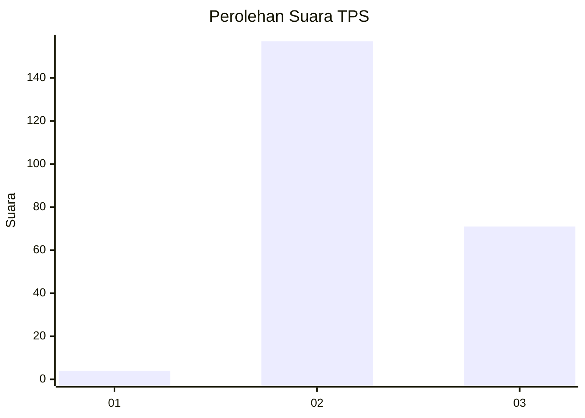

# Hasil

## Grafik

## Tabel

| No. | Nama Paslon    | Suara | Suara (raw) | Persentase |
|:--- |:-------------- | -----:| -----------:| ----------:|
| 1   | ANIES MUHAIMIN | 4     | [4][p-1]    | 1,72       |
| 2   | PRABOWO GIBRAN | 157   | [157][p-2]  | 67,67      |
| 3   | GANJAR MAHFUD  | 71    | [71][p-3]   | 30,60      |

[p-1]: https://github.com/gigit-pemilu/pemilu-2024-51-bali/blob/main/pilpres/hitung-suara/sub/51-bali/sub/02-tabanan/sub/05-tabanan/sub/2004-delod-peken/sub/020-tps/sub/paslon-1.txt
[p-2]: https://github.com/gigit-pemilu/pemilu-2024-51-bali/blob/main/pilpres/hitung-suara/sub/51-bali/sub/02-tabanan/sub/05-tabanan/sub/2004-delod-peken/sub/020-tps/sub/paslon-2.txt
[p-3]: https://github.com/gigit-pemilu/pemilu-2024-51-bali/blob/main/pilpres/hitung-suara/sub/51-bali/sub/02-tabanan/sub/05-tabanan/sub/2004-delod-peken/sub/020-tps/sub/paslon-3.txt

## Foto C Plano

https://sirekap-obj-formc.kpu.go.id/b701/pemilu/ppwp/51/02/05/20/04/5102052004020-20240214-141945--d71dbbd5-9da0-437a-ad7f-d4c46cdebe30.jpg

https://sirekap-obj-formc.kpu.go.id/b701/pemilu/ppwp/51/02/05/20/04/5102052004020-20240215-035256--26ee0174-7d81-4e74-bb82-2fdfff745e4b.jpg

https://sirekap-obj-formc.kpu.go.id/b701/pemilu/ppwp/51/02/05/20/04/5102052004020-20240215-003630--84cf1fa1-f551-4f7c-a78e-e344e5d37b08.jpg

## Metadata

| Key        | Value               |
| ---------- | ------------------- |
| Time Stamp | 2024-02-15 22:30:27 |

## DATA PEMILIH TETAP

Jumlah pemilih dalam DPT: **284**.
 * L: **150**.
 * P: **134**.

## DATA PENGGUNA HAK PILIH

Jumlah pengguna hak pilih dalam DPT: **230**.
 * L: **117**.
 * P: **113**.

Jumlah pengguna hak pilih dalam DPTb: **4**.
 * L: **1**.
 * P: **3**.

Jumlah pengguna hak pilih dalam DPK: **0**.
 * L: **0**.
 * P: **0**.

Jumlah pengguna hak pilih: **234**.
 * L: **118**.
 * P: **116**.

## JUMLAH SUARA SAH DAN TIDAK SAH

JUMLAH SELURUH SUARA SAH: **232**.

JUMLAH SUARA TIDAK SAH: **2**.

JUMLAH SELURUH SUARA SAH DAN SUARA TIDAK SAH: **234**.

