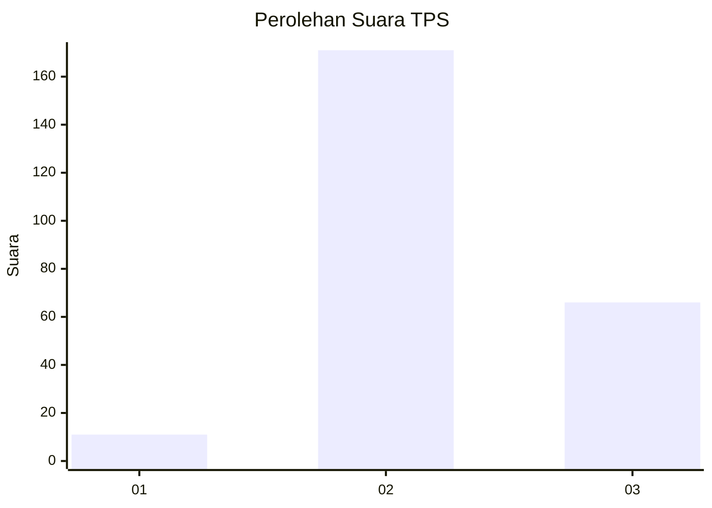

# Hasil

## Grafik

## Tabel

| No. | Nama Paslon    | Suara | Suara (raw) | Persentase |
|:--- |:-------------- | -----:| -----------:| ----------:|
| 1   | ANIES MUHAIMIN | 11    | [11][p-1]   | 4,44       |
| 2   | PRABOWO GIBRAN | 171   | [171][p-2]  | 68,95      |
| 3   | GANJAR MAHFUD  | 66    | [66][p-3]   | 26,61      |

[p-1]: https://github.com/gigit-pemilu/pemilu-2024-51-bali/blob/main/pilpres/hitung-suara/sub/51-bali/sub/02-tabanan/sub/05-tabanan/sub/2004-delod-peken/sub/021-tps/sub/paslon-1.txt
[p-2]: https://github.com/gigit-pemilu/pemilu-2024-51-bali/blob/main/pilpres/hitung-suara/sub/51-bali/sub/02-tabanan/sub/05-tabanan/sub/2004-delod-peken/sub/021-tps/sub/paslon-2.txt
[p-3]: https://github.com/gigit-pemilu/pemilu-2024-51-bali/blob/main/pilpres/hitung-suara/sub/51-bali/sub/02-tabanan/sub/05-tabanan/sub/2004-delod-peken/sub/021-tps/sub/paslon-3.txt

## Foto C Plano

https://sirekap-obj-formc.kpu.go.id/caf8/pemilu/ppwp/51/02/05/20/04/5102052004021-20240215-205138--e0956a08-8d1a-4f46-bab2-7460d3ae433b.jpg

https://sirekap-obj-formc.kpu.go.id/caf8/pemilu/ppwp/51/02/05/20/04/5102052004021-20240215-205140--d203b2e2-9d57-4e35-95c9-c0310c434583.jpg

https://sirekap-obj-formc.kpu.go.id/caf8/pemilu/ppwp/51/02/05/20/04/5102052004021-20240215-205139--bf4f5802-b283-41b1-839a-88238e983864.jpg

## Metadata

| Key        | Value               |
| ---------- | ------------------- |
| Time Stamp | 2024-02-15 22:30:27 |

## DATA PEMILIH TETAP

Jumlah pemilih dalam DPT: **287**.
 * L: **134**.
 * P: **153**.

## DATA PENGGUNA HAK PILIH

Jumlah pengguna hak pilih dalam DPT: **240**.
 * L: **109**.
 * P: **131**.

Jumlah pengguna hak pilih dalam DPTb: **5**.
 * L: **0**.
 * P: **5**.

Jumlah pengguna hak pilih dalam DPK: **5**.
 * L: **5**.
 * P: **0**.

Jumlah pengguna hak pilih: **250**.
 * L: **114**.
 * P: **136**.

## JUMLAH SUARA SAH DAN TIDAK SAH

JUMLAH SELURUH SUARA SAH: **248**.

JUMLAH SUARA TIDAK SAH: **2**.

JUMLAH SELURUH SUARA SAH DAN SUARA TIDAK SAH: **250**.

