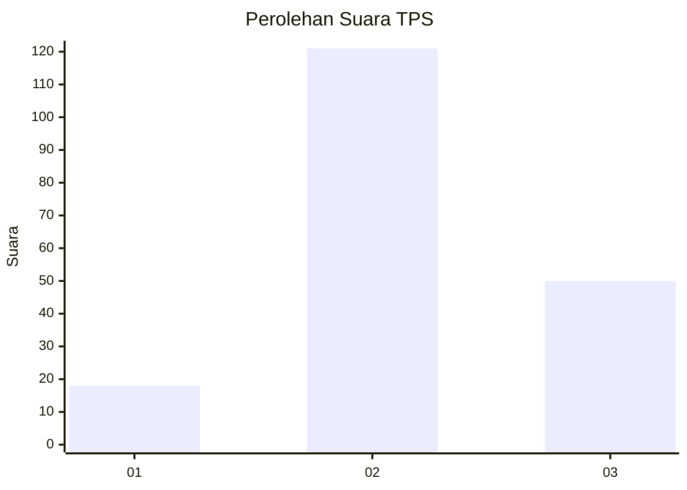
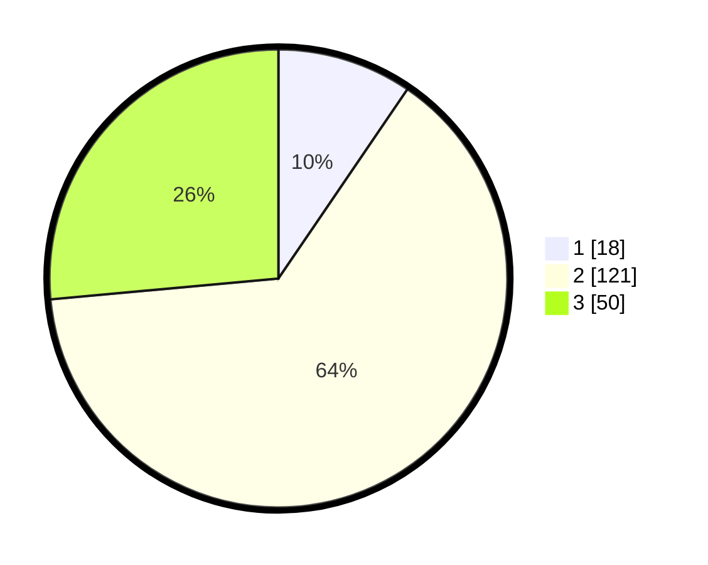

# Hasil

## Grafik

## Tabel

| No. | Nama Paslon    | Suara | Suara (raw) | Persentase |
|:--- |:-------------- | -----:| -----------:| ----------:|
| 1   | ANIES MUHAIMIN | 18    | [18][p-1]   | 9,52       |
| 2   | PRABOWO GIBRAN | 121   | [121][p-2]  | 64,02      |
| 3   | GANJAR MAHFUD  | 50    | [50][p-3]   | 26,46      |

[p-1]: https://github.com/gigit-pemilu/pemilu-2024-51-bali/blob/main/pilpres/hitung-suara/sub/51-bali/sub/02-tabanan/sub/05-tabanan/sub/2004-delod-peken/sub/023-tps/sub/paslon-1.txt
[p-2]: https://github.com/gigit-pemilu/pemilu-2024-51-bali/blob/main/pilpres/hitung-suara/sub/51-bali/sub/02-tabanan/sub/05-tabanan/sub/2004-delod-peken/sub/023-tps/sub/paslon-2.txt
[p-3]: https://github.com/gigit-pemilu/pemilu-2024-51-bali/blob/main/pilpres/hitung-suara/sub/51-bali/sub/02-tabanan/sub/05-tabanan/sub/2004-delod-peken/sub/023-tps/sub/paslon-3.txt

## Foto C Plano

https://sirekap-obj-formc.kpu.go.id/1c9e/pemilu/ppwp/51/02/05/20/04/5102052004023-20240214-210432--1dbcae42-5318-4062-9f46-8a2890ce5a03.jpg

https://sirekap-obj-formc.kpu.go.id/1c9e/pemilu/ppwp/51/02/05/20/04/5102052004023-20240214-210508--99e49f0d-336b-4998-95bd-32156eac9111.jpg

https://sirekap-obj-formc.kpu.go.id/1c9e/pemilu/ppwp/51/02/05/20/04/5102052004023-20240214-210538--421284ac-f127-4f22-b437-79c98b7be885.jpg

## Metadata

| Key        | Value               |
| ---------- | ------------------- |
| Time Stamp | 2024-02-15 22:30:27 |

