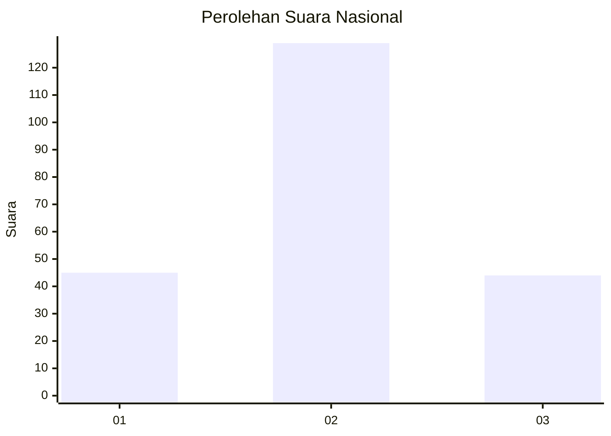
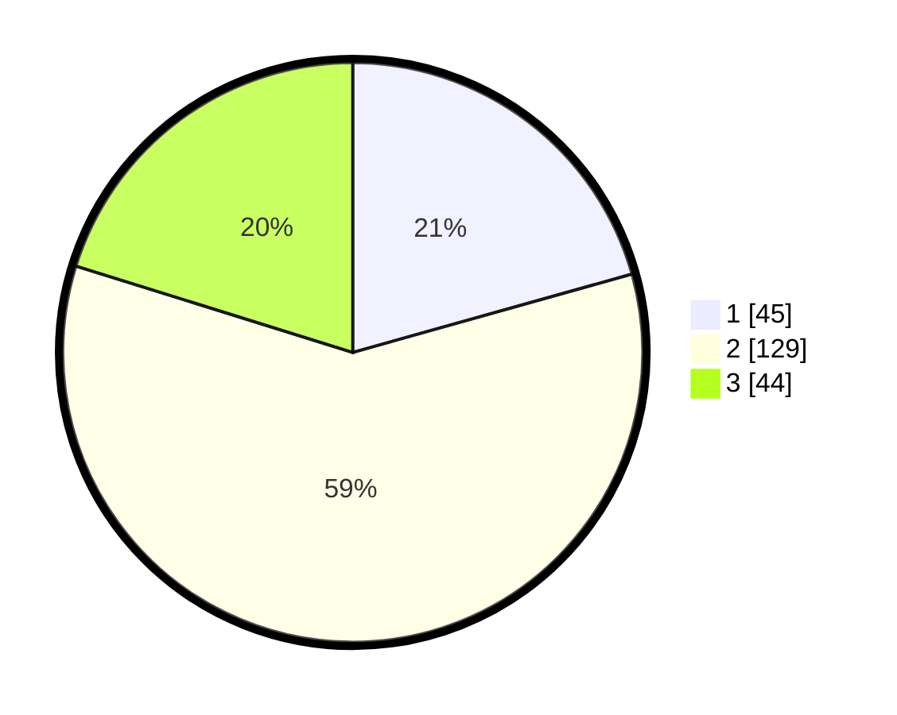

# Hasil

## Grafik

## Tabel

| No. | Nama Paslon    | Suara | Suara (raw) | Persentase |
|:--- |:-------------- | -----:| -----------:| ----------:|
| 1   | ANIES MUHAIMIN | 45    | [45][p-1]   | 20,64      |
| 2   | PRABOWO GIBRAN | 129   | [129][p-2]  | 59,17      |
| 3   | GANJAR MAHFUD  | 44    | [44][p-3]   | 20,18      |

[p-1]: https://github.com/gigit-pemilu/pemilu-2024/blob/main/pilpres/hitung-suara/sub/51-bali/sub/02-tabanan/sub/05-tabanan/sub/2004-delod-peken/sub/024-tps/sub/paslon-1.txt
[p-2]: https://github.com/gigit-pemilu/pemilu-2024/blob/main/pilpres/hitung-suara/sub/51-bali/sub/02-tabanan/sub/05-tabanan/sub/2004-delod-peken/sub/024-tps/sub/paslon-2.txt
[p-3]: https://github.com/gigit-pemilu/pemilu-2024/blob/main/pilpres/hitung-suara/sub/51-bali/sub/02-tabanan/sub/05-tabanan/sub/2004-delod-peken/sub/024-tps/sub/paslon-3.txt

## Foto C Plano

https://sirekap-obj-formc.kpu.go.id/327b/pemilu/ppwp/51/02/05/20/04/5102052004024-20240214-223858--8078d497-f9d4-47b6-a93d-708292b20529.jpg

https://sirekap-obj-formc.kpu.go.id/327b/pemilu/ppwp/51/02/05/20/04/5102052004024-20240214-223959--3f0dfdbb-c61f-4773-8da8-ad3c4970997d.jpg

https://sirekap-obj-formc.kpu.go.id/327b/pemilu/ppwp/51/02/05/20/04/5102052004024-20240214-224137--777891d5-f4b4-464c-94db-fe58ea94fd23.jpg

## Metadata

| Key        | Value               |
| ---------- | ------------------- |
| Time Stamp | 2024-02-15 22:30:27 |

