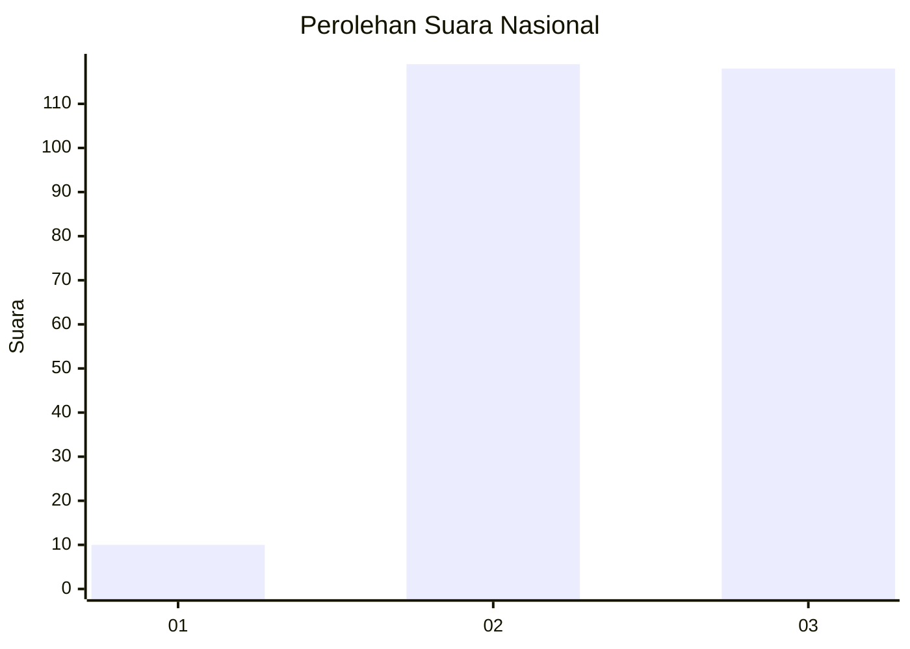
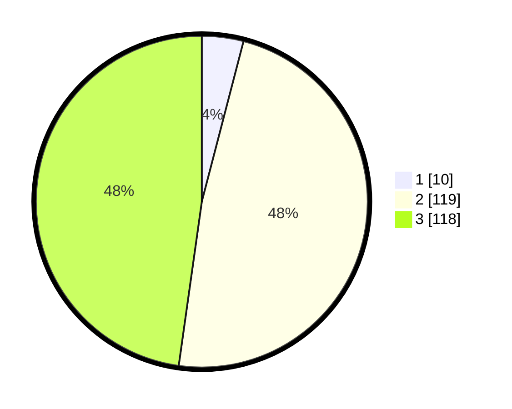

# Hasil

## Grafik

## Tabel

| No. | Nama Paslon    | Suara | Suara (raw) | Persentase |
|:--- |:-------------- | -----:| -----------:| ----------:|
| 1   | ANIES MUHAIMIN | 10    | [10][p-1]   | 4,05       |
| 2   | PRABOWO GIBRAN | 119   | [119][p-2]  | 48,18      |
| 3   | GANJAR MAHFUD  | 118   | [118][p-3]  | 47,77      |

[p-1]: https://github.com/gigit-pemilu/pemilu-2024/blob/main/pilpres/hitung-suara/sub/51-bali/sub/02-tabanan/sub/05-tabanan/sub/2004-delod-peken/sub/025-tps/sub/paslon-1.txt
[p-2]: https://github.com/gigit-pemilu/pemilu-2024/blob/main/pilpres/hitung-suara/sub/51-bali/sub/02-tabanan/sub/05-tabanan/sub/2004-delod-peken/sub/025-tps/sub/paslon-2.txt
[p-3]: https://github.com/gigit-pemilu/pemilu-2024/blob/main/pilpres/hitung-suara/sub/51-bali/sub/02-tabanan/sub/05-tabanan/sub/2004-delod-peken/sub/025-tps/sub/paslon-3.txt

## Foto C Plano

https://sirekap-obj-formc.kpu.go.id/0077/pemilu/ppwp/51/02/05/20/04/5102052004025-20240214-223303--4fd72425-88b0-4d9c-b2e4-e98fc05077aa.jpg

https://sirekap-obj-formc.kpu.go.id/0077/pemilu/ppwp/51/02/05/20/04/5102052004025-20240214-223335--61b1142a-b066-4825-9347-68f26a59839b.jpg

https://sirekap-obj-formc.kpu.go.id/0077/pemilu/ppwp/51/02/05/20/04/5102052004025-20240214-223349--bb84e987-13cf-4d6d-93aa-400813716402.jpg

## Metadata

| Key        | Value               |
| ---------- | ------------------- |
| Time Stamp | 2024-02-15 22:30:27 |

