# Hasil

## Grafik

```mermaid
%%{init: {"pie": {"textPosition": 0.5}, "themeVariables": {"pieOuterStrokeWidth": "5px"}} }%%
pie showData
    "1" : 17
    "2" : 129
    "3" : 86
```

## Tabel

| No. | Nama Paslon    | Suara | Suara (raw) | Persentase |
|:--- |:-------------- | -----:| -----------:| ----------:|
| 1   | ANIES MUHAIMIN | 17    | [17][p-1]   | 7,33       |
| 2   | PRABOWO GIBRAN | 129   | [129][p-2]  | 55,60      |
| 3   | GANJAR MAHFUD  | 86    | [86][p-3]   | 37,07      |

[p-1]: https://github.com/gigit-pemilu/pemilu-2024/blob/main/pilpres/hitung-suara/sub/51-bali/sub/02-tabanan/sub/05-tabanan/sub/2004-delod-peken/sub/026-tps/sub/paslon-1.txt
[p-2]: https://github.com/gigit-pemilu/pemilu-2024/blob/main/pilpres/hitung-suara/sub/51-bali/sub/02-tabanan/sub/05-tabanan/sub/2004-delod-peken/sub/026-tps/sub/paslon-2.txt
[p-3]: https://github.com/gigit-pemilu/pemilu-2024/blob/main/pilpres/hitung-suara/sub/51-bali/sub/02-tabanan/sub/05-tabanan/sub/2004-delod-peken/sub/026-tps/sub/paslon-3.txt

## Foto C Plano

https://sirekap-obj-formc.kpu.go.id/6340/pemilu/ppwp/51/02/05/20/04/5102052004026-20240214-195353--3a182d87-48c8-43c3-b0d5-af7e82cab0ff.jpg

https://sirekap-obj-formc.kpu.go.id/6340/pemilu/ppwp/51/02/05/20/04/5102052004026-20240214-133405--5b424fec-6c19-4dc1-85b7-50be69affa95.jpg

https://sirekap-obj-formc.kpu.go.id/6340/pemilu/ppwp/51/02/05/20/04/5102052004026-20240214-155611--4f7e42c7-9e01-4e53-b7ca-d8a6777bc013.jpg

## Metadata

| Key        | Value               |
| ---------- | ------------------- |
| Time Stamp | 2024-02-14 21:46:01 |

## DATA PEMILIH TETAP

Jumlah pemilih dalam DPT: **270**.
 * L: **124**.
 * P: **146**.

## DATA PENGGUNA HAK PILIH

Jumlah pengguna hak pilih dalam DPT: **224**.
 * L: **102**.
 * P: **122**.

Jumlah pengguna hak pilih dalam DPTb: **3**.
 * L: **1**.
 * P: **2**.

Jumlah pengguna hak pilih dalam DPK: **11**.
 * L: **5**.
 * P: **6**.

Jumlah pengguna hak pilih: **238**.
 * L: **108**.
 * P: **130**.

## JUMLAH SUARA SAH DAN TIDAK SAH

JUMLAH SELURUH SUARA SAH: **232**.

JUMLAH SUARA TIDAK SAH: **6**.

JUMLAH SELURUH SUARA SAH DAN SUARA TIDAK SAH: **238**.

