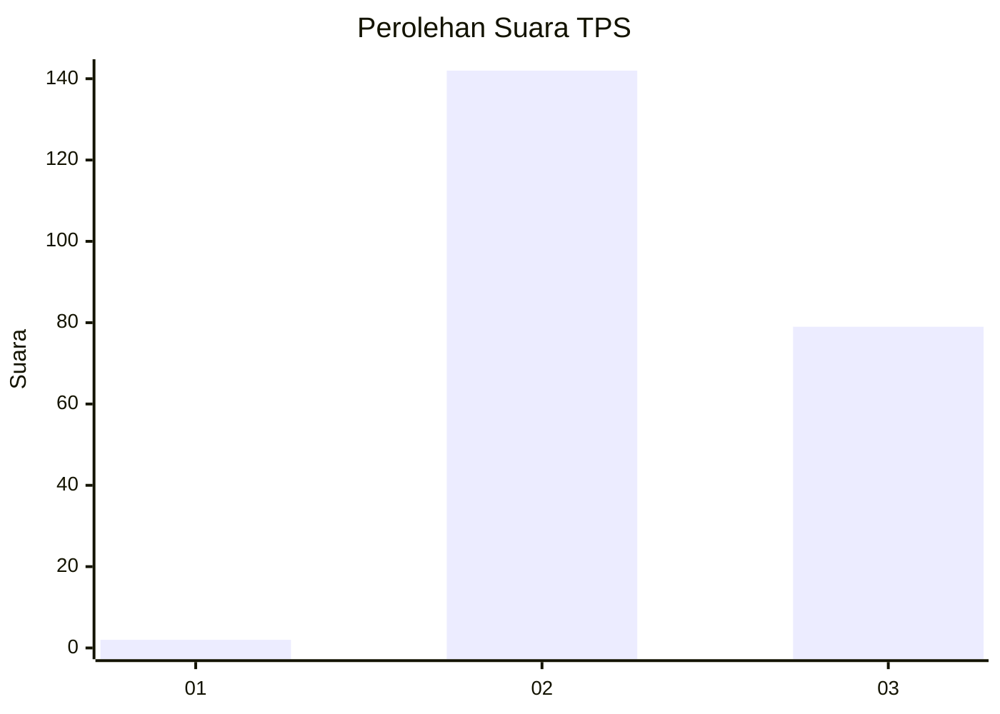
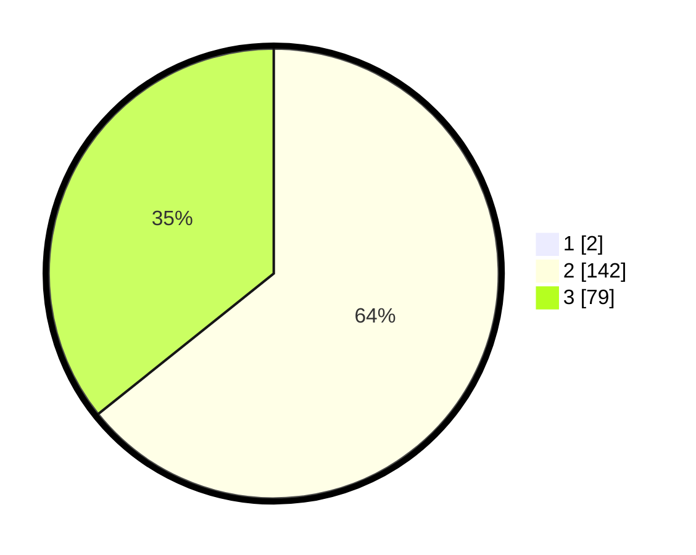

# Hasil

## Grafik

## Tabel

| No. | Nama Paslon    | Suara | Suara (raw) | Persentase |
|:--- |:-------------- | -----:| -----------:| ----------:|
| 1   | ANIES MUHAIMIN | 2     | [2][p-1]    | 0,90       |
| 2   | PRABOWO GIBRAN | 142   | [142][p-2]  | 63,68      |
| 3   | GANJAR MAHFUD  | 79    | [79][p-3]   | 35,43      |

[p-1]: https://github.com/gigit-pemilu/pemilu-2024-51-bali/blob/main/pilpres/hitung-suara/sub/51-bali/sub/02-tabanan/sub/05-tabanan/sub/2004-delod-peken/sub/027-tps/sub/paslon-1.txt
[p-2]: https://github.com/gigit-pemilu/pemilu-2024-51-bali/blob/main/pilpres/hitung-suara/sub/51-bali/sub/02-tabanan/sub/05-tabanan/sub/2004-delod-peken/sub/027-tps/sub/paslon-2.txt
[p-3]: https://github.com/gigit-pemilu/pemilu-2024-51-bali/blob/main/pilpres/hitung-suara/sub/51-bali/sub/02-tabanan/sub/05-tabanan/sub/2004-delod-peken/sub/027-tps/sub/paslon-3.txt

## Foto C Plano

https://sirekap-obj-formc.kpu.go.id/91ee/pemilu/ppwp/51/02/05/20/04/5102052004027-20240216-000404--f1a7a050-7862-4cc9-bf59-c6a25ff6ce02.jpg

https://sirekap-obj-formc.kpu.go.id/91ee/pemilu/ppwp/51/02/05/20/04/5102052004027-20240216-000406--34b1d8a6-f952-4b8a-b0db-89d9ef9edb6e.jpg

https://sirekap-obj-formc.kpu.go.id/91ee/pemilu/ppwp/51/02/05/20/04/5102052004027-20240216-000405--6153776b-efe2-4a5d-888f-c5cc06d4516a.jpg

## Metadata

| Key        | Value               |
| ---------- | ------------------- |
| Time Stamp | 2024-02-16 10:30:29 |

## DATA PEMILIH TETAP

Jumlah pemilih dalam DPT: **268**.
 * L: **130**.
 * P: **138**.

## DATA PENGGUNA HAK PILIH

Jumlah pengguna hak pilih dalam DPT: **215**.
 * L: **106**.
 * P: **109**.

Jumlah pengguna hak pilih dalam DPTb: **9**.
 * L: **4**.
 * P: **5**.

Jumlah pengguna hak pilih dalam DPK: **0**.
 * L: **0**.
 * P: **0**.

Jumlah pengguna hak pilih: **224**.
 * L: **110**.
 * P: **114**.

## JUMLAH SUARA SAH DAN TIDAK SAH

JUMLAH SELURUH SUARA SAH: **223**.

JUMLAH SUARA TIDAK SAH: **1**.

JUMLAH SELURUH SUARA SAH DAN SUARA TIDAK SAH: **224**.

