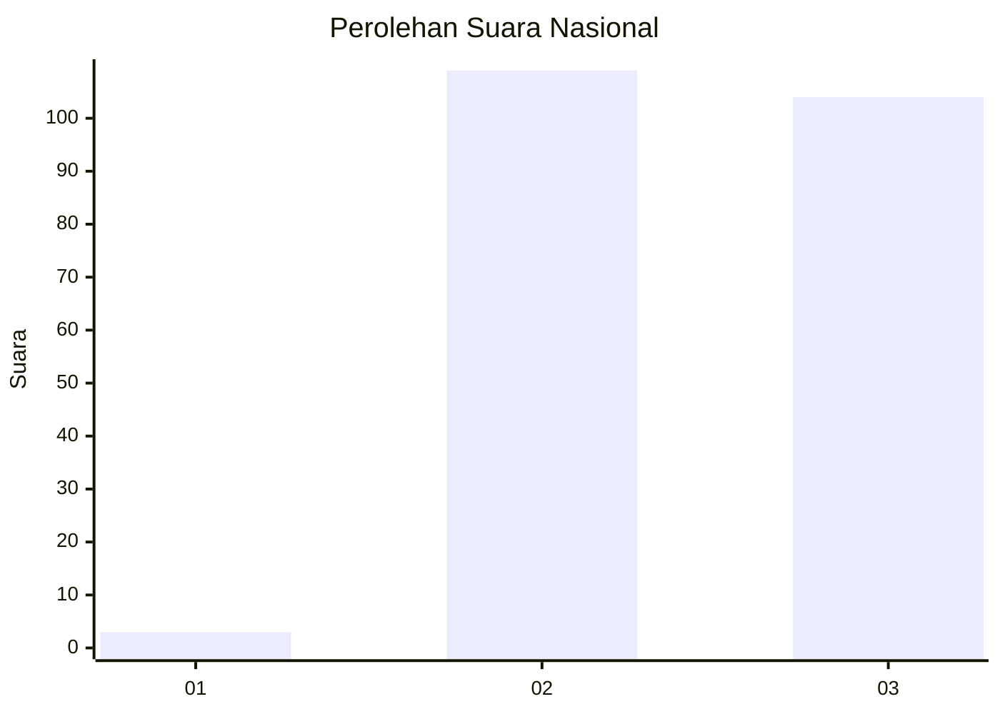
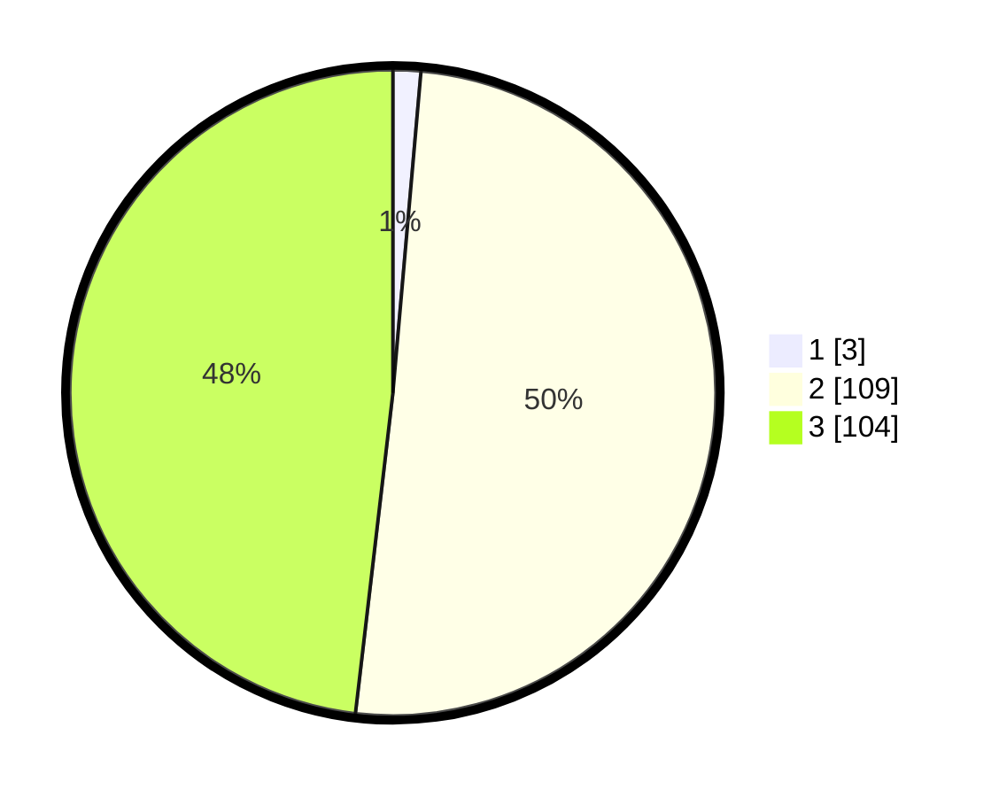

# Hasil

## Grafik

## Tabel

| No. | Nama Paslon    | Suara | Suara (raw) | Persentase |
|:--- |:-------------- | -----:| -----------:| ----------:|
| 1   | ANIES MUHAIMIN | 3     | [3][p-1]    | 1,39       |
| 2   | PRABOWO GIBRAN | 109   | [109][p-2]  | 50,46      |
| 3   | GANJAR MAHFUD  | 104   | [104][p-3]  | 48,15      |

[p-1]: https://github.com/gigit-pemilu/pemilu-2024/blob/main/pilpres/hitung-suara/sub/51-bali/sub/02-tabanan/sub/05-tabanan/sub/2004-delod-peken/sub/030-tps/sub/paslon-1.txt
[p-2]: https://github.com/gigit-pemilu/pemilu-2024/blob/main/pilpres/hitung-suara/sub/51-bali/sub/02-tabanan/sub/05-tabanan/sub/2004-delod-peken/sub/030-tps/sub/paslon-2.txt
[p-3]: https://github.com/gigit-pemilu/pemilu-2024/blob/main/pilpres/hitung-suara/sub/51-bali/sub/02-tabanan/sub/05-tabanan/sub/2004-delod-peken/sub/030-tps/sub/paslon-3.txt

## Foto C Plano

https://sirekap-obj-formc.kpu.go.id/d26d/pemilu/ppwp/51/02/05/20/04/5102052004030-20240215-064755--65b96d3f-2e8a-405e-b4e5-c363390fbf43.jpg

https://sirekap-obj-formc.kpu.go.id/d26d/pemilu/ppwp/51/02/05/20/04/5102052004030-20240215-064801--6989daff-15b0-436e-9c1f-a7df9f562861.jpg

## Metadata

| Key        | Value               |
| ---------- | ------------------- |
| Time Stamp | 2024-02-15 22:30:27 |

