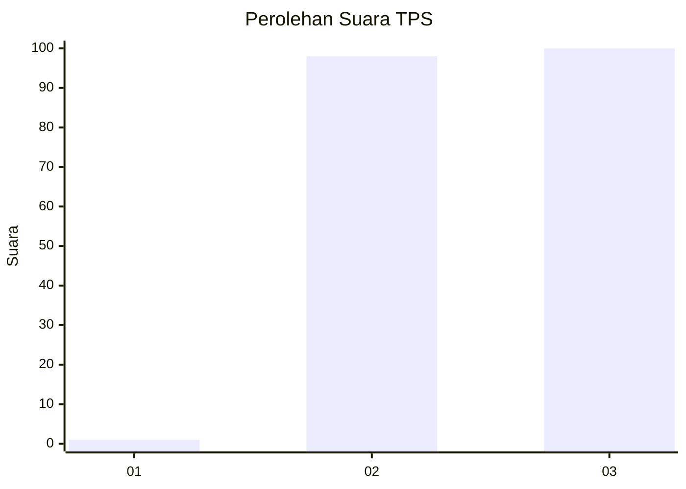
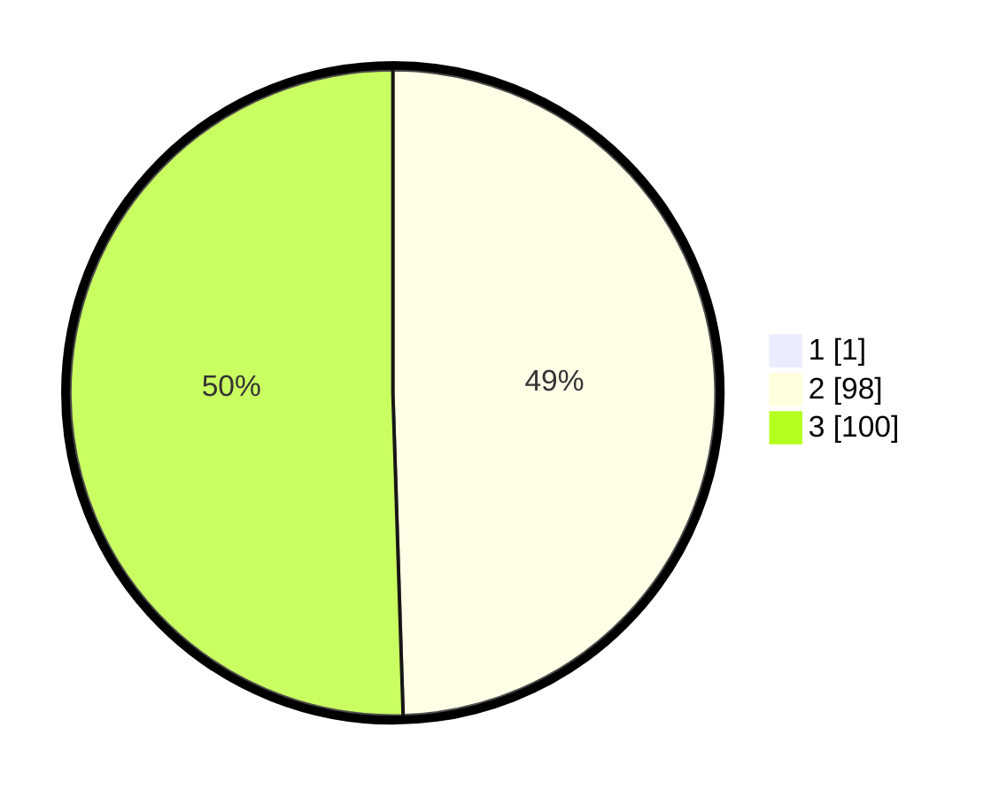

# Hasil

## Grafik

## Tabel

| No. | Nama Paslon    | Suara | Suara (raw) | Persentase |
|:--- |:-------------- | -----:| -----------:| ----------:|
| 1   | ANIES MUHAIMIN | 1     | [1][p-1]    | 0,50       |
| 2   | PRABOWO GIBRAN | 98    | [98][p-2]   | 49,25      |
| 3   | GANJAR MAHFUD  | 100   | [100][p-3]  | 50,25      |

[p-1]: https://github.com/gigit-pemilu/pemilu-2024-51-bali/blob/main/pilpres/hitung-suara/sub/51-bali/sub/02-tabanan/sub/05-tabanan/sub/2004-delod-peken/sub/031-tps/sub/paslon-1.txt
[p-2]: https://github.com/gigit-pemilu/pemilu-2024-51-bali/blob/main/pilpres/hitung-suara/sub/51-bali/sub/02-tabanan/sub/05-tabanan/sub/2004-delod-peken/sub/031-tps/sub/paslon-2.txt
[p-3]: https://github.com/gigit-pemilu/pemilu-2024-51-bali/blob/main/pilpres/hitung-suara/sub/51-bali/sub/02-tabanan/sub/05-tabanan/sub/2004-delod-peken/sub/031-tps/sub/paslon-3.txt

## Foto C Plano

https://sirekap-obj-formc.kpu.go.id/856f/pemilu/ppwp/51/02/05/20/04/5102052004031-20240214-132615--b6564d94-cb5b-44c5-84c5-b31a0a6353eb.jpg

https://sirekap-obj-formc.kpu.go.id/856f/pemilu/ppwp/51/02/05/20/04/5102052004031-20240214-132645--122d5ff3-fd7b-4286-9b33-d371686a0531.jpg

https://sirekap-obj-formc.kpu.go.id/856f/pemilu/ppwp/51/02/05/20/04/5102052004031-20240214-132717--fa9c9e9f-ea94-436b-bc28-2c4c377ca40c.jpg

## Metadata

| Key        | Value               |
| ---------- | ------------------- |
| Time Stamp | 2024-02-14 21:46:01 |

## DATA PEMILIH TETAP

Jumlah pemilih dalam DPT: **220**.
 * L: **111**.
 * P: **109**.

## DATA PENGGUNA HAK PILIH

Jumlah pengguna hak pilih dalam DPT: **202**.
 * L: **102**.
 * P: **100**.

Jumlah pengguna hak pilih dalam DPTb: **1**.
 * L: **0**.
 * P: **1**.

Jumlah pengguna hak pilih dalam DPK: **0**.
 * L: **0**.
 * P: **0**.

Jumlah pengguna hak pilih: **203**.
 * L: **102**.
 * P: **101**.

## JUMLAH SUARA SAH DAN TIDAK SAH

JUMLAH SELURUH SUARA SAH: **199**.

JUMLAH SUARA TIDAK SAH: **4**.

JUMLAH SELURUH SUARA SAH DAN SUARA TIDAK SAH: **203**.

