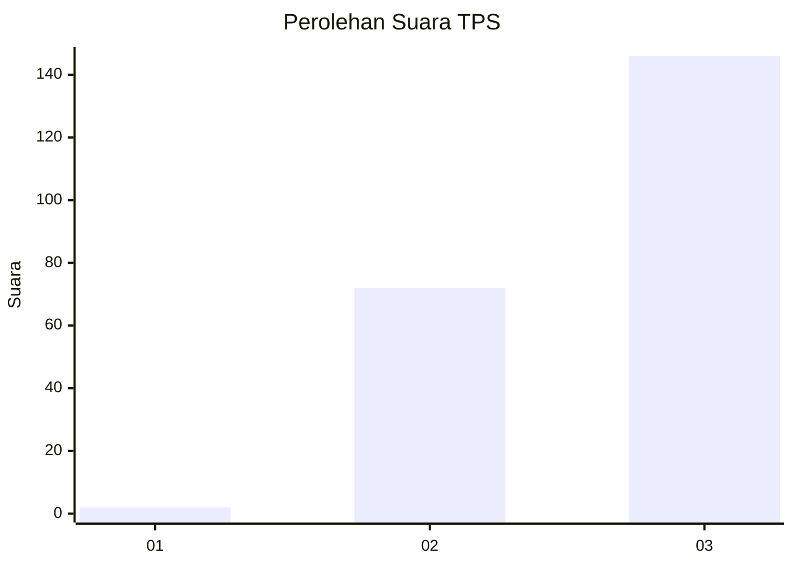
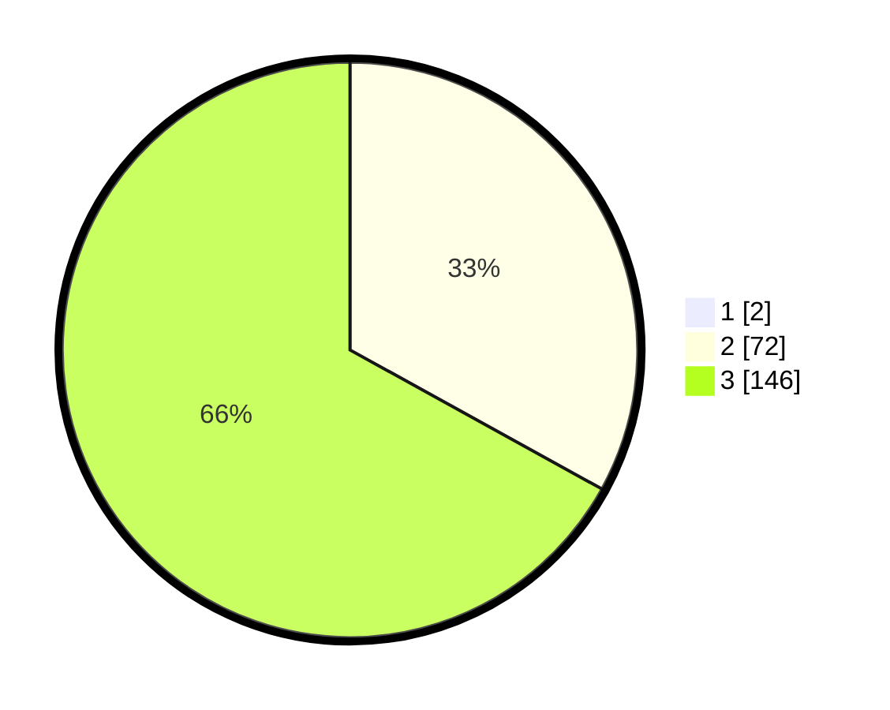

# Hasil

## Grafik

## Tabel

| No. | Nama Paslon    | Suara | Suara (raw) | Persentase |
|:--- |:-------------- | -----:| -----------:| ----------:|
| 1   | ANIES MUHAIMIN | 2     | [2][p-1]    | 0,91       |
| 2   | PRABOWO GIBRAN | 72    | [72][p-2]   | 32,73      |
| 3   | GANJAR MAHFUD  | 146   | [146][p-3]  | 66,36      |

[p-1]: https://github.com/gigit-pemilu/pemilu-2024-51-bali/blob/main/pilpres/hitung-suara/sub/51-bali/sub/02-tabanan/sub/05-tabanan/sub/2005-dauh-peken/sub/001-tps/sub/paslon-1.txt
[p-2]: https://github.com/gigit-pemilu/pemilu-2024-51-bali/blob/main/pilpres/hitung-suara/sub/51-bali/sub/02-tabanan/sub/05-tabanan/sub/2005-dauh-peken/sub/001-tps/sub/paslon-2.txt
[p-3]: https://github.com/gigit-pemilu/pemilu-2024-51-bali/blob/main/pilpres/hitung-suara/sub/51-bali/sub/02-tabanan/sub/05-tabanan/sub/2005-dauh-peken/sub/001-tps/sub/paslon-3.txt

## Foto C Plano

https://sirekap-obj-formc.kpu.go.id/7b04/pemilu/ppwp/51/02/05/20/05/5102052005001-20240215-213454--96a6a144-2337-4084-ace3-e7ce58afec9b.jpg

https://sirekap-obj-formc.kpu.go.id/7b04/pemilu/ppwp/51/02/05/20/05/5102052005001-20240215-213456--4ebb0562-22e5-47ab-90e9-c6240a7371bb.jpg

https://sirekap-obj-formc.kpu.go.id/7b04/pemilu/ppwp/51/02/05/20/05/5102052005001-20240215-213455--e24a5411-4b7d-4e11-992c-77c4d20021e3.jpg

## Metadata

| Key        | Value               |
| ---------- | ------------------- |
| Time Stamp | 2024-02-15 22:30:27 |

## DATA PEMILIH TETAP

Jumlah pemilih dalam DPT: **252**.
 * L: **125**.
 * P: **127**.

## DATA PENGGUNA HAK PILIH

Jumlah pengguna hak pilih dalam DPT: **220**.
 * L: **112**.
 * P: **108**.

Jumlah pengguna hak pilih dalam DPTb: **2**.
 * L: **1**.
 * P: **1**.

Jumlah pengguna hak pilih dalam DPK: **2**.
 * L: **1**.
 * P: **1**.

Jumlah pengguna hak pilih: **224**.
 * L: **114**.
 * P: **110**.

## JUMLAH SUARA SAH DAN TIDAK SAH

JUMLAH SELURUH SUARA SAH: **220**.

JUMLAH SUARA TIDAK SAH: **4**.

JUMLAH SELURUH SUARA SAH DAN SUARA TIDAK SAH: **224**.

