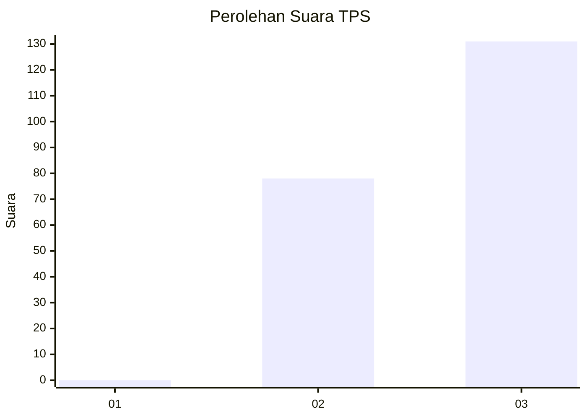
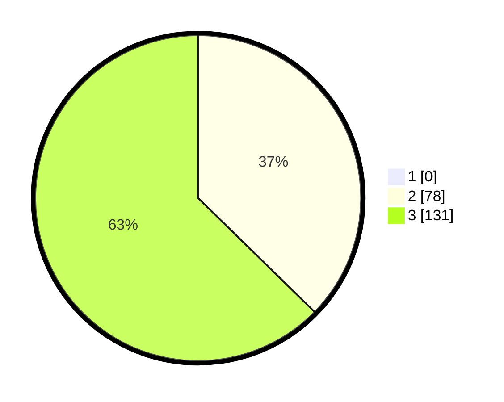

# Hasil

## Grafik

## Tabel

| No. | Nama Paslon    | Suara | Suara (raw) | Persentase |
|:--- |:-------------- | -----:| -----------:| ----------:|
| 1   | ANIES MUHAIMIN | 0     | [0][p-1]    | 0,00       |
| 2   | PRABOWO GIBRAN | 78    | [78][p-2]   | 37,32      |
| 3   | GANJAR MAHFUD  | 131   | [131][p-3]  | 62,68      |

[p-1]: https://github.com/gigit-pemilu/pemilu-2024-51-bali/blob/main/pilpres/hitung-suara/sub/51-bali/sub/02-tabanan/sub/05-tabanan/sub/2005-dauh-peken/sub/002-tps/sub/paslon-1.txt
[p-2]: https://github.com/gigit-pemilu/pemilu-2024-51-bali/blob/main/pilpres/hitung-suara/sub/51-bali/sub/02-tabanan/sub/05-tabanan/sub/2005-dauh-peken/sub/002-tps/sub/paslon-2.txt
[p-3]: https://github.com/gigit-pemilu/pemilu-2024-51-bali/blob/main/pilpres/hitung-suara/sub/51-bali/sub/02-tabanan/sub/05-tabanan/sub/2005-dauh-peken/sub/002-tps/sub/paslon-3.txt

## Foto C Plano

https://sirekap-obj-formc.kpu.go.id/1b0e/pemilu/ppwp/51/02/05/20/05/5102052005002-20240214-211011--5cbdfda4-4bfe-47ad-8efc-aaf576c35ec7.jpg

https://sirekap-obj-formc.kpu.go.id/1b0e/pemilu/ppwp/51/02/05/20/05/5102052005002-20240214-192045--7f3c9fa6-ce23-412c-81d7-59c25db9bf15.jpg

## Metadata

| Key        | Value               |
| ---------- | ------------------- |
| Time Stamp | 2024-02-24 22:31:28 |

