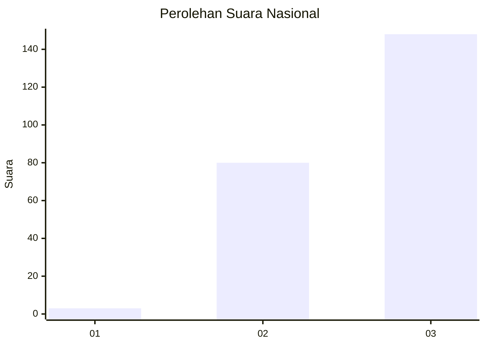
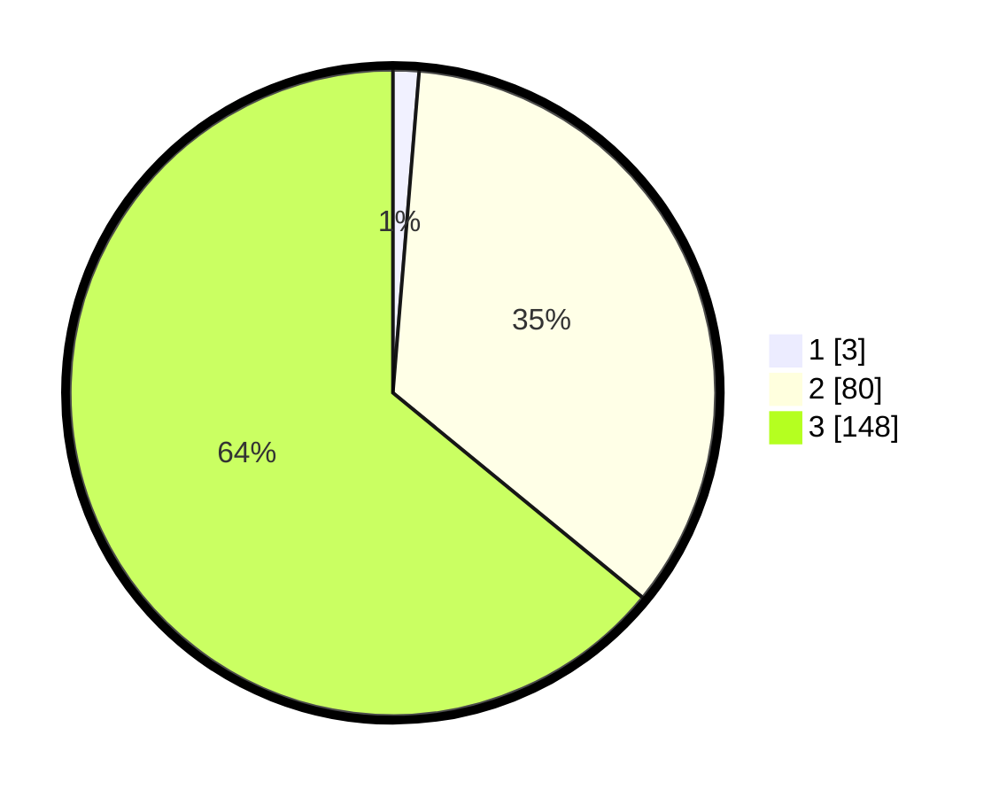

# Hasil

## Grafik

## Tabel

| No. | Nama Paslon    | Suara | Suara (raw) | Persentase |
|:--- |:-------------- | -----:| -----------:| ----------:|
| 1   | ANIES MUHAIMIN | 3     | [3][p-1]    | 1,30       |
| 2   | PRABOWO GIBRAN | 80    | [80][p-2]   | 34,63      |
| 3   | GANJAR MAHFUD  | 148   | [148][p-3]  | 64,07      |

[p-1]: https://github.com/gigit-pemilu/pemilu-2024/blob/main/pilpres/hitung-suara/sub/51-bali/sub/02-tabanan/sub/05-tabanan/sub/2005-dauh-peken/sub/003-tps/sub/paslon-1.txt
[p-2]: https://github.com/gigit-pemilu/pemilu-2024/blob/main/pilpres/hitung-suara/sub/51-bali/sub/02-tabanan/sub/05-tabanan/sub/2005-dauh-peken/sub/003-tps/sub/paslon-2.txt
[p-3]: https://github.com/gigit-pemilu/pemilu-2024/blob/main/pilpres/hitung-suara/sub/51-bali/sub/02-tabanan/sub/05-tabanan/sub/2005-dauh-peken/sub/003-tps/sub/paslon-3.txt

## Foto C Plano

https://sirekap-obj-formc.kpu.go.id/0571/pemilu/ppwp/51/02/05/20/05/5102052005003-20240215-001522--db027fee-2255-4e25-9e71-8a764f730815.jpg

https://sirekap-obj-formc.kpu.go.id/0571/pemilu/ppwp/51/02/05/20/05/5102052005003-20240214-211542--1c248a23-196c-4470-9a7e-a7ff38ad3264.jpg

https://sirekap-obj-formc.kpu.go.id/0571/pemilu/ppwp/51/02/05/20/05/5102052005003-20240214-211548--68c38c45-58da-4d76-9cb9-5202d0c0a1c8.jpg

## Metadata

| Key        | Value               |
| ---------- | ------------------- |
| Time Stamp | 2024-02-15 09:00:24 |

